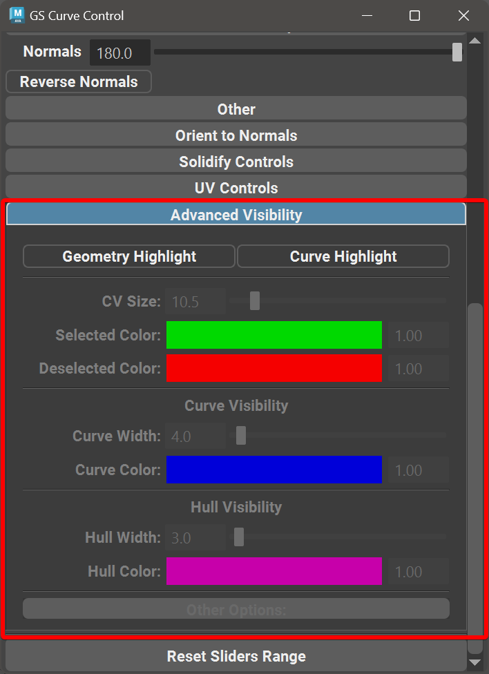
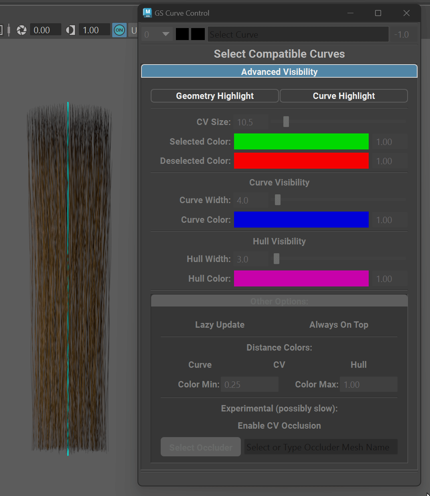
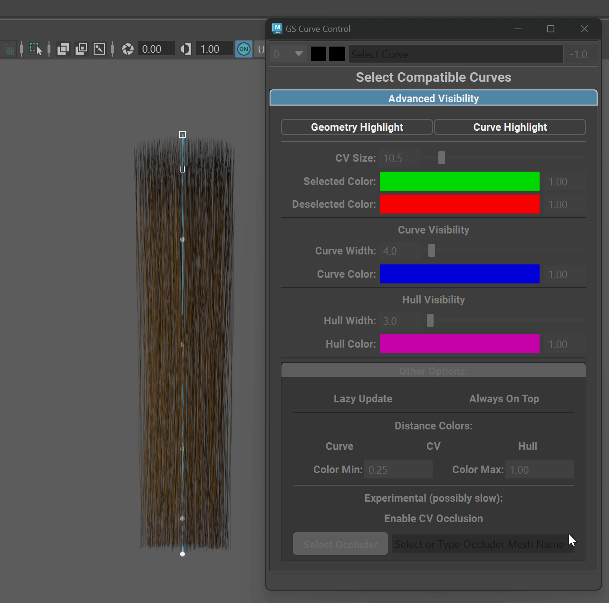
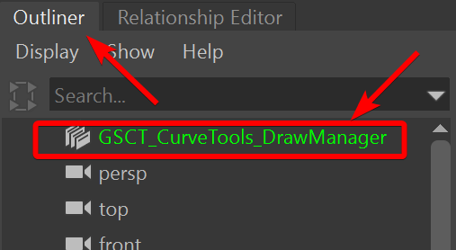
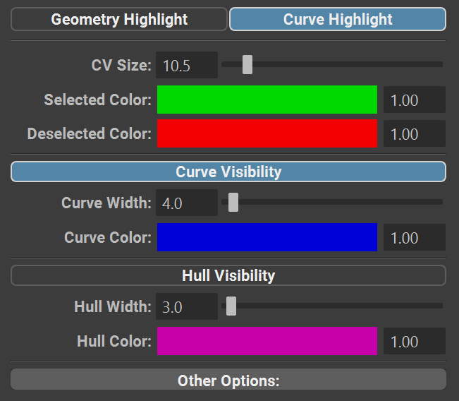
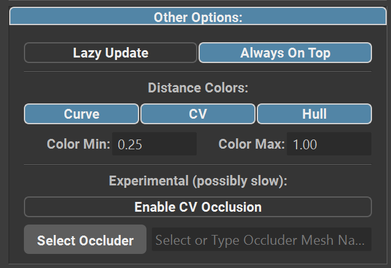

.. currentmodule:: <index>

.. _advanced-visibility:

###################
Advanced Visibility
###################

Advanced Visibility panel can be found in :ref:`Curve Control Window<attributes>` by expanding the "Advanced Visibility" frame.

Using these controls user can enhance the visibility of the selected geometry and curves which can be extremely helpful when working with dense hair textures or complex multi-layered grooms.

Advanced Visibility is only active on selected curves and will enable always-on-top visibility for curve and its components (cvs and hull) as well as adding wireframe visibility to selected cards.

.. note::
  Both Geometry and Curve Highlight have respective hotkeys available in the Hotkey Editor.

Geometry Highlight
^^^^^^^^^^^^^^^^^^

Geometry Highlight will highlight the geometry component of any selected curve. The geometry is not selected in the process, just highlighted for better visibility.

This can be extremely helpful for troubleshooting the geometry overlap or to finetune orientation, twist and other attributes.

.. note::
  When component mode is enabled (F8), highlighted geometry will also show vertices, however they will not be selectable if Geometry Editing is disabled on the current layer (default).

Curve Highlight
^^^^^^^^^^^^^^^

Toggling Curve Highlight button will enabled Advanced Visibility for any selected curve.

In this mode curve itself and its components (CVs and optionally Hull) will be always-on-top and drawn with the chosen color.

CV and hull highlight is soft-selection compatible and will show color gradient similar to Maya's own component visualization.

|

Enabling Curve Highlight will create a node in the outliner called **"GSCT_CurveTools_DrawManager"** node. This node should not be deleted as long as Curve Highlight mode is in use. It will be automatically removed when Curve Highlight mode is disabled.

.. important:: 
  Curve advanced visibility is only a visual effect and does not introduce any additional geometry or other objects to the screen (except for the **GSCT_CurveTools_DrawManager** node).

.. warning::
  **"GSCT_CurveTools_DrawManager"** node can be imported in the scene or appear if you are using scene reference. Redundant imported nodes will be automatically deleted and referenced nodes will be disabled to ensure that there is only one instance that is active.

Curve Highlight Options
^^^^^^^^^^^^^^^^^^^^^^^

Curve Highlight has various customization options available:

- **CV Size** will change the CV size preview. Please note that changing CV size preview will NOT change their hitbox, meaning that it will not increase the selection radius. It's purely visual effect.
- **Selected Color** (CVs) will change the color of the CVs that are currently selected. Color picker will change the color and input field on the right - transparency.
- **Deselected Color** (CVs) will change the color of the CVs that are not selected. Color picker will change the color and input field on the right - transparency.
- **Curve Visibility** Toggle will enable or disable selected curve highlight.
- **Curve Width** slider will change the width of the curve highlight.
- **Curve Color** will change the color of the curve highlight. Color picker will change the color and input field on the right - transparency.
- **Hull Visibility** will enable or disable selected curve Hull visibility. Hull is a line that connects all the CVs on the current curve. Will only be visible if component selection mode is enabled (F8)
- **Hull Width** controls the width of Hull line.
- **Hull Color** will change the color of the hull line and input field on the right - transparency.

.. list-table:: Highlight Options

  * - .. figure:: images/advanced_visibility/component-sizes.gif
        :target: _images/component-sizes.gif
      
        Component sizes

    - .. figure:: images/advanced_visibility/hull-drawing.gif
        :target: _images/hull-drawing.gif
    
        Curve vs Hull drawing

Other Options
^^^^^^^^^^^^^

There are advanced and experimental options available for the Advanced Highlight mode:

- **Lazy Update** will enable Lazy Update algorithm which can be helpful only if there are a lot of curves being selected. It will improve viewport performance but will cause some drawing issues. Recommended to keep this off unless you really need it.
- **Always On Top** toggle will enable or disable always on top drawing for Curve Highlight. Disabling this option will defeat the purpose of this mode, but might be useful in some cases. 
- **Distance Colors** menu controls the Distance Color effect. This effect darkens the components that are further from the camera. This can be helpful as it helps to locate the components in space.

  - **Curve, CV and Hull** toggles will enable or disable Distance Colors for respective components.
  - **Color Min** controls the lowest threshold for the color darkening. 0 means black, 1 means original color.
  - **Color Max** controls the upper threshold for the color darkening. 0 means black, 1 means original color. Can't go lower than Color Min value.
- **Experimental** options:

  - **Enable CV Occlusion** will hide the CVs and Hull components when they are behind the selected occluder mesh.
  - **Select Occluder** will copy the name of the selected mesh into the occluder mesh name input field.
  - **Name** input field needs to have occluder mesh name (full scene path) for the occlusion to function.

.. important:: Enabling occlusion can have significant performance on the scene, based on the density of the occluder geometry, number of selected curves etc.

.. list-table:: Other Options

  * - .. figure:: images/advanced_visibility/distance-color-demo.gif

      Distance Color Demonstration 

    - .. figure:: images/advanced_visibility/occlusion-demo.gif

      Occlusion Demonstration
