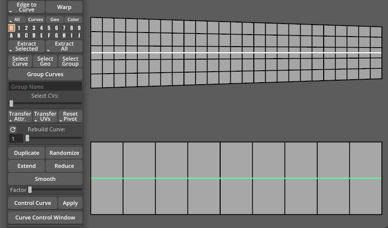
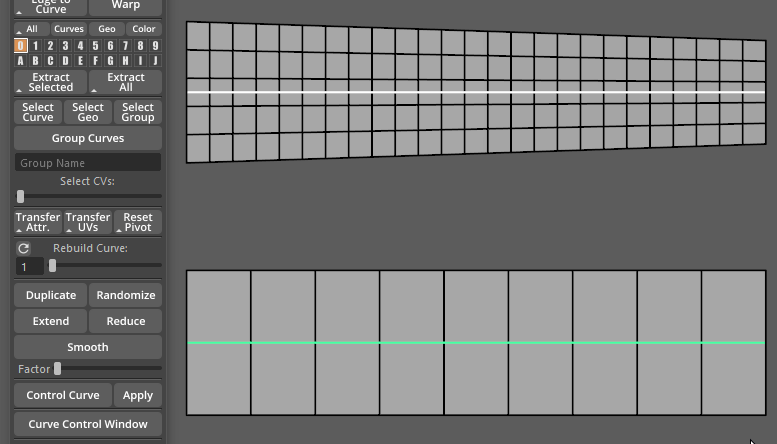
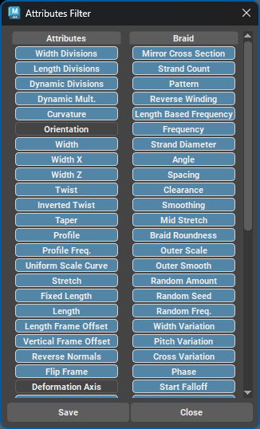

.. currentmodule:: <index>

.. _attributes:

################
Curve Attributes
################

Intro
=====

.. image:: images/curve_control_window.png
  :align: right
  :width: 250px

Curve Cards, Tubes, Braids and Bound objects created by GS CurveTools v2 plug-in have many attributes (or settings) that can be set on each individual curve. These attributes allow you to control how geometry is deformed (twisted, oriented or profiled), how textures are displayed (UV attributes) and geometry thickness (solidify).

All of the attributes can be found in the :ref:`Curve Control Window<curve-control-window>`.

There are 4 main types of attributes:

- **Sliders** with number fields - most common type of attribute. Drag the slider to change.

- **Checkboxes** - these will either activate some function or switch between two states.

- **Graphs** - graphs provide advanced control over some attributes of the curve.

- **Scopes** - these are used to select specific components in Braid and Bound objects. For :ref:`Braids<braids>` it will show individual strands (B1, B2, B3, B4). **Braid All** scope controlls all the strands at the same time. For :ref:`Bound<bind-unbind>` objects it will show individual bound components (C1, C2, C3 etc.). **All Comp.** will controll all those components at the same time.

Some attributes are common for all types of curves. Others can only be found on Braids or Bound objects.

|
|
|

Main Attributes
===============

.. list-table::
  :widths: 6 4

  * - **Length Division** (L-Div) - changes length division of the geometry. 
    - .. image:: images/attributes/length_division.png
  * - **Width Division** (W-Div) - changes width division of the geometry.
    - .. image:: images/attributes/width_division.png
  * - **Dynamic Divisions** - here you can set Curvature divisions (divisions distribution) and Dynamic Divisions based on curve length.
    - .. image:: images/attributes/dynamic_divisions_section.png
  * - **Curvature Divisions** - will automatically redistribute length divisions based on the curvature of the curve.
    - .. gifvideo:: images/attributes/curvature-attribute.mp4
        :width: 250
  * - **Dynamic Length Divisions** - will automatically change length divisions based on the length of the curve.
    - .. gifvideo:: _static/videos/dynamic_length_divisions.mp4
        :width: 250
  * - **Orientation** (Orien) - changes the orientation of the geometry. Rotates the geometry around the curve.
    - .. image:: images/attributes/orientation.png
  * - **Twist and Inverted Twist (Inv.Twist)** - twists the geometry around the curve. Normal twist twists around the tip of the curve and inverted twists around the root of the curve.
    - .. gifvideo:: images/attributes/twist.mp4
        :width: 250
  * - **Twist Curve Graph** - Allows for precise control of the twisting along the curve. You can add or remove additional control points if needed.
    - .. image:: images/attributes/twist_graph.png
  * - **Width** - uniformly changes width of the geometry along the curve.
    - .. image:: images/attributes/width.png
  * - **WidthX and WidthZ** - For Tubes, Braids and Bound objects. Individually changes width along X and Z axis.
    - .. gifvideo:: images/attributes/width_x_z.mp4
        :width: 250
  * - **Width Curve Graph** - Allows for precise control over the width of the geometry along the curve.
    - .. image:: images/attributes/width_curve_graph.png
  * - **Taper** - Adds positive or negative tapering to the geometry.
    - .. image:: images/attributes/taper.png
  * - **Profile** - Adds positive or negative profile to the geometry.
    - .. image:: images/attributes/profile.png
  * - **Profile Length Graph** - Controls the profile strength along the length of the curve.
    - .. image:: images/attributes/profile_length_graph.png
  * - **Profile Width Graph** - Controls the profile strength along the width of the geometry.
    - .. image:: images/attributes/profile_width_graph.png
  * - **Profile Frequency** - Only for Tubes. Controls the amount of repetition of the profile around the tube cross-section.
    - .. gifvideo:: images/attributes/profile_frequency.mp4
        :width: 250
  * - **Stretch** - Slider that controls the stretching of the geometry along the curve. Default value is 1.0 (full stretch).
    - .. gifvideo:: images/attributes/stretch.mp4
        :width: 250
  * - **Fixed Length and Length Slider** - Toggle and slider that controls the fixed length of the curve. If the toggle is on, the length will be fixed and the slider will control the length of the curve in Maya units.
    - .. image:: images/attributes/length.png
  * - **L-Offset** - Will offset the geometry along the curve. Useful in combination with Stretch or Fixed Length.
    - .. gifvideo:: images/attributes/l_offset.mp4
        :width: 250
  * - **Shape** - Controls the shape of the object (Card or Tube)
    - .. image:: images/attributes/shape_flip_reverse_nangle_tangent.png
  * - **Flip Frame** - Flips the geometry on the curve 180 degrees.
    - .. image:: images/attributes/shape_flip_reverse_nangle_tangent.png
  * - **Reverse Normals** - Reverses the normals of the geometry.
    - .. image:: images/attributes/shape_flip_reverse_nangle_tangent.png
  * - **V-Offset** - Changes the geometry offset on the curve (vertical).
    - .. gifvideo:: images/attributes/v_offset.mp4
        :width: 250
  * - **Normal Angle** - Controls the smoothness of the normals. Default is 180 degrees (fully smooth).
    - .. image:: images/attributes/shape_flip_reverse_nangle_tangent.png
  * - **Tangent and Set Optimal Tangent** - Changes the internal reference vector of the curve. Usually computed automatically, but can be manually adjusted by pressing the button. Fixes geometry instability on the curve (sudden orientation changes).
    - .. image:: images/attributes/shape_flip_reverse_nangle_tangent.png

.. note::
  For UV attributes, please visit :ref:`UVs<uvs>` chapter. It is recommended to use :ref:`UV Editor<uv-editor>` instead of the manual UV attributes.

.. _braid-attributes:

Braid Attributes
================

Braid object is used to create various types of braids. More details in the :ref:`Braids<braids>` chapter.

Main Braid Attributes
---------------------

.. list-table::
  :widths: 6 4

  * - **R-Div** - Controls the radial divisions of the braid.
    - .. gifvideo:: images/attributes/braid/divisions.mp4
        :width: 250
  * - **L-Div** - Controls the fixed length divisions of the braid. Overridden by Div/Turn.
    - .. gifvideo:: images/attributes/braid/divisions.mp4
        :width: 250
  * - **Div/Turn** - Controls the amount of divisions per braid turn. Overrides L-Div if more than 0.
    - .. gifvideo:: images/attributes/braid/divisions.mp4
        :width: 250
  * - **Strands** - Controls the number of strands in the braid. Max strands is 4.
    - .. gifvideo:: images/attributes/braid/strands.mp4
        :width: 250
  * - **Pattern** - Controls the pattern of the braid. Available options are: Twist, Flat, Flat Basket, Celtic. Some options are only available for higher strand count.
    - .. gifvideo:: images/attributes/braid/pattern.mp4
        :width: 250
  * - **Reverse Winding** - Reverses the winding of the braid.
    - .. gifvideo:: images/attributes/braid/reverse_winding.mp4
        :width: 250
  * - **Frequency/Auto** - Controls the amount of repetition of the braid. Auto toggle will automatically keep the relative frequency based on the length of the curve.
    - .. gifvideo:: images/attributes/braid/frequency.mp4
        :width: 250
  * - **Diameter** - Controls the diameter of the braid.
    - .. gifvideo:: images/attributes/braid/diameter-spacing.mp4
        :width: 250
  * - **Spacing** - Controls the horizontal spacing of the braid strands.
    - .. gifvideo:: images/attributes/braid/diameter-spacing.mp4
        :width: 250
  * - **Clearance** - Controls how much the strands are offset from each other on each vertical turn.
    - .. gifvideo:: images/attributes/braid/clearance.mp4
        :width: 250
  * - **Smoothing** - Controls the overall smoothing of the strands. Very important in combination with Clearance.
    - .. gifvideo:: images/attributes/braid/smoothing.mp4
        :width: 250
  * - **Mid Stretch** - (Only for 3-strand Flat Braid) Controls the middle section stretching. Can deform the braid. Use with Smoothing.
    - .. gifvideo:: images/attributes/braid/mid_stretch.mp4
        :width: 250
  * - **Roundness** - Adds a rounded profile to the braid shape.
    - .. gifvideo:: images/attributes/braid/roundness.mp4
        :width: 250
  * - **Outer Scale** - Controls the thickness of the outer parts of the strands.
    - .. gifvideo:: images/attributes/braid/outer_scale.mp4
        :width: 250
  * - **O.Smooth** - Smooths the Outer Scale effect.
    -
  * - **Phase** - Controls where the braid pattern starts.
    - .. gifvideo:: images/attributes/braid/phase.mp4
        :width: 250
  * - **Start/End Falloff** - Collapses the start/end of the braid to center based on the value.
    - .. gifvideo:: images/attributes/braid/falloff_unwind.mp4
        :width: 250
  * - **Start/End Unwind** - Unwinds the start/end of the braid based on the value.
    - .. gifvideo:: images/attributes/braid/falloff_unwind.mp4
        :width: 250

Braid Variation Parameters
--------------------------

Braid parameters are slightly randomized/offset based on the braid Variation parameters. More details in the :ref:`Braids<braids>` chapter.

.. gifvideo:: images/attributes/braid/variation.mp4
  :height: 250
  :align: center

- **Amount** - The strength of the variation effect.
- **Seed** - The initial seed of the randomization. Can be used to create different sets of the same variation params.
- **Frequency** - The frequency of the randomization effect along the braid length.
- **Width** - The width randomization effect. Slightly changes the width of the strands along the braid based on frequency.
- **Pitch** - Vertical randomization effect. Slightly changes the vertical offset of the strands along the braid based on frequency.
- **Crossing** - Randomizes the crossing param along the braid length.

Solidify Attributes
===================

.. list-table::
  :widths: 6 4

  * - **Solidify** allows you to add thickness to the geometry. Thickness is added in a procedural way so that every other function and attribute is still fully functional. Just tick the "Solidify" checkbox to proceed.
    - .. image:: images/attributes/solidify.gif
  * - **Solidify Thickness** will increase the thickness of the solidified geometry.
    - .. image:: images/attributes/solidify_thickness.gif
  * - **Solidify Divisions** will increase the number of divisions that new solidified geometry has.
    - .. image:: images/attributes/solidify_divisions.gif
  * - **Scale X, Scale Y and Offset** will change the profile of the solidified geometry. The main difference between them is that offset works more uniformly.
    - .. image:: images/attributes/scale_x_y.gif
  * - **Solidify Normals** (SNormals) will change the hardness of normals along the solidified edges.
    -

.. _transferring-attributes:

Transferring Attributes
=======================

You can easily **copy** (or **transfer**) attributes from one curve to any number of other curves. For that, just use the provided **"Transfer Attr."** button. It will show you the **[Source]** curve when you click on it. Attributes are transferred from the **[Source]** curve to all other curves.

:ref:`Attribute filters <attribute-filters>` can be used to limit which attributes will be transferred.

Transfer attributes work in two directions:

- By default, it will transfer **From First Selected Curve** ⇨ **To All Other Curves**.

|
|
|
|
|
|
|
|

- Using **Shift** modifier, you can reverse the direction of the transfer. It will now transfer **From Last Selected Curve** ⇨ **To All Other Curves**.

|
|
|
|

.. note:: Transfer Attr. command is **multi-selection compatible**, so you can transfer Attributes from one curve to any number of other curves in one click.

.. _copy-paste-attributes:

Copy and Paste Attributes
=========================

.. image:: images/transfer-attributes-marking-menu.png
  :align: right
  :width: 250px

User can also choose to copy and paste attributes instead of transferring them with selection.

To copy attributes simply select a curve, open marking menu (hold RMB on Transfer Attr.) and choose Copy.

After that select any number of target curves, open marking menu and Paste.

Hotkeys are also available for both commands.

:ref:`Attribute filters <attribute-filters>` can be used to limit which attributes will be transferred.

|

.. _attribute-filters:

Attribute Filters
=================

User can also choose which attributes to transfer using the new Attribute (and UV) Filter Window.

Simply hover over Transfer Attrs. or Transfer UVs button, hold RMB and select a square ▢ button near the Copy or Paste buttons.

In the new window, select or deselect attributes you wish to transfer or ignore (blue highlight vs blank) and click Save.

Now Transfer, Copy and Paste commands will only transfer highlighted attributes and ignore deselected ones.
