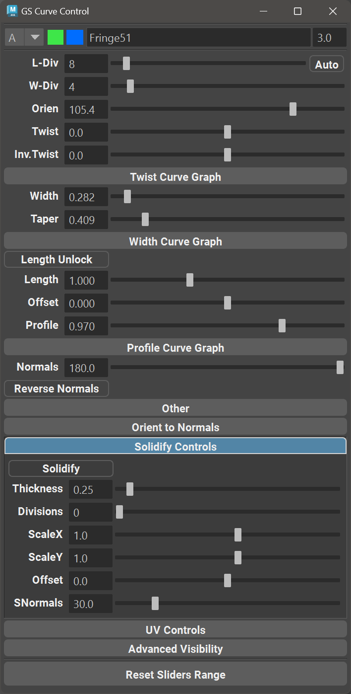
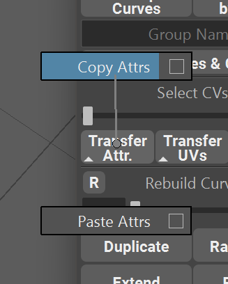

.. currentmodule:: <index>

.. _attributes:

################
Curve Attributes
################

Intro
^^^^^

Curve Cards and Tubes created by GS CurveTools plug-in have a bunch of attributes (or settings) that can be set on each individual curve. These attributes allow you to control how geometry is deformed (twisted, oriented or profiled), how textures are displayed (UV attributes) and geometry thickness (solidify).

All of the attributes can be found in **Curve Control Window** or directly in the **Channel Box** when pathCurve is selected.

There are 3 main types of attributes:

- **Sliders** with number fields - most common type of attribute. Drag the slider to change.

- **Checkboxes** - these will either activate some function or switch between two states.

- **Graphs** - graphs provide with advanced control over some attributes of the curve.

Some attributes are common for all types of curves. Others can only be found on, for example, :ref:`Tubes or Warp Cards<creating-cards-and-tubes>`

:ref:`Bind <bind-unbind>` curves have their own set of attributes.

Main Attributes
^^^^^^^^^^^^^^^

.. list-table::
  :widths: 6 4

  * - **Axis Control** - Only for :ref:`Bound<bind-unbind>` geometry and curves. This menu will control the axis at which the geometry is bound the the curve. By default it is set on Auto and generally it produces a desired result. If you notice that geometry is bound to the curve in a wrong direction, try changing this attribute.
    - .. image:: images/attributes/axis_control.png
        :target: _images/axis_control.png
  * - **Edit Original Curves** (Edit Orig. Curves) - Only for :ref:`Bound<bind-unbind>` objects. This button allows to edit original curves when you are using :ref:`bind<bind-unbind>` function on an already existing curves. Clicking on this button will go "one step backwards" on in the Custom Warp group. Clicking on this button again will return the curves back to their bound state. Refer to :ref:`bind<bind-unbind>` function documentation for further details.
    - .. image:: images/attributes/edit-orig-objects.png
        :target: _images/edit-orig-objects.png
  * - **Select Original Curves** - Only for :ref:`Bound<bind-unbind>` objects. This button allows to select original curves when you are using :ref:`bind<bind-unbind>` function on an already existing curves. Clicking on this button will select the original curves that were bound to the current curve. This allows for quick adjustment of attributes on the original curves. Refer to :ref:`bind<bind-unbind>` function documentation for further details.
    - .. image:: images/attributes/select-orig-curves.png
        :target: _images/select-orig-curves.png
  * - **Length Division** (L-Div) - changes length division of the geometry. 
    - .. image:: images/attributes/length_division.png
        :target: _images/length_division.png
  * -  **Auto** Length Divisions Toggle - automatically recomputes length divisions based on the length of the curve. In this mode, L-Div slider controls the density of the geometry.
    - .. image:: images/attributes/auto-l-div.png
        :target: _images/auto-l-div.png
  * - **Width Division** (W-Div) - changes width division of the geometry.
    - .. image:: images/attributes/width_division.png
        :target: _images/width_division.png
  * - **Orientation** (Orien) - changes the orientation of the geometry. Rotates the geometry around the curve.
    - .. image:: images/attributes/orientation.png
        :target: _images/orientation.png
  * - **Twist and Inverted Twist (Inv.Twist)** - twists the geometry around the curve. Normal twist twists around the tip of the curve and inverted twists around the root of the curve.
    - .. image:: images/attributes/twist.gif
        :target: _images/twist.gif
  * - **Twist Curve Graph** - Only for Warp geometry. Allows for precise control of the twisting along the curve. You can add or remove additional control points if needed. 
    - .. image:: images/attributes/twist_graph.png
        :target: _images/twist_graph.png
  * - **Twist Curve Graph Options** - **M:** field will change the Magnitude of the twisting. Essentially it increases or decreases the effect of the Twist Curve Graph. **Reset Curve** will reset the graph to its default state. **^** button will open a pop-out Twist Curve Graph that can be resized by user.
    - .. image:: images/attributes/twist-curve-graph-demo.gif
        :target: _images/twist-curve-graph-demo.gif
  * - **Width** - uniformly changes width of the geometry along the curve 
    - .. image:: images/attributes/width.png  
        :target: _images/width.png
  * - **WidthX and WidthZ** - Only for Tubes. Individually changes width along X and Z axis of the tube. You can also lock these two sliders together to change the width uniformly.
    - .. image:: images/attributes/width_x_z.gif
        :target: _images/width_x_z.gif
  * - **Width Curve Graph** - Only for Warp geometry. Allows for precise control over the width of the geometry along the curve.
    - .. image:: images/attributes/width_curve_graph.png
        :target: _images/width_curve_graph.png
  * - **Width Curve Graph Options** - In case of width, Magnitude can be controlled by normal Width Slider **Reset Curve** will reset the graph to its default state. **^** button will open a pop-out Twist Curve Graph that can be resized by user.
    - .. image:: images/attributes/curve_width_demo.png
        :target: _images/curve_width_demo.png
  * - **Taper** - Adds positive or negative tapering to the geometry.
    - .. image:: images/attributes/taper.png
        :target: _images/taper.png
  * - **Profile** - Adds positive or negative profile to the geometry.
    - .. image:: images/attributes/profile.png
        :target: _images/profile.png
  * - **Profile Graph** - Controls the profile strength along the length of the curve. 
    - .. image:: images/attributes/profile_curve_graph.png
        :target: _images/profile_curve_graph.png
  * - **Profile Graph Options** - **Number input field** (1.00) controls the magnitude of the Profile Curve Graph effect **Smoothing** will control the smoothness of the profile curve graph effect **Auto and Manual** will enable/disable automatic equalization of the curve. **^** button will open a pop-out Profile Curve Graph that can be resized by user.
    - .. image:: images/attributes/profile-graph-demo.gif
        :target: _images/profile-graph-demo.gif
  * - **Normals and Reverse Normals** - Slider will smoothen or harden normals of the geo. Checkbox will flip the normals direction.
    - .. image:: images/attributes/reverse-normals.png
        :target: _images/reverse-normals.png
  * - **Length Unlock and Length** - Only for Warp geometry. This checkbox and attribute slider will unlock the stretching of the geometry and allow for manual stretching along the curve. By default geometry is fully stretched along the curve.
    - .. image:: images/attributes/length_unlock.gif
        :target: _images/length_unlock.gif
  * - **Offset** - Only for Warp geometry. This slider will control the offset of the geometry along the curve. Geometry will automatically follow straight line after it leaves the curve it is attached to.
    - .. image:: images/attributes/offset.gif
        :target: _images/offset.gif

      .. _auto-sampling:
  * - **Auto-Sampling Toggle** - this toggle enables the automatic calculation of the sampling accuracy based on the number of CVs on the curve. It will increase the sampling rate on low CV counts and decrease it on high CV counts to avoid lag in the viewport. Should be enabled for most use cases.
    - .. image:: images/attributes/auto-sampling.png
        :target: _images/auto-sampling.png

  * - **Auto-Refine Toggle** - changes the refine algorithm (on by default). Faster, but less precise than manual refinement. Should be enabled for most use cases.
    - .. image:: images/attributes/auto-refine.png
        :target: _images/auto-refine.png

      .. _sampling-accuracy:
  * - **Sampling Accuracy** - This slider will increase or decrease the accuracy of the deformation for :ref:`Bound<bind-unbind>` objects and :ref:`Warp Cards and Tubes<warp-cards>`. Values higher than 1.0 can significantly degrade performance based on the density of the curve. Only increase past 0.5 if you observe geometry stretching and deformations that can happen on very low CV counts (<6).
    - .. image:: images/attributes/sampling-accuracy-demo.gif
        :target: _images/sampling-accuracy-demo.gif

  * - **Refine** - Adds additional "virtual" CVs to a curve to achieve additional precision in geometry deformation. Real CVs stay the same. If you see that geometry is not exactly on the curve (this can sometimes happen on long curves), just increase Refine value. **Warning** - High refine values can cause severe performance issues.
    - .. image:: images/attributes/refine.png
        :target: _images/refine.png
  * - **Smooth** - This attribute (do no confuse it with Smooth Function in the Main Menu) will interactively smooth pinched or highly deformed parts of the curve. Can only be used on manual Refinement modes.
    - .. image:: images/attributes/smooth.png
        :target: _images/smooth.png

.. note::
  For UV attributes, please visit :ref:`UVs<uvs>` chapter. It is recommended to use :ref:`UV Editor<uv-editor>` instead of the old UV attributes.

Solidify Attributes
^^^^^^^^^^^^^^^^^^^

.. list-table::
  :widths: 6 4

  * - **Solidify** allows you to add thickness to the geometry. Thickness is added in a procedural way so that every other function and attribute is still fully functional. Just tick the "Solidify" checkbox to proceed.
    - .. image:: images/attributes/solidify.gif
        :target: _images/solidify.gif
  * - **Solidify Thickness** will increase the thickness of the solidified geometry.
    - .. image:: images/attributes/solidify_thickness.gif
        :target: _images/solidify_thickness.gif
  * - **Solidify Divisions** will increase the number of divisions that new solidified geometry has.
    - .. image:: images/attributes/solidify_divisions.gif
        :target: _images/solidify_divisions.gif
  * - **Scale X, Scale Y and Offset** will change the profile of the solidified geometry. The main difference between them is that offset works more uniformly.
    - .. image:: images/attributes/scale_x_y.gif
        :target: _images/scale_x_y.gif
  * - **Solidify Normals** (SNormals) will change the hardness of normals along the solidified edges.
    -
 
.. note:: To use better precision than sliders can provide we can either stretch the Curve Control Window or use combination of Ctrl + Left Mouse Button Drag on the Value Fields.

.. _transferring-attributes:

Transferring Attributes
^^^^^^^^^^^^^^^^^^^^^^^

You can easily **copy** (or **transfer**) attributes from one curve to any number of other curves. For that, just use the provided **"Transfer Attr."** button. It will show you the **[Source]** curve when you click on it. Attributes are transferred from the **[Source]** curve to all other curves.

:ref:`Attribute filters <attribute-filters>` can be used to limit which attributes will be transferred.

Transfer attributes works in two directions:

- By default, it will transfer **From First Selected Curve** ⇨ **To All Other Curves**.

|
|
|
|
|
|
|
|

- Using **Shift** modifier, you can reverse the direction of the transfer. It will now transfer **From Last Selected Curve** ⇨ **To All Other Curves**.

|
|
|
|

.. note:: Transfer Attr. command is **multi selection compatible**, so you can transfer Attributes from one curve to any number of other curves in one click.

.. _copy-paste-attributes:

Copy and Paste Attributes
^^^^^^^^^^^^^^^^^^^^^^^^^

User can also choose to copy and paste attributes instead of transferring them with selection.

To copy attributes simply select a curve, open marking menu (hold RMB on Transfer Attr.) and choose Copy.

After that select any number of target curves, open marking menu and Paste.

Hotkeys are also available for both commands.

:ref:`Attribute filters <attribute-filters>` can be used to limit which attributes will be transferred.

|

.. _transferring-attributes-to-bound:

Transferring to and from Bound Objects
^^^^^^^^^^^^^^^^^^^^^^^^^^^^^^^^^^^^^^

Transferring (or copy-pasting) attributes for Bind Groups is a bit different than on regular Warp or Extrude cards. 

When transferring "Bound ⇨ Bound" it will match the number of original curves of the source and target objects and if they match - it will transfer the attributes and UVs to matching curves. If the source and target objects do not match it will transfer from the first original curve to all the target curves that make up the target bound object.

When transferring from any other object type it will simply transfer to all the same attributes to all original curves of the bound object.

.. _attribute-filters:

Attribute Filters
^^^^^^^^^^^^^^^^^

User can also choose which attributes to transfer using the new Attribute (and UV) Filter Window.

Simply hover over Transfer Attrs. or Transfer UVs button, hold RMB and select a square ▢ button near the Copy or Paste buttons.

In the new window, select or deselect attributes you wish to transfer or ignore (blue highlight vs blank) and click Save.

Now Transfer, Copy and Paste commands will only transfer highlighted attributes and ignore deselected ones.
