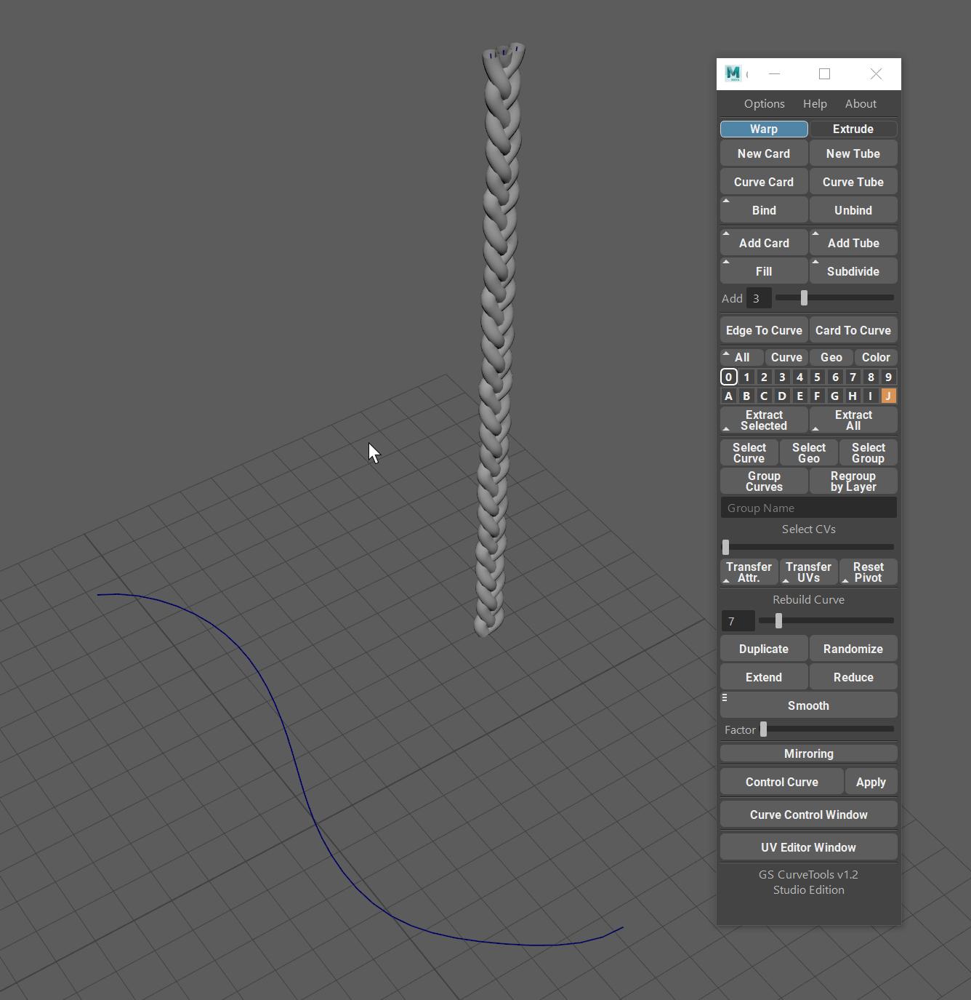
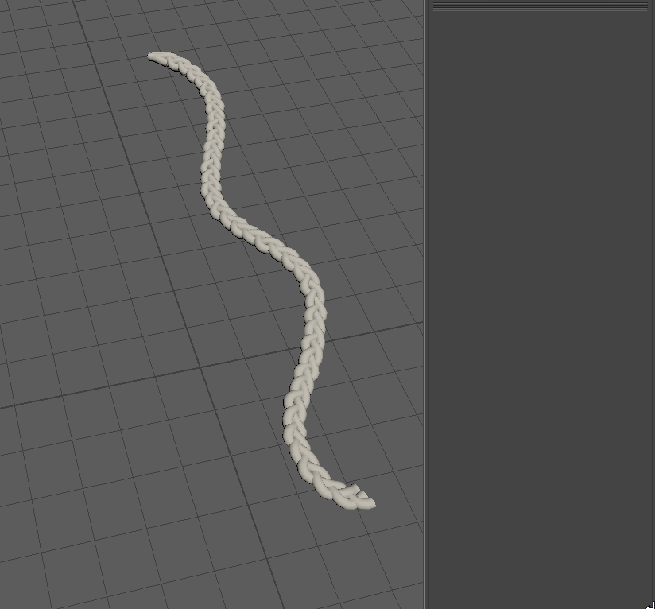
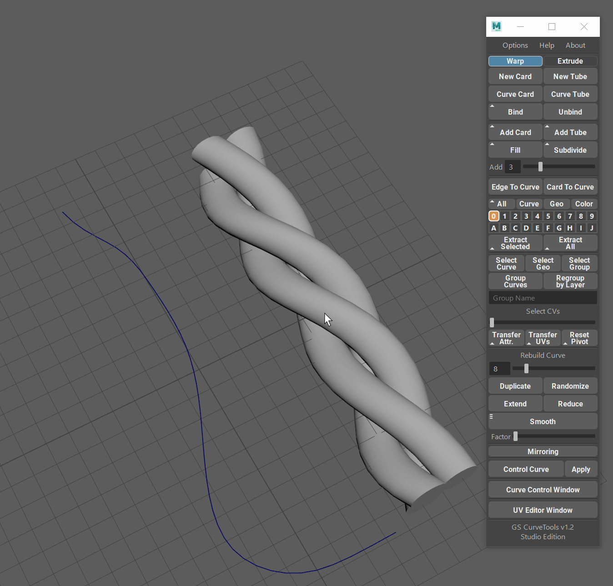
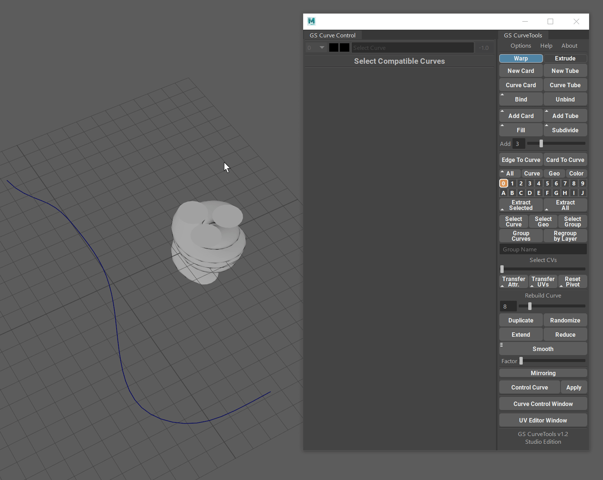
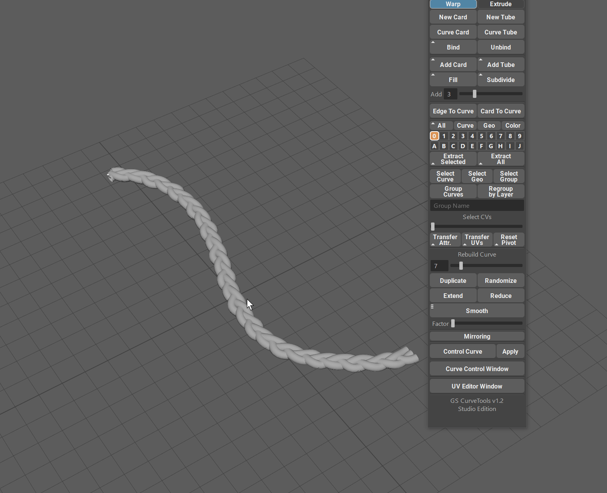
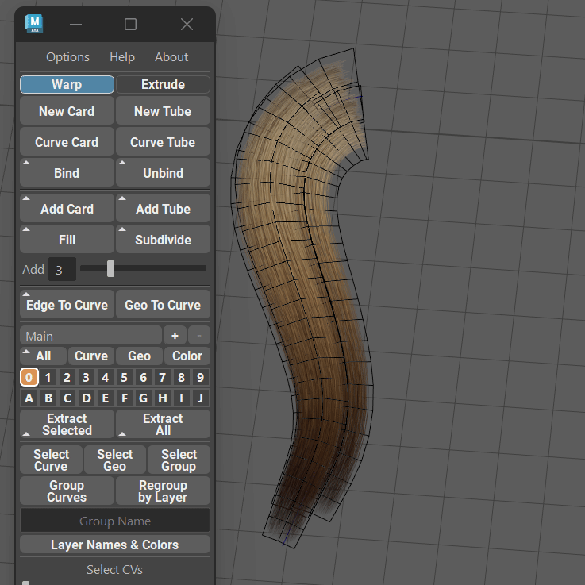
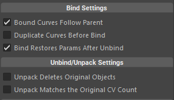

.. currentmodule:: <index>

.. _bind-unbind:

############################
Bind/Unbind/Unpack Functions
############################

Intro
^^^^^

.. image:: images/creation_section.png
	:align: right
	:width: 150px

**Bind** button allows for an entire new level of customization of your curves as it allows to bind any selected geometry to a curve AND it also supports binding Curves, Tubes and Braids to a single curve, keeping the original geometry shape intact.

**Bind** button will create a group in the outliner, called **gsBind**. Just like with any other group in GS CurveTools, you can rename it to anything you like or group it with other groups, but do not rename or move anything inside this group. Bound curves and geometry will be assigned to the currently highlighted :ref:`layer<layers>`.

**Unbind** will unbind any bound curves. If you bound already bound groups (nested binding) it will unbind only the top "layer" of bound cards.

**Unpack** will reconstruct the original objects in-place, meaning they will keep their world position and deformation.

Binding Curve Cards/Tubes to a Curve
^^^^^^^^^^^^^^^^^^^^^^^^^^^^^^^^^^^^

You can now bind any number and arrangement of Curve Cards/Tubes to one curve for ease of control.

All the attributes and UVs of the original curves will stay the same.

Original geometry will keep its shape, so if you created a hair braid and then want to position it on your model, you can do that with Bind.

Binding Curves to a Curve will create a new group called "bindGroup" and place it in the selected Layer in the layers menu.

You can use Axis Control in the :ref:`Curve Control Window<curve-control-window>` to change the axis manually or to Flip the direction of bound geometry.

Holding **Shift** before clicking on Bind will first duplicate the original curves and then bind the duplicates, leaving the original curves intact.

You can **switch back to the original curves and modify** them at any moment using **"Edit Orig. Curves"** button in the **Curve Control Window**. Any changes you make to the original curves will propagate back to its bound copy. You can also freely change any attribute of the original curve or change the UVs, and changes will propagate to the bound copy.

|
|
|
|
|

Binding Geometry to a Curve
^^^^^^^^^^^^^^^^^^^^^^^^^^^

**Bind** function can attach any selected geometry to any selected curve. It will automatically detect if there is a geometry selection and choose the first selected curve as its target.

After you attach the selected geometry, a new group will be created in the Outliner - **gsBind**. This group is fully compatible with the layers system and can be duplicated using the :ref:`Duplicate<duplicate>` button.

Original geometry should be roughly **aligned** to any of the three main axes of the world: X, Y, Z. Any deviation from a major axis will result in deformation.

|

	
If geometry is aligned but was bound in the wrong axis, you can use **Axis** attribute in the :ref:`Curve Control Window<curve-control-window>` to manually select the desired axis. This misalignment can happen if the original geometry shape is scaled in a way that makes it wider than its length/height.

Holding **Shift** before clicking on Bind will first duplicate the original curves and then bind the duplicates, leaving the original curves intact.

|

.. _unbind:

Unbind
^^^^^^

You can easily unbind already bound cards and tubes by simply selecting the bindGroup curve and clicking on Unbind.

You will get the original cards/tubes as well as the original curve.

If you have Keep Curve Attributes option selected in the :ref:`Options Menu<options>`, you can then easily edit and Bind these unbound objects back to the original curve and keep the original orientation, twist, etc.

.. _unpack:

Unpack
^^^^^^

**Unpack** will **attempt** to recreate the original objects (cards or tubes only) from the :ref:`Bound<bind-unbind>` object and place them in the exact same position as they are currently placed with all the deformations and world position.

In practice, the recreation and positioning process is not 100% precise as you are effectively creating a new set of procedural objects during the Unpack. However, it is close enough in most cases to prove useful and add an additional layer of customization for the hair cards.

Unpacking the Bound object is **irreversible** (unless you press Undo, of course). You can't re-bind the new objects back, as they are now deformed to mimic the Bind object they were created from.

|

Additional Options
^^^^^^^^^^^^^^^^^^

- The **Duplicate Curves Before Bind** option in the :ref:`Options Menu<options>` automatically duplicates curves before applying the Bind operation. This will create a copy of the curves and leave the original unbound curves behind.

- **Bound Curves Follow Parent** is a very important option that ensures that Bound curves follow their parent when you move the parent curve between layers. It should be enabled most of the time.

- **Unpack Deletes Original Objects** will enable deletion of original :ref:`Bound<bind-unbind>` objects during the :ref:`Unpack<unpack>`. By default :ref:`Unpack<unpack>` will just place the new curves on top of the old geo.

- **Unpack Matches the Original CV Count** will enable curve rebuilding after the :ref:`Unpack<unpack>` to match the original curve CV count. In most cases it is not recommended as the unpacked objects might have different deformation and complexity compared to the Bound object curve and some of the details might be lost.
