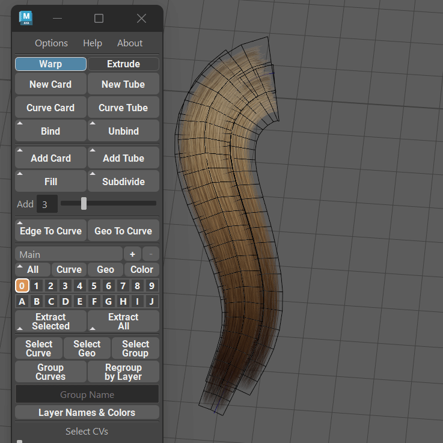
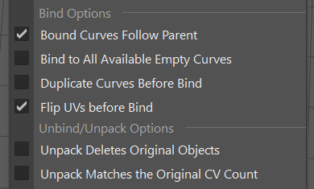

.. currentmodule:: <index>

.. _bind-unbind:

############################
Bind/Unbind/Unpack Functions
############################

Intro
^^^^^

**Bind** button allows for an entire new level of customization of your curves as it allows to bind any selected geometry to a curve AND it also supports binding Curve Cards and Curve Tubes to a single curve, keeping the original geometry shape intact.

**Bind** button will create a group in the outliner, called **bindGroup** or **bindGeo**. Just like with any other group in GS CurveTools, you can rename it to anything you like or group it with other groups, but do not rename or move anything inside this group.

.. note:: Bound curves and geometry will be assigned to the currently highlighted :ref:`layer<layers>`.

**Unbind** will unbind any bound curves. If you bound already bound groups (nested binding) it will unbind only the top "layer" of bound cards.

Binding Geometry to a Curve
^^^^^^^^^^^^^^^^^^^^^^^^^^^

.. image:: images/bind_geo_function.gif
	:align: right
	:width: 350px

**Bind** function can attach any selected geometry (as long as it's one mesh) to any selected curve. It will automatically detect if there is a geometry selection and choose the first selected curve as its target.

After you attach the selected geometry, a new group will be created in the Outliner - **bindGeo**. This group is fully compatible with the layers system and can be duplicated using **"Duplicate"** button.

Original geometry should be roughly **aligned** to any of the three main axis of the world: X,Y,Z. Any deviation from major axis will result in deformation.

|

.. image:: images/bind_geo_wrong_axis.gif
	:align: right
	:width: 350px
	
If geometry is aligned but was bound in the wrong axis, you can use **"Axis Control"** in the **Curve Control Window** to manually select desired axis. This misalignment can happen if original geometry shape is scaled in a way that makes it wider than its length/height.

Holding **Shift** before clicking on Bind will first duplicate the original curves and then bind the duplicates, leaving the original curves intact.

|
|
|
|

Binding Curve Cards/Tubes to a Curve
^^^^^^^^^^^^^^^^^^^^^^^^^^^^^^^^^^^^

You can now bind any number and arrangement of Curve Cards/Tubes to one curve for ease of control.

All the attributes and UVs of the original curves will stay the same.

Original geometry will keep its shape, so if you created a hair braid and then want to position it on your model, you can do that with Bind.

Binding Curves to a Curve will create a new group called "bindGroup" and place it in the selected Layer in the layers menu.

You can use Axis Control in the Curve Control Window to change the axis manually or to Flip the direction of bound geometry.

Holding **Shift** before clicking on Bind will first duplicate the original curves and then bind the duplicates, leaving the original curves intact.

.. image:: images/edit_orig_curves.gif
	:align: right
	:width: 350px

You can **switch back to the original curves and modify** them at any moment using **"Edit Orig. Curves"** button in the **Curve Control Window**. Any changes you make to the original curves will propagate back to its bound copy. You can also freely change any attribute of the original curve or change the UVs, and changes will propagate to the bound copy.

|
|
|
|
|

.. _unbind:

Unbind
^^^^^^

.. image:: images/unbind_function.gif
	:align: right
	:width: 350px

You can easily unbind already bound cards and tubes by simply selecting the bindGroup curve and clicking on Unbind.

You will get the original cards/tubes as well as the original curve.

If you have Keep Curve Attributes option selected in the Options menu, you can then easily edit and Bind these unbound objects back to the original curve and keep the original orientation, twist etc.

.. _unpack:

Unpack
^^^^^^

**Unpack** is an alternative mode to the :ref:`Unbind<unbind>` button. It is activated by holding **Shift** and clicking on the :ref:`Unbind<unbind>` button while having the **Bound object selected in the viewport**. **Bound object** is the object created by :ref:`Bind<bind-unbind>` function.

**Unpack** will **attempt** to recreate the original objects (cards or tubes only) from the :ref:`Bound<bind-unbind>` object and place them in the exact same position as they are currently placed with all the deformations and world position.

In practice, the recreation and positioning process in not 100% precise as you effectively creating a new set of procedural objects during the Unpack. However, it is close enough in most cases to prove useful and add additional layer of customization for the hair cards.

Unpacking the Bound object is **irreversible** (unless you press Undo, of course). You can't re-bind the new objects back, as they are now deformed to mimic the Bind object they were created from.

|

Using Maya Deformers on Bind Group
^^^^^^^^^^^^^^^^^^^^^^^^^^^^^^^^^^

.. image:: images/using_maya_deformers_edit_orig.gif
	:align: right
	:width: 350px

You can also use **Maya Non-Linear Deformers** and **Lattice** on the original curves. You can then either keep them or simply select original curves and Delete by Type ⇨ History (Alt + Shift + D)

.. _mass-bind:

|
|
|
|
|
|
|
|
|

Bind to All Available Curves
^^^^^^^^^^^^^^^^^^^^^^^^^^^^

You can also bind to an unlimited number of "empty" curves using **Bind to All Available Curves** option from the :ref:`options`. This option will also duplicate the original clump before binding (regardless of the Duplicate Before Bind option).

|
|
|
|
|
|
|

Bind and UV Attributes Transfer
^^^^^^^^^^^^^^^^^^^^^^^^^^^^^^^

Refer to :ref:`Attributes Transfer for Bound Objects<transferring-attributes-to-bound>`.

Additional Options
^^^^^^^^^^^^^^^^^^

- **Duplicate Curves Before Bind** option in the options menu to automatically duplicate curves before applying Bind operation. This will create a copy of the curves and leave the original unbound curves behind.

- **Bound Curves Follow Parent** is a very important option that ensures that Bound curves follow parent when you move the parent curve between layers. Should be enabled most of the time.

- **Bind to All Available Empty Curves** is a :ref:`Mass Bind<mass-bind>` option that will look for any "empty" curves in the selection and duplicate and bind the GS CurveTools objects or any custom geometry in the selection to those curves.

- **Flip UVs before Bind** will flip the UVs before binding the objects to a single curve to compensate for Maya's own UV flipping. Should be enabled most of the time.

- **Unpack Deletes Original Objects** will enable deletion of original :ref:`Bound<bind-unbind>` objects during the :ref:`Unpack<unpack>`. By default :ref:`Unpack<unpack>` will just place the new curves on top of the old geo.

- **Unpack Matches the Original CV Count** will enable curve rebuilding after the :ref:`Unpack<unpack>` to match the original curve CV count. In most cases it is not recommended as the unpacked objects might have different deformation and complexity compared to the Bound object curve and some of the details might be lost.