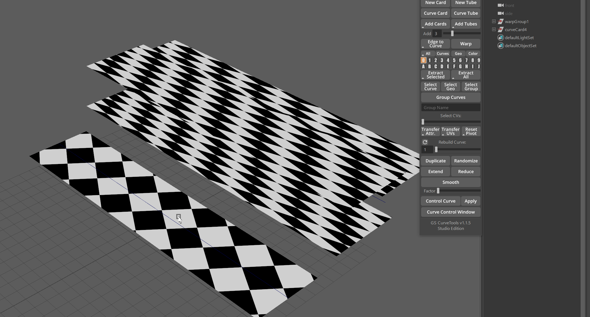

.. currentmodule:: <index>

####################
Bind/Unbind Function
####################

Intro
^^^^^
.. figure:: images/buttons/bind_unbind_buttons.png
	:class: with-shadow float-right
	:width: 300px

**Bind** button allows for an entire new level of customization of your curves as it allows to bind any selected geometry to a curve AND it also supports binding Curve Cards and Curve Tubes to a single curve, keeping the original geometry shape intact.

**Bind** button will create a group in the outliner, called **bindGroup** or **bindGeo**. Just like with any other group in GS CurveTools, you can rename it to anything you like or group it with other groups, but do not rename or move anything inside this group.

**Unbind** will unbind any bound curves. If you bound already bound groups (nested binding) it will unbind only the top "layer" of bound cards.

Binding Geometry to a Curve
^^^^^^^^^^^^^^^^^^^^^^^^^^^

.. figure:: images/bind_geo_function.gif
	:class: with-shadow float-right
	:width: 350px

**Bind** function can attach any selected geometry (as long as it's one mesh) to any selected curve. It will automatically detect if there is a geometry selection and choose the first selected curve as its target.

After you attach the selected geometry, a new group will be created in the Outliner - **bindGeo**. This group is fully compatible with the layers system and can be duplicated using **"Duplicate"** button.

Original geometry should be roughly **aligned** to any of the three main axis of the world: X,Y,Z. Any deviation from major axis will result in deformation.

|

	
If geometry is aligned but was bound in the wrong axis, you can use **"Axis Control"** in the **Curve Control Window** to manually select desired axis. This misalignment can happen if original geometry shape is scaled in a way that makes it wider than its length/height.

|
|
|
|

Binding Curve Cards/Tubes to a Curve
^^^^^^^^^^^^^^^^^^^^^^^^^^^^^^^^^^^^

.. figure:: images/bind_function.gif
	:class: with-shadow float-right
	:width: 350px

You can now bind any number and arrangement of Curve Cards/Tubes to one curve for ease of control.

All the attributes and UVs of the original curves will stay the same.

Original geometry will keep its shape, so if you created a hair braid and then want to position it on your model, you can do that with Bind.

Binding Curves to a Curve will create a new group called "bindGroup" and place it in the selected Layer in the layers menu.

You can use Axis Control in the Curve Control Window to change the axis manually or to Flip the direction of bound geometry.

You can **switch back to the original curves and modify** them at any moment using **"Edit Orig. Curves"** button in the **Curve Control Window**. Any changes you make to the original curves will propagate back to its bound copy. You can also freely change any attribute of the original curve or change the UVs, and changes will propagate to the bound copy.

|
|
|
|
|

Unbind
^^^^^^

You can easily unbind already bound cards and tubes by simply selecting the bindGroup curve and clicking on Unbind.

You will get the original cards/tubes as well as the original curve.

If you have Keep Curve Attributes option selected in the Options menu, you can then easily edit and Bind these unbound objects back to the original curve and keep the original orientation, twist etc.

|

Using Maya Deformers on Bind Group
^^^^^^^^^^^^^^^^^^^^^^^^^^^^^^^^^^

You can also use **Maya Non-Linear Deformers** and **Lattice** on the original curves. You can then either keep them or simply select original curves and Delete by Type -> History (Alt + Shift + D)

|
|
|
|
|
|
|
|

.. _mass-bind:

Mass Bind
^^^^^^^^^

.. figure:: images/mass_bind_demo.gif
	:class: with-shadow float-right
	:width: 350px

You can also bind to an unlimited number of "empty" curves using **Bind to All Available Curves** option in the options menu. This option will also duplicate the original clump before binding (regardless of the Duplicate Before Bind option).

|
|
|
|
|
|
|

Bind and UV Attributes Transfer
^^^^^^^^^^^^^^^^^^^^^^^^^^^^^^^

Transferring attributes for Bind Groups is a bit different. You want to select the source curve first and then the entire Bind Group (or multiple groups). After that just click on Transfer UVs and you are done. You can reverse this by holding Shift (UVs will be transferred from the last selection to all other).

This will only work on UV attributes, but not on normal attributes. Normal attributes will be transferred to the Bind group and each individual card and it will create a mess.

Additional Options
^^^^^^^^^^^^^^^^^^

User can also enable **Duplicate Before Bind** option in the options menu to automatically duplicate curves before applying Bind operation. This will create a copy of the curves and leave the original unbound curves behind.