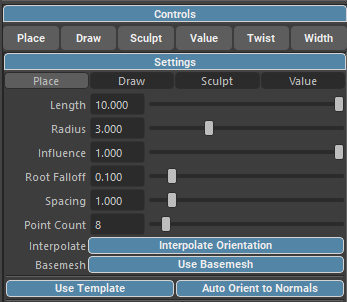
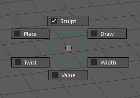
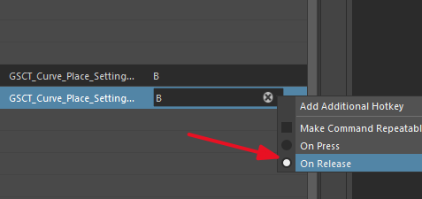
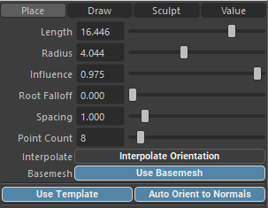
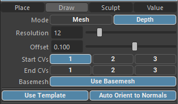
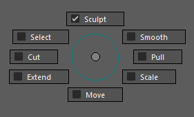
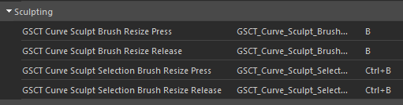
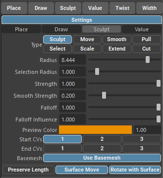
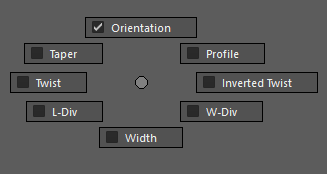

.. currentmodule:: <index>

##################
Controls and Tools
##################

.. _controls:

Controls (tools) allow for quick placement and editing of GS CurveTools objects.

They can be activated via the :ref:`Curve Control Window<curve-control-window>` "Controls" menu, by using a hotkey or by using a built-in marking menu. Marking menu requires the user to set the hotkey.

When activated they replace the current context (tool) and react to user selection.

Place, Draw, Sculpt and Value tools have additional settings accessed via "Settings" menu.

Tool Switcher Marking Menu
==========================

Tool Switcher marking menu allows for quick switch between tools.

Marking menu is accessed via "Press/Release" hotkey pair found in ``Windows -> Settings/Preferences -> Hotkey Editor -> Custom Scripts -> GS -> GS CurveTools -> Marking Menus``.

IMPORTANT: When setting the second hotkey (Release) make sure to switch the hotkey mode to "On Release".

.. _place-tool:

Place Tool
==========

.. gifvideo:: images/place.mp4
    :align: right
    :width: 250

Place tool allows for quick placement of the new curves (or cards, tubes, templates etc.) on the surface of the base mesh.

When base mesh is selected this tool will ignore other meshes and target the base mesh directly.

The circle around the tool target indicates the influence radius. Curves within this radius will change the shape of the placed curve.

Place Hotkeys
-------------

When using Place tool, it is very important to set the context hotkey. This hotkey will allow for quick control of influence, blending, root falloff and influence radius.

The hotkeys can be found in ``Windows -> Settings/Preferences -> Hotkey Editor -> Custom Scripts -> GS -> GS CurveTools -> Curve Place``.

There are two hotkey available: Curve Place Settings Adjust Press and Curve Place Settings Adjust Release. Both of them should be set to the same button and they are scoped to only work when Place tool is active. Recommended button is B.

**IMPORTANT:** When setting the second hotkey (Release) make sure to switch the hotkey mode to "On Release".

Place Gestures
--------------

When the hotkey is set, you can hold the hotkey and drag with the mouse in the viewport.

- **LMB left-right drag** - change the length of the curve.
- **LMB up-down drag** - change blending of the curve with other curves in the influence radius.
- **MMB left-right drag** - change the influence radius.
- **MMB up-down drag** - change the root falloff.

Place Settings
--------------

You can access all the settings for the Place Tool in the "Settings" menu.

- **Length** - the length of the curve.
- **Radius** - the radius of the blending influence.
- **Influence** - the strength of the influence.
- **Root Falloff** - how much the root CVs are following the rest of the curve.
- **Spacing** - how often the curve is placed when Place Tool is dragged across the surface.
- **Point Count** - the resolution of the curve.
- **Interpolate** - whether the curve should rotate with the mesh surface.
- **Basemesh** - whether to use global base mesh.
- **Use Template** - whether to use the template when creating new curves.
- **Auto Orient to Normals** - whether to orient the newly generated object to the surface normals.

.. _draw-tool:

Draw Tool
=========

.. gifvideo:: images/draw_tool.mp4
    :align: right
    :width: 250

Draw tool allows for quick drawing of new curves right on the surface of the base mesh. When no base mesh is selected it will draw on any polygon surface. Selecting the base mesh will allow the tool to ignore other meshes and only draw on the base mesh.

Draw tool can be activated via the markin menu or by using a hotkey.

Draw Hotkeys
------------

The activation hotkey can be found in ``Windows -> Settings/Preferences -> Hotkey Editor -> Custom Scripts -> GS -> GS CurveTools -> Tools``

Draw Settings
-------------

- **Mode** - the drawing mode. In **Mesh** mode the tool will not be able to leave the surface of the base mesh when drawing. In **Depth** mode the curve is drawn on the mesh just until the point where the cursor is leaving the surface. It will then be drawn on the camera plane.
- **Resolution** - the resolution of the curve.
- **Offset** - the offset from the surface of the base mesh in scene units. The offset will not affect the CVs selected in the next section: Start CVs and End CVs.
- **Start CVs** - the CVs that will not be affected by the offset at the start of the curve.
- **End CVs** - the CVs that will not be affected by the offset at the end of the curve.
- **Use Basemesh** - whether to use the base mesh when drawing.
- **Use Template** - whether to use the template when creating new curves.
- **Auto Orient to Normals** - whether to orient the newly generated object to the surface normals.

.. _sculpt-tool:

Sculpt Tool
===========

.. gifvideo:: images/sculpt_tool.mp4
    :align: right
    :width: 250

Sculpt tool is a powerful manipulation tool that allows for sculpting, selecting, moving, smoothing, scaling, extending, pulling and cutting NURBS curves.

On activation sculpt tool is in the "Sculpt" mode but can be changed via Settings menu or using the marking menu.

|
|
|

Sculpt Marking Menu
-------------------

Sculpt tool marking menu allows for quick switch between modes.

Marking menu is accessed via "Press/Release" hotkey pair found in ``Windows -> Settings/Preferences -> Hotkey Editor -> Custom Scripts -> GS -> GS CurveTools -> Marking Menus``.

IMPORTANT: When setting the second hotkey (Release) make sure to switch the hotkey mode to "On Release".

Sculpt Hotkeys
--------------

Sculpt tool supports two pairs of Press/Release hotkeys: Sculpt Brush Resize and Sculpt Selection Resize.

Both Press and Release variant should be set to the same hotkey. They are scoped to only work in Sculpt tool context so they will not override your other hotkeys. Recommended hotkeys are `B` for Sculpt Resize and `Ctrl+B` for Selection Resize.

Sculpt Tool Settings
--------------------

- **Type** - the type (mode) of the brush used. Available types are: Sculpt, Move, Smooth, Pull, Select, Scale, Extend, Cut.
- **Radius** - the radius of the brush.
- **Selection Radius** - the radius of the selection brush.
- **Strength** - the strength of the brush influence.
- **Smooth Strength** - the strength of the smoothing brush.
- **Falloff** - the falloff of the brush.
- **Falloff Influence** - how strong is the influence of the falloff.
- **Preview Color** - the color of the CVs that are drawn as preview when hovering over them with Sculpt tool.
- **Start CVs** - the CVs that will be ignored by the brush at the root of the curve. Default first CV only.
- **End CVs** - the CVs that will be ignored by the brush at the tip of the curve.
- **Basemesh** - whether to use global base mesh.
- **Preserve Length** - keeps the length of the curve constant when enabled.
- **Surface Move** - whether to move the curve along the base mesh surface in Move mode.
- **Rotate with Surface** - whether to rotate the curve with the base mesh surface in Move mode.

Sculpt Tool Modes
=================

Sculpting Mode
--------------

.. gifvideo:: images/sculpting_mode.mp4
    :align: right
    :width: 250

In Sculping mode the selected curves CVs will be affected by the brush based on the falloff and strength settings.

When strength is 1.0 and falloff is 0.0 it means that the CVs will follow the sculpting brush exactly.

Sculpt brush is a 3D brush, meaning that it has notion of depth. The brush will seemingly resize when targeting CVs that are farther away from the camera but the real world size of the brush is constant.

The CVs that are affected by the brush will be highlighted in the viewport based on the selected Preview Color setting and brush falloff.

To quickly resize the brush it is recommended to use Press/Release hotkeys pair. If set to "B" button they will act just like regular Maya brush resize hotkey.

In sculpting mode you can set certain CVs to be ignored by the bruwsh. For example, first CV is ignored by default to not affect the root of the curve.

Sculpt mode has quick Smooth mode acces if Shift is held.

When you are in Sculpt mode you can quickly move the eniter curve using Middle Mouse Button drag. It will switch you to Move mode just for this stroke.

Move Mode
---------

.. gifvideo:: images/move_mode.mp4
    :align: right
    :width: 250

In Move mode you can quickly move the curve object either in the screen space or on the surface of the base mesh (depending on the settings selected).

You can quickly access sculpt mode via the marking menu or by holding MMB in Sculpt mode.

It is important to select the base mesh in the global Base Mesh menu to utilize surface move mode.

You can disable the base mesh influence in the settings menu and move tool will fall back to the regular screen-space movement.

Surface move setting will enable or disable surface move mode.

Rotate with surface setting will enable or disable rotation of the curve with the base mesh surface. Without this setting the curves will be moved along the surface but no world space rotaiton will be applied.

Smooth Mode
-----------

.. gifvideo:: images/smooth_mode.mp4
    :align: right
    :width: 250

In Smooth mode the brush will smooth the curves CVs except for root and tip CVs.

The strength of the Smoothing brush is set in the settings menu.

You can quickly access Smooth mode via the marking menu or by holding Shift in Sculpt mode.

The radius of the Smoothing brush is shared with the Sculpt brush.

Select Mode
-----------

.. gifvideo:: images/select_mode.mp4
    :align: right
    :width: 250

In Select mode the brush will select or deselect the curves in the viewport. When hovering over deselected curves the Select mode will highlight them to show that they will be selected.

Left mouse drag will select and middle mouse drag will deselect the curves in the brush radius.

Selection brush radius has its own Press/Release hotkey pair and also a separate slider in the settings menu.

Scale Mode
----------

.. gifvideo:: images/scale_mode.mp4
    :align: right
    :width: 250

In Scale mode the brush will scale the whole curve object uniformly.

The radius of the scaling brush will dictate which curves are affected.

In contrast with Extend, scale mode will not change the overall shape of the curve. Just scale it.

|
|
|

Extend Mode
-----------

.. gifvideo:: images/extend_mode.mp4
    :align: right
    :width: 250

In Extend mode the brush will extend or retract the curve object based on their curvature and shape.

The radius of the extend brush will dictate which curves are affected.

In contrast with Scale, extend mode will will change the curve shape because it will follow the natural curvature if extending or it will cut the curve if retracting.

|

Cut Mode
--------

.. gifvideo:: images/cut_mode.mp4
    :align: right
    :width: 250

In Cut mode the brush will cut the curve object based on the brush radius.

It is important to cut the curve from the tip to the root. Attempting to cut from the root CV will just create a very short curve.

|
|
|

Pull Mode
---------

.. gifvideo:: images/pull_mode.mp4
    :align: right
    :width: 250

In Pull mode the brush will pull the CVs towards the camera or away from the camera based on the stroke direction.

The strength is shared with the Sculpt brush.

|
|
|
|
|

.. _value-tool:

Value Tool
==========

.. gifvideo:: images/value_tool.mp4
    :align: right
    :width: 250

Value tool will allow for quick adjustment of the main curve attributes like Orientation, Twist, Width etc.

There's only one setting available: a dropdown menu that switches between the attributes.

Value tool can be activated via the marking menu, in Curve Control Window or by using a hotkey.

To switch between attributes use the Press/Release marking menu set in the Hotkey Editor.

When the hotkey is set you can press it and use quick gestures to switch between attributes just like in any other marking menu in Maya.

The hotkeys can be found in ``Windows -> Settings/Preferences -> Hotkey Editor -> Custom Scripts -> GS -> GS CurveTools -> Marking Menus``.

IMPORTANT: When setting the second hotkey (Release) make sure to switch the hotkey mode to "On Release".

.. _twist-and-width-tool:

Twist and Width Tool
====================

.. gifvideo:: images/twist_width_tool.mp4
    :align: right
    :width: 250

Twist and Width tool will you to adjust the Graph based attributes like Twist Curve Graph and Width Curve Graph.

When the supported curve is selected it will show indicators along the curve representing the points on the graph.

These points can be dragged along the curve using Left Mouse Button drag or their value can be adjusted using Middle Mouse Button drag.

You don't need to select them to edit them. Just hover close to them and you will see the connection line appear. This line marks the point that will be affected by the MMB drag.

Do add new points simply hover over the curve and use click with LMB.

To remove the points just hover over them, hold Ctrl and click with LMB.

First and Last points are fixed. You can change their value, but you can't move or remove them.
