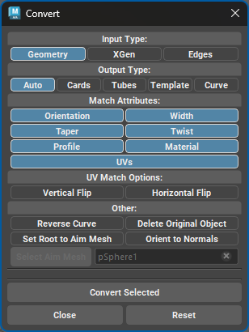
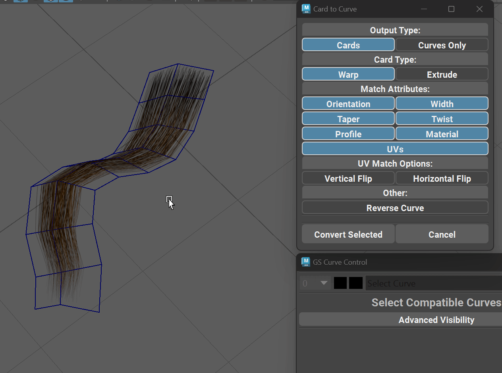

.. currentmodule:: <index>

.. _edge-to-curve-card-to-curve:

#################
Conversion Window
#################

.. _conversion:

Conversion Window
=================

Conversion window holds all the conversion functionality of GS CurveTools. It can convert geometry, XGen or selected geometry edges to NURBS curves or directly to Cards, Tubes or Template objects.

It has three input types (Geometry, XGen and Edges) and it converts them to five different output types (Auto, Cards, Tubes, Template, Curve).

Based on the Input type there will be different options available in the Conversion window.

After the conversion is done there are a number of post-processing options available: Reverse Curve, Delete Original Objects, Use Aim Mesh and Orient to Normals. The last two require a valid Aim Mesh set in the Aim Mesh field.

.. _conversion-from-geometry:

From Geometry
=============

GS CurveTools can convert any number of one-sided geometry or hollow tubes to GS CurveTools Cards, Tubes or regular Maya NURBS curves.

Auto output will determine the shape of the original object (card or tube) and generate new Curve Card or Curve Tube.

Setting specific output will override the auto output shape and use the specified shape.

Source geometry cards or tubes should be separate objects, have no construction history and be one-sided cards or hollow tubes.

It is recommended for the source geometry cards and tubes to have evenly spaced quad geometry, but it is not mandatory.

    Geo to Curve function in action

Geo to Curve Parameters:
------------------------

.. warning:: Profile attribute matching is only supported when scene units are set to centimeters "cm" (default for Maya). Any other units like inches, meters etc. will not work with Profile matching.

- **Output Type** - controls the desired result of the operation

    - **Auto** will determine the shape of the original object (card or tube) and generate new Curve Card or Curve Tube. 
    - **Cards** will generate procedural Curve Cards with all the options and attributes.
    - **Tubes** will generate procedural Curve Tubes with all the options and attributes.
    - **Templates** will use Auto mode but then apply the Template to the object copying the template params.
    - **Curves** will only generate simple Maya NURBS curves.

- **Match Attributes** controls which attributes to match from the original geometry when creating new cards
    
    - **Orientation, width, taper, twist and profile** - will attempt to set the respective attributes on the new cards to match the original geometry as close as possible.
    - **Material** - will copy the material from the original geometry.
    - **UVs** - will attempt to recreate the UVs on the new cards based on the original geometry UVs. Not an exact operation, as GS CurveTools UVs are limited to square shape.

- **UV Match Options** - will apply a vertical or horizontal flip to the final UVs after matching.

- **Reverse Curve** will reverse the final curve (enabled by default)

- **Delete Original Objects** will delete the original geometry objects after the new procedural cards or tubes were created.

- **Use Aim Mesh** will activate the aim mesh mode. It will use the Aim Mesh object to determine where to place the curve root CV.

- **Orient to Normals** will activate the aim mesh mode. Will automatically orient the newly created objects to the normals of the Aim Mesh.

.. _conversion-from-xgen:

From XGen Description
=====================

.. gifvideo:: images/xgen_conversion.mp4
    :width: 350
    :align: right

This will convert any selected XGen description (Interactive Groom only) to GS CurveTools Cards, Tubes, Templates or regular Maya NURBS curves.

XGen description can be selected from the Outliner or in the XGen window.

Reverse Curve, Use Aim Mesh and Orient to Normals options are exactly the same as for the :ref:`Geometry conversion<conversion-from-geometry>`.

|

.. _conversion-from-edges:

From Edges
==========

.. gifvideo:: images/convert_from_edges.mp4
    :width: 350
    :align: right

Edge to Curve function will convert any number of selected edge groups to Maya NURBS curves.

Edge groups are edge selections that are not connected (have no common vertices). Function will automatically separate them into groups and convert them to separate curves.

Reverse Curve, Use Aim Mesh and Orient to Normals options are exactly the same as for the :ref:`Geometry conversion<conversion-from-geometry>`.
