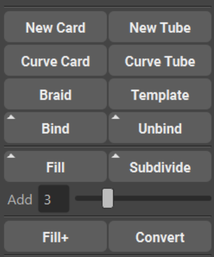
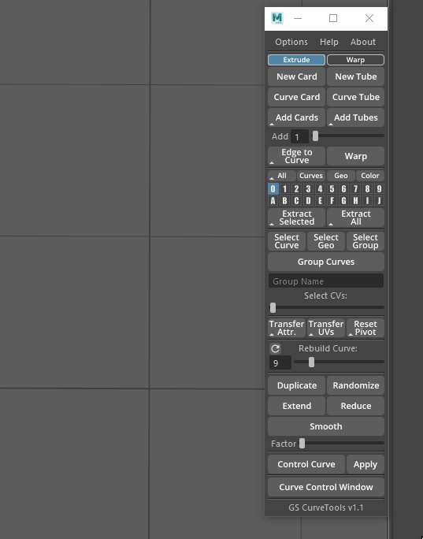
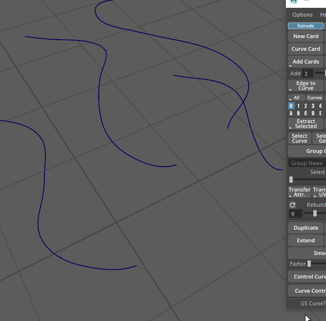
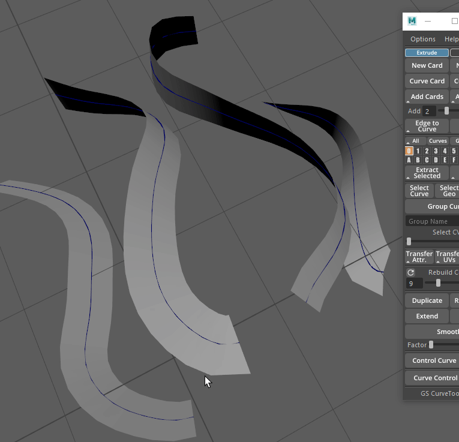
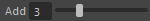
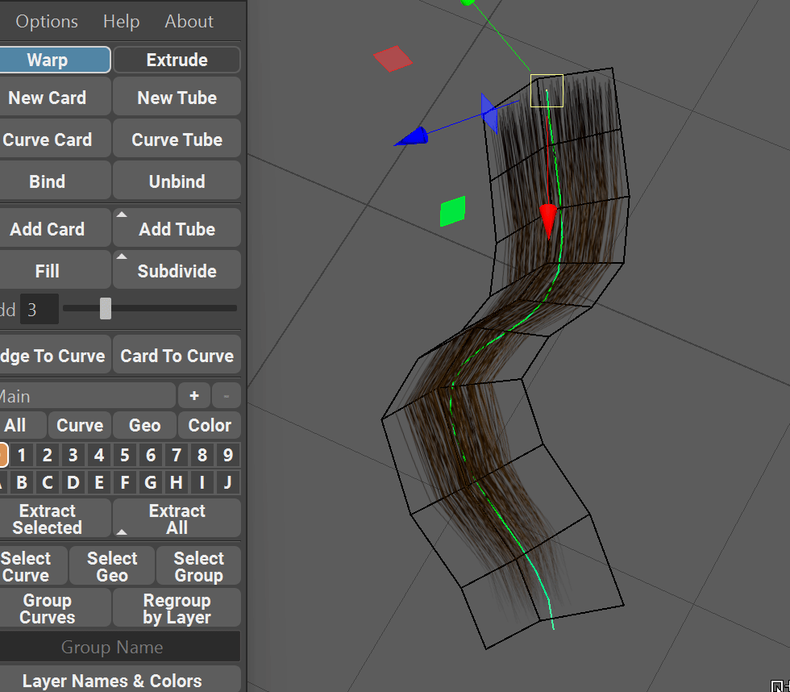
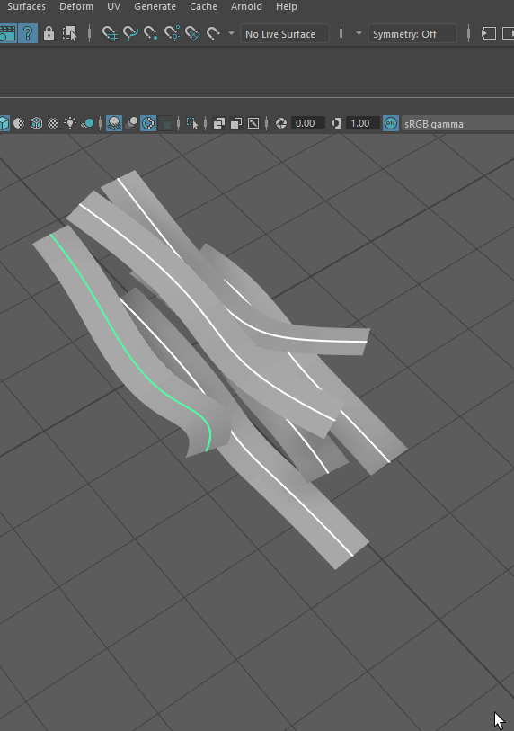

.. currentmodule:: <index>

.. _creating-cards-and-tubes:

###########################
Curve Cards and Curve Tubes
###########################

Intro
=====

In this chapter we will discuss all the regular creation methods for cards, tubes, braids and bound objects.

GS CurveTools has 4 types of objects available: Cards, Tubes, Braids and Bound objects. You can easily switch between Cards and Tubes by using "Shape" param in the :ref:`Curve Control Window<curve-control-window>`.

You can rename this group or even group it with other groups, but do not rename or move anything inside those groups.

.. _extrude-cards:

Cards and Tubes
===============

.. _new-card-button:

New Card and New Tube
---------------------

**New Card** and **New Tube** buttons will create a default Card or Tube object in the center of the world with the scale defined by the "Scale Factor" in the :ref:`Options Menu<options>` (more on that in the :ref:`Scale Factor<scale-factor>` section). Curves are placed in the selected layer (Layer 0 by default).

|
|
|
|
|
|
|

.. _curve-card-button:

Curve Card and Curve Tube
-------------------------

**Curve Card** and **Curve Tube** will convert any number of selected regular NURBS curves to **Cards** and **Tube** objects. Original curve position will stay the same. Curves are placed in the selected layer (Layer 0 by default).

|
|
|
|
|

.. _braids:

Braid Button
============

.. gifvideo:: images/braid_demo.mp4
    :width: 250
    :align: right

Braid button will either create a new Braid in the center of the scene (no curves selected) or use selected NURBS curves to create new braids from them.

Braids are procedurally generated objects so any changes to their parameters are non-destructive.

Braid function by default creates 3-strand braids with "Flat" pattern, but you can change all the parameters in the :ref:`Curve Control Window<curve-control-window>`.

More details about braid Attributes are in :ref:`Attributes<braid-attributes>` chapter.

.. _template-button:

Template Button
===============

Template button will use currently selected template (:ref:`Curve Control Window<curve-control-window>`) and have different effects based on the selection:

#. If nothing in the scene is selected the Template button will create the current template in the center of the scene.
#. If a curves are selected, the Template button will create a copy of the selected template on that curve.
#. If Curve, Tube, Braid or Bound objects are selected the Template button will copy the parameters from the template to the selected objects.

When holding RMB on the Template button the marking menu will open and you can use Orient to Normals toggle to control if the newly created objects should be oriented to the global base mesh normals or not.

More in the :ref:`Templates<templates>` chapter.

.. _fill-button:

Fill Function
=============

Fill function will copy the objects and distribute them between selected curves blending the attributes between them.

Fill can also output curves without the geometry (as an option in the :ref:`Options Menu<options>`)

Holding **Shift** button while clicking **Fill** button will disable blending of attributes between curve pairs. Instead, attributes will be copied from the first selected curve in the curve pair.

.. _add-cards-button:

Holding RMB on the **Fill** will open a marking menu where you can use Add Card or Add Tube buttons. They will create new Cards or Tubes between selected curves instead of copying the original objects. This marking menu also have Orient to Normals toggle that will control if the newly created objects should be oriented to the global base mesh normals or not.

|

The number of created curves is defined by the **Add** slider. The number of the slider indicates how many curves will be created between each pair of selected curves.

**Selection order is extremely important** here because it defines the direction of added curves. The algorithm adds curves from the first selected curve, to the next in the selection order. So First ⇨ Second ⇨ Third and so on.

Here is an example of two different selection orders:

.. list-table:: Selection Order

  * - .. image:: images/add_cards_selection_01.gif
        :target: _images/add_cards_selection_01.gif

    - .. image:: images/add_cards_selection_02.gif
        :target: _images/add_cards_selection_02.gif

.. _subdivide:

Subdivide
=========

Subdivide command will create multiple copies of the selected curve based on the "Add" slider value.

It will copy all the attributes and material from the original object and place the new objects based on the original object geometry.

Holding **Shift** before clicking on Subdivide will not delete the original card when subdividing.

|
|

Using Maya Deformers
====================

You can use **Maya Deformers** on any number of selected curves without any issues.

If you want to apply the deformer, simply select curves and the deformer and Delete By Type ⇨ History (Alt + Shift + D). Original curves will stay fully functional.

Supported and tested deformers are:

- Lattice
- Bend
- Flare
- Sine
- Squash
- Twist
- Wave

Other deformers might work just fine as well.

|
|

.. warning:: When deleting history it is **very important** to only use **Delete By Type** and **NOT Delete All**. **Delete All** will break all curves in the scene.

