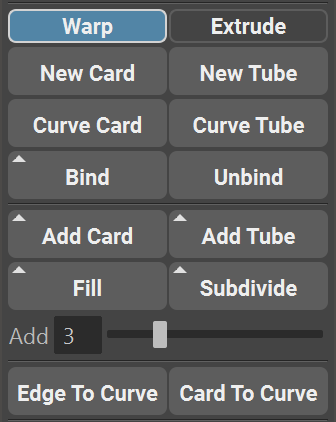

.. currentmodule:: <index>

.. _creating-cards-and-tubes:

###########################
Curve Cards and Curve Tubes
###########################

Intro
^^^^^

In this chapter we will discuss all the types of cards and tubes, difference between them and additional commands available for each type.

GS CurveTools has 4 main types of curves split into two categories: **Extrude** and **Warp**. You can easily switch between categories using Extrude and Warp radio button (switch) on the top of the menu.

**Extrude** will create groups in the outliner called **curveCard** or **curveTube** and Warp mode will create **warpCard** or **warpTube** groups. 

You can rename this group or even group it with other groups, but do not rename or move anything inside those groups.

**Extrude** and **Warp** use completely different algorithms, and in general, **Warp** is more advanced version of **Extrude**.

The main reason why **Extrude** was left as an option is because it has slightly better performance than **Warp** mode. **Warp** mode, on the other hand, has the ability to precisely control the twist and scale along the length of the curve, as well as detaching the length of the geometry from the length of the curve etc.

.. note:: For relatively powerful PC there should be almost no difference, but if you are experiencing performance issues it is better to use **Extrude** mode. Both **Extrude** and **Warp** modes are fully compatible with all the functions of the GS CurveTools plug-in.

.. _extrude-cards:

Extrude Mode
^^^^^^^^^^^^

**New Card** and **New Tube** buttons will create a default Curve Card or Curve Tube in the center of the world with the scale defined by the "Scale Factor" in the options menu (more on that in the Options Chapter). This simplest command is the best way to start off your project. Curves are placed in the selected layer (Layer 0 by default)

|
|
|
|
|
|

**Curve Card** and **Curve Tube** will convert any number of selected normal curves to **Curve Cards** and **Curve Tubes**. Instanced curves will be automatically converted to normal curves. Original curve position will stay the same. Curves are placed in the selected layer (Layer 0 by default)

|
|

Fill function is similar to :ref:`Add Cards and Tubes <add-cards-button>`, but it is compatible with :ref:`Bind <bind-unbind>` geometry. It will copy the first selected curve and distribute it like Add Cards does.

Fill function is generally a recommended way of adding new curves in-between other curves as it is faster and more reliable than Add Cards and Tubes.

Fill can also output curves without the geometry (as an option in the :ref:`Options Menu<options>`)

**Add Cards** and **Add Tubes** will add cards/tubes in-between selected cards/tubes. Curves are placed in the selected layer (Layer 0 by default)

The attributes of those selected curves will be smoothly blended between new added curves to provide more natural feel to the transition.

Holding **Shift** button while clicking **Add Cards**/**Tubes** buttons will disable blending of attributes between curve pairs. Instead, attributes will be copied from the first selected curve in the curve pair.

The number of crated curves is defined by the **Add** slider. The number of the slider indicates how many curves will be created between each pair of selected curves.

**Selection order is extremely important** here because it defines the direction of added curves. The algorithm adds curves from the first selected curve, to the next in the selection order. So First ⇨ Second ⇨ Third and so on.

Here is an example of two different selection orders:

.. list-table:: Selection Order

  * - .. image:: images/add_cards_selection_01.gif
        :target: _images/add_cards_selection_01.gif

    - .. image:: images/add_cards_selection_02.gif
        :target: _images/add_cards_selection_02.gif

.. _warp-cards:

Warp Mode
^^^^^^^^^

**Warp Mode** mirrors the **Extrude** functionality but creates Warp Cards and Tubes instead. These advanced curves have additional options:

**Twist Curve Graph:**

Twist at any point along the curve using **Twist Curve** graph in the Curve Control Window.

The graph can be reset to default using **Reset Curve** button.

|
|

**M:** field controls the **Magnitude** of the **Curve Twist Graph**. Changing this value will increase or decrease the effect that **Twist Curve Graph** has on the twisting of the curve.

|
|
|
|
|

**Width Curve Graph:**

	
Using this graph you can scale the curve width at any point along the curve.

The graph can be reset to default using **Reset Curve** button.

|
|
|
|
|

Both graphs can be detached from the Curve Control Window into their own windows using **"^"** button so you can scale and position them as you see fit. If you need better resolution, just detach the graph and scale it.

|
|
|
|
|
|
|

Both graphs support **adding and removing additional points** to further enhance the control over the curve.

|
|
|
|
|
|

**Length Unlock** will unlock the stretching of the geometry and allow for precise control over the length of the geometry.

|
|
|
|
|
|

.. _subdivide:

Subdivide
^^^^^^^^^

Subdivide command will create multiple copies of the selected curve based on the "Add" slider value.

It will copy all the attributes and material from the original object and place the new objects based on the original object geometry.

Holding **Shift** before clicking on Subdivide will not delete the original card when subdividing.

|
|

Using Maya Deformers
^^^^^^^^^^^^^^^^^^^^

You can use **Maya Deformers** on any number of selected curves without any issues.

If you want to apply the deformer, simply select curves and the deformer and Delete By Type ⇨ History (Alt + Shift + D). Original curves will stay fully functional.

Supported and tested deformers are:

- Lattice
- Bend
- Flare
- Sine
- Squash
- Twist
- Wave

Other deformers might work just fine as well

|
|

.. warning:: When deleting history it is **very important** to only use **Delete By Type** and **NOT Delete All**. **Delete All** will break all curves in the scene.

