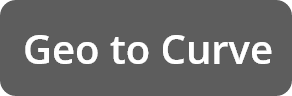
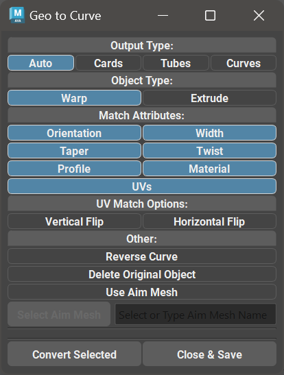

.. currentmodule:: <index>

.. _edge-to-curve-card-to-curve:

###############################
Edge to Curve and Geo to Curve
###############################

.. _edge-to-curve:

Edge to Curve
^^^^^^^^^^^^^

.. image:: images/buttons/edge_to_curve.png
    :width: 150px

Edge to Curve function will convert any number of selected edge groups to Maya NURBS curves.

Edge groups are edge selections that are not connected (have no common vertices). Function will automatically separate them into groups and convert them to separate curves.

.. _card-to-curve:

Geo to Curve
^^^^^^^^^^^^^

Geo to Curve function will create a GS CurveTools procedural cards or tubes from any number of selected compatible geometry.

Clicking on Geo to Curve button will open a new window where user can configure the options and convert selection.

Selecting any compatible one sided geometry or geometry tube and clicking on Convert Selected will attempt to convert the selection to GS CurveTools Cards or Tubes based on the topology and options selected.

Source geometry cards or tubes should be separate objects, have no construction history and be one-sided cards or hollow tubes.

It is recommended for the source geometry cards and tubes to have evenly spaced quad geometry, but it is not mandatory.

.. figure:: images/card-to-curve-demo.gif
    :align: center
    :width: 400px

    Geo to Curve function in action

**Geo to Curve Parameters:**

.. warning:: Profile attribute matching is only supported when scene units are set to centimeters "cm" (default for Maya). Any other units like inches, meters etc. will not work with Profile matching.

- **Output Type** - controls the desired result of the operation

    - **Auto** will determine the shape of the original object (card or tube) and generate new Curve Card or Curve Tube. 
    - **Cards** will generate procedural Curve Cards with all the options and attributes.
    - **Tubes** will generate procedural Curve Tubes with all the options and attributes.
    - **Curves** will only generate simple Maya NURBS curves.

- **Card Type** - determines the output Card type (:ref:`Warp<warp-cards>` or :ref:`Extrude <extrude-cards>`)

- **Match Attributes** controls which attributes to match from the original geometry when creating new cards
    
    - **Orientation, width, taper, twist and profile** - will attempt to set the respective attributes on the new cards to match the original geometry as close as possible.
    - **Material** - will copy the material from the original geometry.
    - **UVs** - will attempt to recreate the UVs on the new cards based on the original geometry UVs. Not an exact operation, as GS CurveTools UVs are limited to square shape.

- **UV Match Options** - will apply a vertical or horizontal flip to the final UVs after matching.

- **Reverse Curve** will reverse the final curve (enabled by default)

- **Delete Original Objects** will delete the original geometry objects after the new procedural cards or tubes were created.

- **Use Aim Mesh** will activate the aim mesh mode. When this mode is active and the Aim Mesh is set in the field the algorithm will check to see if the root CV of the generated curve is the closest to the Aim Mesh surface. If the root CV is further from the mesh than the tip CV, the curve will be flipped. This is useful to ensure that the root CV is the closest to the scalp of the model, as it should be in most of the hair models. Select Aim Mesh will copy the name of the selected mesh to the field.