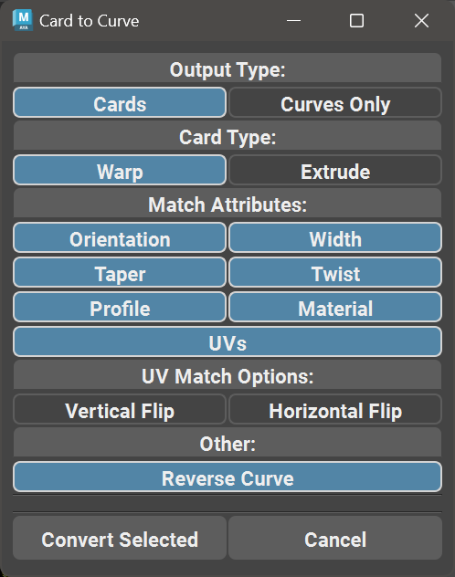
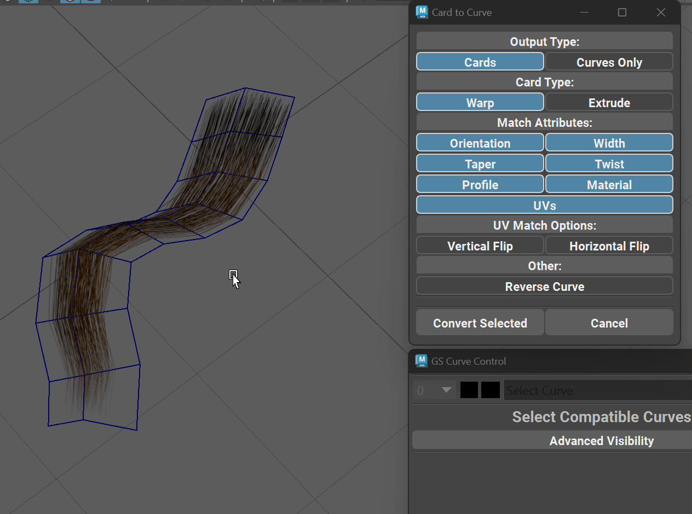

.. currentmodule:: <index>

.. _edge-to-curve-card-to-curve:

###############################
Edge to Curve and Card to Curve
###############################

.. _edge-to-curve:

Edge to Curve
^^^^^^^^^^^^^

.. image:: images/buttons/edge_to_curve.png
    :width: 150px

Edge to Curve function will convert any number of selected edge groups to Maya NURBS curves.

Edge groups are edge selections that are not connected (have no common vertices). Function will automatically separate them into groups and convert them to separate curves.

.. _card-to-curve:

Card to Curve
^^^^^^^^^^^^^

Card to Curve function will create a GS CurveTools procedural cards from any number of selected one sided geometry cards.

Clicking on Card to Curve button will open a new window where user can configure the operation.

Selecting any compatible one sided geometry and clicking on Convert Selected will attempt to convert the selection to GS CurveTools Cards.

Source geometry cards should be separate objects, have no construction history and be one-sided.

It is recommended for the source geometry cards to have evenly spaced quad geometry.

    Card to Curve function in action

**Card to Curve Parameters:**

.. warning:: Profile attribute matching is only supported when scene units are set to centimeters "cm" (default for Maya). Any other units like inches, meters etc. will not work with Profile matching.

- **Output Type** - controls the desired result of the operation

    - **Cards** will generate Curve Cards with all the options and attributes 
    - **Curves** only will generate simple Maya NURBS curves

- **Card Type** - determines the output Card type (:ref:`Warp<warp-cards>` or :ref:`Extrude <extrude-cards>`)

- **Match Attributes** controls which attributes to match from the original geometry when creating new cards
    
    - **Orientation, width, taper, twist and profile** - will attempt to set the respective attributes on the new cards to match the original geometry as close as possible.
    - **Material** - will copy the material from the original geometry.
    - **UVs** - will attempt to recreate the UVs on the new cards based on the original geometry UVs. Not an exact operation, as GS CurveTools UVs are limited to square shape.

- **UV Match Options** - will apply a vertical or horizontal flip to the final UVs after matching.

- **Reverse Curve** will reverse the final curve (enabled by default)