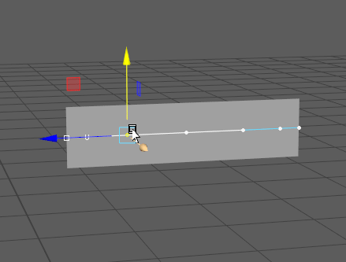
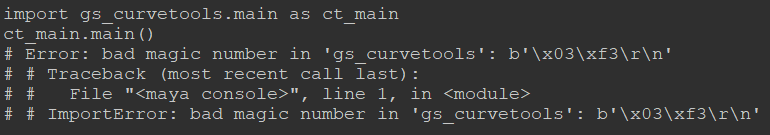
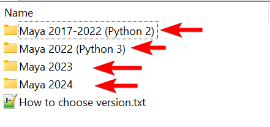

.. currentmodule:: <index>

########################################
Frequently Asked Questions and Solutions
########################################

Here you can find some of the common questions/issues and possible solutions to them. 

This list is always updating.

---------

Card Orientation Flip
^^^^^^^^^^^^^^^^^^^^^

**Issue:**

If you move the CVs of the curve in object space too much (complete rotation for example) you might need to reset the Optimal Tangent Axis to avoid undesirable rotation.

**Explanation:**

The geometry generator uses initial axis to determine the initial orientation of the geometry. This axis is set in a way that normal edits and world rotation of the curve does not affect the stability of the geometry. However, if user rotates the curve in the object space (by moving CVs, not by moving the curve itself in world space) that initial axis becomes invalid.

**Solution/Workaround:**

You simply need to use "Set Optimal Tangent" function when curves are selected and it will automatically re-calculate and adjust it for you. No other actions needed.

.. note:: To avoid this it is recommended to rotate the curve object itself, not its CV components.

---------

Geometry was Left Behind When Deleting Curves
^^^^^^^^^^^^^^^^^^^^^^^^^^^^^^^^^^^^^^^^^^^^^

.. image:: images/structure_of_card_object.png
	:align: right
	:width: 200px

**Explanation:**

When the user deletes **only** the curve component (**pathCurve1**) and not the entire card group (**gsCard1**), the geometry will not be removed and will just be stuck there without any curve to control it.

**Solution/Workaround:**

Since v1.3 there is a convenient hotkey available in the Hotkey Editor ⇨ Custom Scripts ⇨ GS ⇨ GS_CurveTools ⇨ Utilities ⇨ Delete Curves

The **correct** way to delete cards/tubes is to **delete the entire group** that holds all of the components of that card/tube. **Do not** delete only the curve (**pathCurve#**), delete the entire group (**gsCard, gsBraid etc.**). Select the **Curve** ⇨ **press UP** on the keyboard (this will select the entire card) ⇨ **Delete**.

---------

Can I use Z-up World Coordinates?
^^^^^^^^^^^^^^^^^^^^^^^^^^^^^^^^^

The plug-in should work just fine in Z-up, however you might encounter some issues like default cards being created in a different orientation and some inconsistencies in orientations of cards created using **Curve Card** and **Add Card** functions.

In general it is recommended to use Y-up world coordinates to avoid any incompatibilities.

---------

"Bad Magic Number" Error
^^^^^^^^^^^^^^^^^^^^^^^^

**Explanation:**

Bad Magic Number error indicates that the host (Maya) is using different version of Python than the script (GS CurveTools).

**Solution/Workaround:**

During the :ref:`installation of GS CurveTools<installation-steps>` make sure to use the correct version of Maya in the zip file. Read the "How to choose version.txt" for details:

.. code-block::

	How to choose version

	If you are using old versions of Maya (2017-2020):
	- Use Maya 2017-2022 (Python 2) folder

	If you are using Maya 2022, but run it in Python 2 compatibility mode (for older scripts):
	- Use Maya 2017-2022 (Python 2) folder

	If you are using Maya 2022 in the default Python 3 mode:
	- Use Maya 2022 (Python 3) folder

	If you are using Maya 2023:
	- Use Maya 2023 folder

	If you are using Maya 2024:
	- Use Maya 2024 folder
