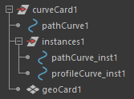

.. currentmodule:: <index>

########################################
Frequently Asked Questions and Solutions
########################################

Here you can find some of the common questions/issues and possible solutions to them. 

This list is always updating.

---------

Maya 2020-2022 and Broken UVs
^^^^^^^^^^^^^^^^^^^^^^^^^^^^^

**Issue:**

Only for Maya 2020 and 2022. UVs are not working after save and reload of the scene. UV parameters are correct but UVs on the existing cards seem to be wrong. Changing UV parameters on cards created before the save has no effect. New cards are working correctly.

**Explanation:**

First of all, this issue is not related to GS CurveTools in any way.

This issue is related to Maya 2020, 2020.1, 2020.2 and 2022 and the bug it has with saving/loading Maya Binary scene files (.mb). During the reload of the scene the inputComponents list used in polyMoveUV nodes is getting corrupted and shows as nmm[*] instead of map[*]. This bug was reported for Maya 2020, 2020.1, 2020.2, 2022 and was FIXED in 2023.

**Solution/Workaround:**

This issue only appears when loading Maya Binary (.mb) scene files and not Maya ASCII files (.ma). You can easily fix your already corrupted cards using a fix command built in to GS CurveTools plugin:

Steps: 

	1. Open your Maya Binary file 

	2. Apply the "Fix Maya 2020-2022 UV Bug" fix in the Options Menu of GS CurveTools 

	3. Save the scene as Maya ASCII using "Save Scene As" 

	4. It should now work perfectly fine 

Maya ASCII loading times can be a bit longer, but should work just fine in Maya 2020.

---------

When rebuilding a curve it distorts (small curves)
^^^^^^^^^^^^^^^^^^^^^^^^^^^^^^^^^^^^^^^^^^^^^^^^^^

**Issue:**

When the scale of the curve is very small the nurbs curve (the one used to control the card) can distort during rebuilding at certain rebuild values.
This issue is also present in native Maya curves and native Maya rebuild command.

**Explanation:**

When curves are very small and Maya tries rebuilding it it lacks the necessary precision for certain operations. It's the issue with all maya curves, not only GS CurveTools ones.

**Solution/Workaround:**

There are several ways to fix this issue:

1. Using smaller values of :ref:`Precision Scale<precision-scale>`. The default value of 0.05 is suitable for most of the curves in normal project, but sometimes the value can be lowered to 0.01 if distortion occurs.

2. Using :ref:`Smooth<smooth>` function right after the rebuild if distortion has occurred.

**Video Demo:**

.. raw:: html

	<video width="400" controls>
	<source src="_static/curve_rebuild_distortion.mp4" type="video/mp4">
	Your browser does not support the video tag.
	</video>

---------

.. _stuck-graphs:

Maya 2020 Width and Twist graphs "stuck"
^^^^^^^^^^^^^^^^^^^^^^^^^^^^^^^^^^^^^^^^

**Issue:**

In Maya 2020 it is hard to move points on Width and Twist graphs. Creating new points works fine, but moving existing ones feels like they are loosing left click "signal". Consecutive clicks and drags will eventually move the point properly.

**Explanation:**

This is a bug with Maya 2020 and its widget called "falloffCurveAttr". This issue is only present in Maya 2020. All the other versions behave as expected. This can't be fixed in GS CurveTools as this is a native Maya issue. Autodesk did not fix it in Maya 2020.4, the latest patch for 2020.

**Solution/Workaround:**

The only option is to downgrade to 2019 or update to 2022+ versions since Autodesk rarely patches old versions.

---------

.. _broken-graphs:

Graphs are Broken After Reloading
^^^^^^^^^^^^^^^^^^^^^^^^^^^^^^^^^

**Issue:**

In some rare cases Width or Twist graphs can become broken after the reload of Maya.
The issue is native to Maya and is caused by the CurveWarp node.

This issue has nothing to do with CurveTools or its code.

**Explanation:**

Maya graphs can be corrupted during safe/reload sequence.

This only occurs when the graph nodes (dots on a graph) are in their extreme points (0 or 1) shown on the image.
It is something internal to CurveWarp node, to which there is no access. It is a compiled plug-in and it can't be fixed by anyone but Autodesk.

Autodesk repeatedly notified about this issue being fixed (at least in 2019 and 2022 release notes).
The issue persists still in the 2022.

The issue can be replicated without loading CurveTools, by simply creating a CurveWarp node with geo attached and making aforementioned changes to the built-in graphs.

**Solution/Workaround:**

Since this issue can't be fixed from my end, there's only workarounds. 

**GS CurveTools v1.2.4+** you can simply click on "Reset Curve" under the graph to reset it to defaults. You can also use "Fix Broken Graphs" function in the options menu to attempt to fix all the graphs in the scene and restore their parameters.

|

**Video demonstration of CurveWarp node issue (Maya 2022):**

.. raw:: html

	<video width="400" controls>
	<source src="_static/curve_warp_bug.mp4" type="video/mp4">
	Your browser does not support the video tag.
	</video>

---------

Corrupted Layer Names
^^^^^^^^^^^^^^^^^^^^^

**Issue:**

Sometimes, layer names can become corrupted due to user error.
User can see errors like:

.. code:: text

	--------------------------------------------------------------
	ValueError: invalid literal for int() with base 10: 'curveGrp'
	--------------------------------------------------------------
	[GS CurveTools|ERROR]: Failed to extract layer ID from layer "pasted__curveGrp_1_Geo". Display Layer name is corrupted. Please delete corrupted layers and curves.
	Warning: Failed to extract layer ID from layer "pasted__curveGrp_1_Geo". Display Layer name is corrupted. Please delete corrupted layers and curves.

or similar...

**Explanation:**

This mainly happens when user accidentally Copies and Pastes cards in the scene (Ctrl+C, Ctrl+V) instead of using :ref:`Duplicate<duplicate>` command. This leads to name corruption and other errors. This issue can also happen if user imports (using Maya import) from a scene with GS CurveTools objects (cards or tubes). Only import and export curves using GS CurveTools ⇨ Options ⇨ Export/Import function.

**Solution:**

The only solution to this issue is to delete the pasted cards and tubes and also delete pasted display layers. You can find the display layers in Windows⇨Relationship Editors⇨Display Layers window.

**Video Demonstration of deleting the corrupted cards:**

.. raw:: html

	<video width="400" controls>
	<source src="_static/deleting_corrupted_cards.mp4" type="video/mp4">
	Your browser does not support the video tag.
	</video>

**Video Demonstration of deleting the corrupted layers:**

.. raw:: html

	<video width="400" controls>
	<source src="_static/deleting_corrupted_layers.mp4" type="video/mp4">
	Your browser does not support the video tag.
	</video>

---------

Maya 2018.0-2018.1 Random Deformations Issue (stuck vertices)
^^^^^^^^^^^^^^^^^^^^^^^^^^^^^^^^^^^^^^^^^^^^^^^^^^^^^^^^^^^^^

**Issue:**

Using orientation parameter after changing the divisions parameters causes the vertices of the card to deform in an unexpected way.

**Explanation:**

This issue appears only in Maya 2018.0 and 2018.1 versions and is not connected to GS CurveTools.
User can replicate this same behavior by creating any object, applying a lattice deformer to it and trying to change the number of divisions on that object procedurally (on sphere, plane or other starter object) and trying to rotate the object using the deformer transform node.
This issue is due to lattice deformer bug that was fixed in a subsequent versions.

**Solution/Workaround:**

The only solution to this problem is to use the latest patch of Maya 2018 (2018.6).
Updating to 2018.6 was confirmed to fix this issue completely.

**Video demo of the issue:**

.. raw:: html

	<video width="400" controls>
	<source src="_static/2018_deformation_issue.mp4" type="video/mp4">
	Your browser does not support the video tag.
	</video>

---------

Warp Card Orientation Flip
^^^^^^^^^^^^^^^^^^^^^^^^^^

**Issue:**

In some cases Warp bound geometry (Warp Cards, Tubes and Custom Geometry) can randomly flip its orientation and behave seemingly erratic.

**Explanation:**

The issue here lies within Maya itself and its **curveWarp** node and in particular its "Aim" or Normal Direction calculation. This issue only appears when the curve has its object space rotation in Y axis set to 90 degrees, or very close to 90. This confuses the algorithm and it flips the normal orientation when some part of the curve crosses a specific boundary. This results in geometry flipping its orientation.

**Solution/Workaround:**

Since this issues is fundamental to Maya and can't be fixed without rewriting the curveWarp node from scratch, the only thing that user can do is to **avoid using Y axis rotation** on the curve and primarily using **Orientation** parameter in Curve Control Window.

.. important:: To avoid the need of Y axis rotation it is also recommended to use Y-up axis World Coordinate System (default), over Z-up axis.

.. note:: In general using curve parameters such as **Width** and **Orientation** is recommended over Mayas Rotation and Scale parameters.

---------

Geometry was Left Behind When Deleting Curves
^^^^^^^^^^^^^^^^^^^^^^^^^^^^^^^^^^^^^^^^^^^^^

**Explanation:**

When the user deletes **only** the curve component (**pathCurve1**) and not the entire card group (**curveCard1**), in some cases (warp cards, tubes) the geometry cards will appear in the origin of the scene (0,0,0). This happens because the curve that was deforming the geometry is deleted, but the geometry itself is still in the scene. That geometry is what appears in the origin of the scene.

**Solution/Workaround:**

Since v1.3 there is a convenient hotkey available in the Hotkey Editor ⇨ Custom Scripts ⇨ GS ⇨ GS_CurveTools ⇨ Utilities ⇨ Delete Curves

The **correct** way to delete cards/tubes is to **delete the entire group** that holds all of the components of that card/tube. **Do not** delete only the curve (**pathCurve#**), delete the entire group (**curveCard, curveTube etc.**). Select the **Curve** ⇨ **press UP** on the keyboard (this will select the entire card) ⇨ **Delete**.

---------

Can I use Z-up World Coordinates?
^^^^^^^^^^^^^^^^^^^^^^^^^^^^^^^^^

The plug-in should work just fine in Z-up, however you might encounter some issues like default cards being created in a different orientation and some inconsistencies in orientations of cards created using **Curve Card** and **Add Card** functions.

In general it is recommended to use Y-up world coordinates to avoid any incompatibilities.

---------

"Bad Magic Number" Error
^^^^^^^^^^^^^^^^^^^^^^^^

**Explanation:**

Bad Magic Number error indicates that the host (Maya) is using different version of Python than the script (GS CurveTools).

**Solution/Workaround:**

During the :ref:`installation of GS CurveTools<initialize>` make sure to use the correct version of Maya in the zip file. Read the "How to choose version.txt" for details:

.. code-block::

	How to choose version

	If you are using old versions of Maya (2017-2020):
	- Use Maya 2017-2022 (Python 2) folder

	If you are using Maya 2022, but run it in Python 2 compatibility mode (for older scripts):
	- Use Maya 2017-2022 (Python 2) folder

	If you are using Maya 2022 in the default Python 3 mode:
	- Use Maya 2022 (Python 3) folder

	If you are using Maya 2023:
	- Use Maya 2023 folder

	If you are using Maya 2024:
	- Use Maya 2024 folder