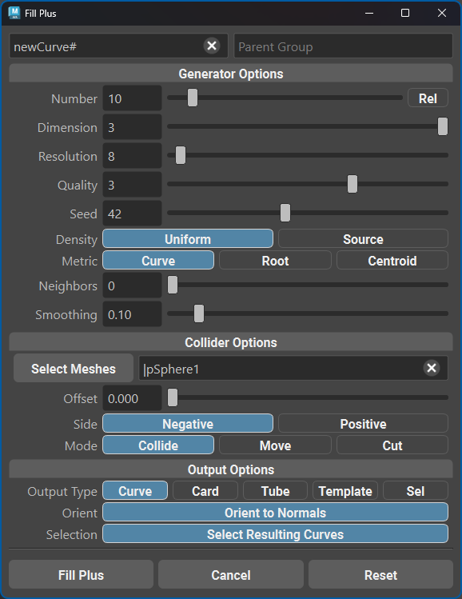

.. currentmodule:: <index>

.. _fill-plus:

#########
Fill Plus
#########

**Fill Plus** is an extension of the regular :ref:`Fill<fill-button>` function.

Where the regular Fill function will copy and distribute curves between selected curves in the exact order you selected them, Fill Plus will work with the space between the selected curves regardless of the selection order. Based on the parameters (neighbors and dimension), it will either fill the volume between the curves or select pairs of curves by proximity and add new curves between them.

**Fill Plus** button will generate the new curves and **Reset** will reset the parameters to their default values.

.. note:: Fill Plus is highly dependent on a good selection of curves. If you select curves that are very far apart and don't have supporting curves in the middle, the algorithm will not do a great job of adding the intermediate curves.

Initial Setup
=============

.. gifvideo:: images/fill_plus_demo.mp4
    :align: right
    :width: 250

Before using Fill Plus you can select the new curve names and whether to add new curves to a separate group upon creation.

At the top of the window there are two input fields. The left one will define the curve names and the right one will define the parent group name. It can either be an existing group or the tool will create it.

Generator Options
=================

Generator options are what control the shape of the generated curves:

- **Number/Rel** - will define the absolute number of created curves or, if "Rel" is checked, the relative number of curves between the selected curves.
- **Dimension** - will define the interpolation topology, meaning the shape of the interpolation between the curves. Dimension 1 means just pairs of curves that are connected with a flat ribbon (similar to regular Fill). Dimension 2 means triangular surfaces between three curve candidates. Dimension 3 means volumetric regions between the curves. Default is volumetric generation (3), but you can just check which one works better for your situation.
- **Resolution** - final resolution of the generated curves. Essentially the number of points in the curve.
- **Quality** - the quality of the interpolation and generation. Higher quality will take longer to generate.
- **Seed** - random seed for the generation. Will change the generated curves distribution even if all the other parameters are exactly the same.
- **Density** - defines whether the density of the source curves (how close they are to each other) affects the generated curves distribution.
- **Metric** - which curves are counted as neighbors. Curve - average distance between all the points on the curves. Root - distance between root CVs. Centroid - distance between averaged center points of the curves.
- **Neighbors** - how many curves are considered neighbors by the algorithm. 0 - all the curves are neighbors.
- **Smoothing** - how much smoothing is applied to the generated curves after they are created.

Collider Options
================

Collider options define how the curves are interacting with the base mesh (collider).

- **Collider Mesh Names** - the names of the collider meshes involved in the calculations. If no meshes are set, the collision will be disabled completely. You can use the "Select Meshes" button to quickly set selected meshes as colliders.
- **Offset** - how much the resulting curves are offset from the collider meshes.
- **Side** - which side of the collider meshes is considered an "inaccessible" area. Negative means inside of the mesh (negative surface normals) and positive is the reverse.
- **Mode** - collision mode. Cut will cut the curves at the collider mesh boundary. Move will move the curves along the normals of the collider meshes. Collide will sample all the generated CVs and offset them along the collider surface normals so they are not penetrating the mesh.

Output Options
==============

Output options define the expected output of the Fill Plus command.

- **Output Type** - what kind of output will be generated. Curves are the default ones. Card/Tube will generate new Cards and Tubes. Template will use the currently selected Template. Sel will use selection and generate similar objects.
- :ref:`Orient to Normals<orient-to-normals>` - whether to orient the generated cards, tubes, templates to the surface of the collider meshes.
- **Selection** - whether to select the generated cards, tubes, or templates.
