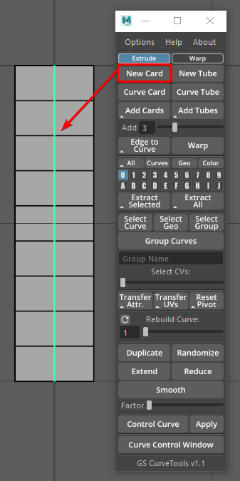
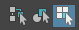
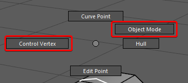
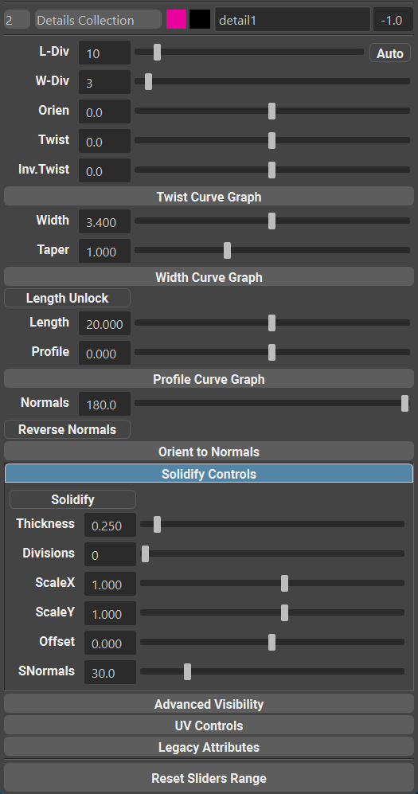
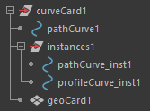

.. currentmodule:: <index>

#########################
Main Menu and First Steps
#########################

Intro
^^^^^

GS CurveTools main function is to create and manipulate geometry that is bound to a curve.

This is useful in many ways. You can create hair cards for games. Belts and straps for characters. Tubes, pipes and cables for environments and much more.

GS CurveTools also allows for an advanced geometry manipulation, for example complex braided cables, hair braids, clusters of hair cards all controlled by a single curve in a natural way.

In this chapter we will go through the main concepts of the plug-in.

.. note:: If you want in-depth functionality explanation, please select appropriate chapter from the Table of Contents on the left.

Basic Workflow Example
^^^^^^^^^^^^^^^^^^^^^^

Start by creating a simple curve card with Add Card button. Now try modifying the curve that was created. 

You can switch to "Control Vertex" editing mode by selecting "Select by Component Type" in the Maya Menu or by pressing F8. 

You can also access Marking Menu of the curve by holding RMB. There you can switch between control vertex and object selection modes.

Now open :ref:`Curve Control Window <attributes>` by pressing the button with the same name.

Here you will find all the main controls for the curve.

Now select your curve and click :ref:`Duplicate <duplicate>` button. You now have two curves with the same attributes, UVs and material.

.. note:: To read about UVs setup, please read the appropriate section in the Table of Contents (Textures and UVs, UV Editor)

By default, :ref:`Layer <layers>` 0 is selected and all new curves will go there. You can switch between layers by simply clicking on them. All the new curves (except for duplicated ones) will go into selected layers. Duplicated curves will inherit the layer of the original selected curve.

.. _main-menu:

Main Menu
^^^^^^^^^

Main Menu is a simple window that can be docked to any place within Maya main window

Main Menu is split into 5 logical sections:

    .. image:: images/options_help_about.png
        :align: right
        :width: 150px

#. On the top of the menu are :ref:`Options <options>`, Help and About drop down menus:

    a. **Options** menu holds various tweaks that you can use to alter functionality of the plug-in.
    #. **Help** menu holds main links to documentation as well as contacts and social media links of the author.
    #. **About** menu holds information about the version of the plug-in and licensing details.

    .. image:: images/creation_section.png
        :align: right
        :width: 150px

#. In the :ref:`Creation Section <creating-cards-and-tubes>` you will find all the commands that create new cards or tubes, modify existing curves, add cards between other cards, convert edges of poly objects to curves and advanced geometry and curves binding function - :ref:`Bind and Unbind <bind-unbind>`.
    
    a. Switch buttons :ref:`Warp <warp-cards>` and :ref:`Extrude <extrude-cards>` will switch between two curve creation modes. Extrude is the basic geometry creation that existed before v1.1 and Warp is the new, advanced, algorithm that adds a lot of new controls to created curves.
    #. :ref:`New Card <new-card-button>` and :ref:`New Tubes <new-card-button>` will create a default card or tube in the center of the world.
    #. :ref:`Curve Card <curve-card-button>` or :ref:`Curve Tube <curve-card-button>` will convert any Maya curve to fully functional Curve Card or Tube
    #. :ref:`Bind and Unbind <bind-unbind>` buttons allow for advanced binding of geometry and curves to other curves. More details in the **Bind** section.
    #. :ref:`Add Cards and Add Tubes <add-cards-button>` will create new Cards or Tubes between selected Curve Cards or Curve Tubes. The number of created curves is controlled by **Add** slider
    #. :ref:`Fill <fill-button>` will create duplicate selected Cards, Tubes or Bound objects and distribute them in-between selected curves. In comparison to Add Cards and Add Tubes, Fill is faster, more reliable, compatible with Bound objects and in general a recommended way of adding new cards in-between other cards.
    #. :ref:`Edge to Curve <edge-to-curve>` will convert any selected edge groups to CV curves.
    #. :ref:`Card to Curve <card-to-curve>` function allows to convert selected one sided geometry to Curve Cards.
    #. :ref:`Subdivide <subdivide>` will replace any selected card with multiple duplicates based on the Add slider.

    .. image:: images/layer_section.png
        :align: right
        :width: 150px

#. :ref:`Layer Section <layers>` consists of three filters and one color mode toggle, 20, 30, 40, 60 or 80 available curve layers and geometry extraction buttons:

    a. :ref:`Filters <layers>` allow you to quickly show/hide all curve cards, show only curves, show only geometry and enable geometry colorization mode.
    #. :ref:`Color mode <layer-customization>` will change the color of all the cards based on the Layer color.
    #. :ref:`20 Layers <layers>` (by default) switch buttons allow for advanced and intuitive organization of curve cards. New curves are placed in the selected layer. Using Marking Menu (Hold RMB) you can transfer curves between layers, hide individual layers, change selectability of geometry and more.
    #. :ref:`Extract Selected <extract-buttons>` will extract geometry from selected curves. Holding Shift during extraction will result in separated cards, instead of one combined mesh. Holding Ctrl will open Export window and delete extracted geometry after export.
    #. :ref:`Extract All <extract-buttons>` will extract geometry from all layers. Holding Shift during extraction will result in separated cards, instead of one combined mesh. Holding Ctrl will open Export window and delete extracted geometry after export.

    .. image:: images/selection_transfer_section.png
        :align: right
        :width: 150px

#. :ref:`Selection and Transfer Section <selection>` adds additional useful functions to control Curve Cards/Tubes attributes and grouping.

    a. :ref:`Select Curve, Select Geo, Select Group <selection>` will select the appropriate Curve Card component. Refer to `Structure of the Curve Card/Tube Object`_.
    #. :ref:`Group Curves button and Group Name<group-curves>` field allows for quick grouping of selected curves in the Outliner. Selected curves will be placed in one group named based on the Group Name filed text. Default name will be used if the filed is empty.
    #. :ref:`Select CVs Slider <select-slider>` will quickly select CVs based on the slider position. Select curves and drag the slider.
    #. :ref:`Transfer Attr<transferring-attributes>` and :ref:`Transfer UVs<transferring-uvs>` button will transfer appropriate attributes and UVs from one selected curve to all other curves in selection list. Holding RMB on these buttons will open a marking menu to :ref:`Copy-Paste<copy-paste-attributes>` and :ref:`Filter<attribute-filters>` transferred attributes.
    #. :ref:`Reset Pivot <reset-pivot>` will reset the manipulator pivot to the first CV of the curve.
    
    .. image:: images/utility_section.png
        :align: right
        :width: 150px

#. :ref:`Utility Section <utility>` holds advanced functions that change the curve density, length, smoothness and more:

    a. :ref:`Rebuild Curve Slider <rebuild-curve-slider>` will interactively rebuild selected curves (change the number of CVs).
    #. :ref:`Duplicate <duplicate>` button is probably the most important function for quick duplication of already existing Curve Cards and Tubes. Simply select any number of curves and click duplicate.
    #. :ref:`Extend and Reduce <extend-reduce-smooth>` will lengthen or shorten the selected curves based on the Factor Slider.
    #.  :ref:`Smooth <extend-reduce-smooth>` will Smooth selected curves or selected CVs based on the Factor slider.
    #. :ref:`Curve Control and Apply<control-curve>` buttons create a deformer curve that can deform selected curves. So apply the deformer, simply select it and click Apply.
    #. :ref:`Curve Control Window<attributes>` Will open a separate menu that holds sliders and graphs that control curve attributes and UVs.
    #. :ref:`UV Editor<uv-editor>` Window will open the UV Editor 

.. note:: 
    You might notice a **small triangle** ▲ on some icons. This triangle indicates that there is an alternative algorithm available for this function. To activate it, just **Hold Shift** before clicking the button.

.. note:: 
    Some buttons also have **three horizontal lines** ≡ icon that indicates that this button has marking menu. Holding RMB on that button will open it.

Curve Control Window
^^^^^^^^^^^^^^^^^^^^

:ref:`Curve Control Window<attributes>` holds all the sliders and checkboxes that control the attributes of any selected curves. Window is dockable to any part of Maya UI. It is multi-selection capable and have several sections:

#. At the top there are controls for :ref:`Curve Layer<layers>` drop-down menu, :ref:`Geometry Color swatch in Color mode<layer-customization>`, :ref:`Curve Color swatch<layer-customization>`, Curve Name and :ref:`Geometry Color in Color mode<options>`.
#. Main :ref:`Attributes<attributes>` Section holds all the main sliders and graphs for curve control.
#. Other holds less used attributes, like :ref:`Sampling Accuracy<sampling-accuracy>` and Refine.
#. :ref:`Orient to Normals<orient-to-normals>` holds all the controls for orient to normals algorithm
#. :ref:`Solidify Section<attributes>` holds sliders and checkbox to enable solidify (extrusion) of selected curves
#. :ref:`UV controls<uv-editor>` holds all the UV attributes (mostly unused since UV Editor release)
#. :ref:`Advanced Visibility<advanced-visibility>` Holds all the options for highlighting of the selected curves and geo.

**Reset Sliders Range** button will reset sliders minimum and maximum values to preset default values.

.. note:: 
    You can always extend the range of the sliders by manually typing values into a value field.

.. _structure-of-curve-object:

Structure of the Curve Card/Tube Object
^^^^^^^^^^^^^^^^^^^^^^^^^^^^^^^^^^^^^^^

Curve Cards and Tubes are complex objects and thus they consist of multiple simple objects grouped together.

**curveCard** is the main group that holds all the elements of the Curve Cards and Tubes. This top level group can be moved, grouped and renamed.

The main object that you will interact with is **pathCurve** object. It is the only viewport selectable object by default. It is a control curve that deform the geometry based on its shape. This curve holds all the attributes and has no construction history which allows you to use default Maya Deformers, curve functions and other curve related options from Maya without loosing the functionality of the Curve Card group. pathCurve should not be renamed or moved outside the main group.

**instances** sub-group is a construction group and should be ignored by the user. It holds only functional elements that should not be moved to other groups or renamed.

**geoCard** is the actual geometry that is controlled by the **pathCurve**. The only way to interact with it is to enable "Geometry Edit" in the layer.

.. warning:: You should not remove or rename any objects inside the main group. If you want to organize your scene - use layers or/and rename and group the main group itself but not its contents.

.. note:: **Warp** function will sometimes create additional sub-group called **origCurves** that should not be moved or renamed by the user.

