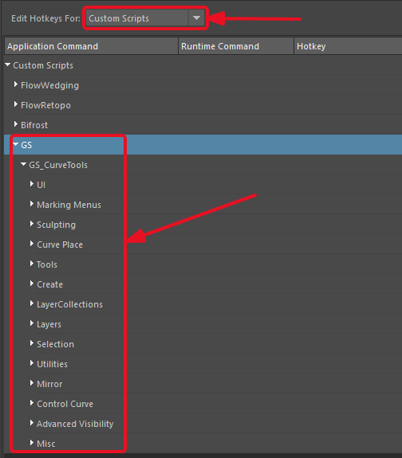
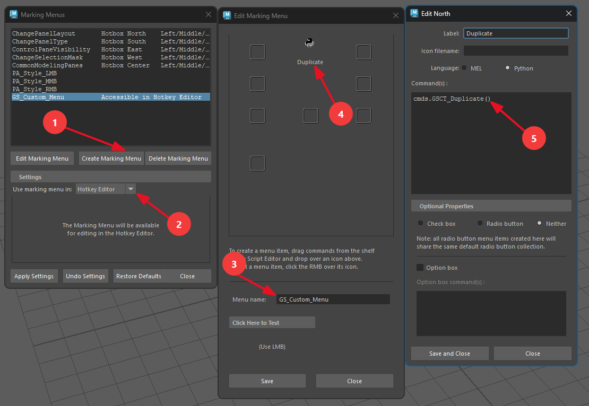

.. currentmodule:: <index>

.. _hotkeys-page:

#########################
Hotkeys and Marking Menus
#########################

GS CurveTools v2 comes with a set of hotkeys that covers most of the commands and functions.

All the hotkeys can be found in the ``Windows -> Settings/Preferences -> Hotkey Editor -> Custom Scripts -> GS -> GS CurveTools`` menu.

.. note:: Some hotkeys are in Press/Release pairs. Make sure to set both of them to the same button and set the Release one to "On Release".

Setting Hotkeys
===============

To set a hotkey, first navigate to ``Windows -> Settings/Preferences -> Hotkey Editor -> Custom Scripts -> GS -> GS CurveTools`` menu. There, you can expand the required section and find the required hotkey. They are all named with the prefix "GSCT\_"

.. image:: images/on_release.png
    :align: right
    :width: 250

It is important to set "On Release" hotkey variant as "On Release" for it to work properly. To do so, double click on the hotkey and expand the menu on the right. Select "On Release".

Some hotkeys are scoped to their respective tools. For example, Sculpting hotkeys will only work when the Sculpting tool is active.

.. _maya-marking-menus:

Using Hotkeys in Marking Menus
==============================

Hotkeys are basically Maya commands so you can call them directly or set them in custom Marking Menus.

Every hotkey in GS CurveTools can be set to a custom Marking Menu. Just note the hotkey command name (for example, ``GSCT_Duplicate``) and use it in the Marking Menu.

To start creating a custom Marking Menu:

#. Navitage to ``Windows -> Settings/Preferences -> Marking Menus`` menu.
#. Click on the "Create Marking Menu" button.
#. Name the menu.
#. At the top there will be radial slots and linear slot. Right click on any of them and select "Edit Menu Item" to create a direct command or "Popup Submenu" to create a sub-menu.
#. Label it and add the command code. For example, to quickly use Duplicate function, you can enter ``GSCT_Duplicate`` to mel field or ``cmds.GSCT_Duplicate()`` to Python field.

|

.. _hotkeys-list:

List of Hotkeys and their Commands
==================================

UI
--

.. list-table::
  :widths: 25 25 50
  :header-rows: 1

  * - Hotkey Name
    - MEL command
    - Description
  * - Show Hide UI
    - ``GSCT_Show_Hide_UI``
    - Show/Hide main UI
  * - Reset to Defaults
    - ``GSCT_Reset_to_Defaults``
    - Reset the plug-in to defaults
  * - Stop UI
    - ``GSCT_Stop_UI``
    - Close the UI and stop scripts
  * - Curve Control Window
    - ``GSCT_Curve_Control_Window``
    - Open Curve Control Window
  * - UV Editor Window
    - ``GSCT_UV_Editor_Window``
    - Open UV Editor Window

Marking Menus
-------------

.. list-table::
  :widths: 25 25 50
  :header-rows: 1

  * - Hotkey Name
    - MEL command
    - Description
  * - Context Switcher Marking Menu Press
    - ``GSCT_Context_Switcher_Marking_Menu_Press``
    - Open GS CurveTools context switcher marking menu
  * - Context Switcher Marking Menu Release
    - ``GSCT_Context_Switcher_Marking_Menu_Release``
    - Close GS CurveTools context switcher marking menu
  * - Curve Sculpt Marking Menu Press
    - ``GSCT_Curve_Sculpt_Marking_Menu_Press``
    - Open Curve Sculpt marking menu
  * - Curve Sculpt Marking Menu Release
    - ``GSCT_Curve_Sculpt_Marking_Menu_Release``
    - Close Curve Sculpt marking menu
  * - Curve Value Marking Menu Press
    - ``GSCT_Curve_Value_Marking_Menu_Press``
    - Open Curve Value attribute marking menu
  * - Curve Value Marking Menu Release
    - ``GSCT_Curve_Value_Marking_Menu_Release``
    - Close Curve Value attribute marking menu

Sculpting
---------

.. list-table::
  :widths: 25 25 50
  :header-rows: 1

  * - Hotkey Name
    - MEL command
    - Description
  * - Curve Sculpt Brush Resize Press
    - ``GSCT_Curve_Sculpt_Brush_Resize_Press``
    - Start Curve Sculpt brush radius adjustment
  * - Curve Sculpt Brush Resize Release
    - ``GSCT_Curve_Sculpt_Brush_Resize_Release``
    - Stop Curve Sculpt brush radius adjustment
  * - Curve Sculpt Selection Brush Resize Press
    - ``GSCT_Curve_Sculpt_Selection_Brush_Resize_Press``
    - Start Curve Sculpt selection brush radius adjustment
  * - Curve Sculpt Selection Brush Resize Release
    - ``GSCT_Curve_Sculpt_Selection_Brush_Resize_Release``
    - Stop Curve Sculpt selection brush radius adjustment
  * - Activate Sculpt Sculpt Mode
    - ``GSCT_Activate_Sculpt_Mode``
    - Activate the Curve Sculpt Tool in Sculpt mode
  * - Activate Sculpt Move Mode
    - ``GSCT_Activate_Sculpt_Move_Mode``
    - Activate the Curve Sculpt Tool in Move mode
  * - Activate Sculpt Smooth Mode
    - ``GSCT_Activate_Sculpt_Smooth_Mode``
    - Activate the Curve Sculpt Tool in Smooth mode
  * - Activate Sculpt Pull Mode
    - ``GSCT_Activate_Sculpt_Pull_Mode``
    - Activate the Curve Sculpt Tool in Pull mode
  * - Activate Sculpt Select Mode
    - ``GSCT_Activate_Sculpt_Select_Mode``
    - Activate the Curve Sculpt Tool in Select mode
  * - Activate Sculpt Scale Mode
    - ``GSCT_Activate_Sculpt_Scale_Mode``
    - Activate the Curve Sculpt Tool in Scale mode
  * - Activate Sculpt Extend Mode
    - ``GSCT_Activate_Sculpt_Extend_Mode``
    - Activate the Curve Sculpt Tool in Extend mode
  * - Activate Sculpt Cut Mode
    - ``GSCT_Activate_Sculpt_Cut_Mode``
    - Activate the Curve Sculpt Tool in Cut mode

Curve Place
-----------

.. list-table::
  :widths: 25 25 50
  :header-rows: 1

  * - Hotkey Name
    - MEL command
    - Description
  * - Curve Place Settings Adjust Press
    - ``GSCT_Curve_Place_Settings_Adjust_Press``
    - Start Curve Place settings adjustment
  * - Curve Place Settings Adjust Release
    - ``GSCT_Curve_Place_Settings_Adjust_Release``
    - Stop Curve Place settings adjustment

Tools
-----

.. list-table::
  :widths: 25 25 50
  :header-rows: 1

  * - Hotkey Name
    - MEL command
    - Description
  * - Activate Place Tool
    - ``GSCT_Activate_Place_Tool``
    - Activates the Curve Place Tool
  * - Activate Draw Tool
    - ``GSCT_Activate_Draw_Tool``
    - Activates the Curve Draw Tool
  * - Activate Sculpt Tool
    - ``GSCT_Activate_Sculpt_Tool``
    - Activates the Curve Sculpt Tool
  * - Activate Value Tool
    - ``GSCT_Activate_Value_Tool``
    - Activates the Curve Value Tool
  * - Activate Twist Tool
    - ``GSCT_Activate_Twist_Tool``
    - Activates the Twist Tool
  * - Activate Width Tool
    - ``GSCT_Activate_Width_Tool``
    - Activates the Width Tool

Create
------

.. list-table::
  :widths: 25 25 50
  :header-rows: 1

  * - Hotkey Name
    - MEL command
    - Description
  * - New Card
    - ``GSCT_New_Card``
    - Create New Card
  * - New Tube
    - ``GSCT_New_Tube``
    - Create New Tube
  * - Curve Card
    - ``GSCT_Curve_Card``
    - Convert to Card
  * - Curve Tube
    - ``GSCT_Curve_Tube``
    - Convert to Tube
  * - Bind
    - ``GSCT_Bind``
    - Bind Curves or Geo
  * - Bind Duplicate
    - ``GSCT_Bind_Duplicate``
    - Bind Curves or Geo with duplication
  * - Unbind
    - ``GSCT_Unbind``
    - Unbind Curves from Bind Object
  * - Unpack
    - ``GSCT_Unpack``
    - Unpack Bind Object
  * - Add Card
    - ``GSCT_Add_Card``
    - Add Cards between selection
  * - Add Tube
    - ``GSCT_Add_Tube``
    - Add Tubes between selection
  * - Fill
    - ``GSCT_Fill``
    - Duplicate Fill between selection
  * - Fill No Blend
    - ``GSCT_Fill_No_Blend``
    - Duplicate Fill between selection without attribute blend
  * - Subdivide
    - ``GSCT_Subdivide``
    - Subdivide Selected Card/Tube
  * - Subdivide Duplicate
    - ``GSCT_Subdivide_Duplicate``
    - Subdivide Selected Card/Tube and Duplicate
  * - Edge to Curve
    - ``GSCT_Edge_to_Curve``
    - Convert Edges to Curves
  * - Card to Curve
    - ``GSCT_Card_to_Curve``
    - Convert Cards to Curves

Layer Collections
-----------------

.. list-table::
  :widths: 25 25 50
  :header-rows: 1

  * - Hotkey Name
    - MEL command
    - Description
  * - Add Layer Collection
    - ``GSCT_Add_Layer_Collection``
    - Adds a New Layer Collection With the Specified Name
  * - Delete Layer Collection
    - ``GSCT_Delete_Layer_Collection``
    - Deletes Current Layer Collection
  * - Clear Layer Collection
    - ``GSCT_Clear_Layer_Collection``
    - Deletes All The Curves from the Current Layer Collection
  * - Rename Layer Collection
    - ``GSCT_Rename_Layer_Collection``
    - Renames the Current Layer Collection
  * - Merge Up Layer Collection
    - ``GSCT_Merge_Up_Layer_Collection``
    - Merges the Current Layer Collection With One Above It
  * - Merge Down Layer Collection
    - ``GSCT_Merge_Down_Layer_Collection``
    - Merges the Current Layer Collection With One Below It
  * - Move Up Layer Collection
    - ``GSCT_Move_Up_Layer_Collection``
    - Moves the Current Layer Collection Up One Index
  * - Move Down Layer Collection
    - ``GSCT_Move_Down_Layer_Collection``
    - Moves the Current Layer Collection Down One Index
  * - Copy Layer Collection
    - ``GSCT_Copy_Layer_Collection``
    - Copies Curves from Current Layer Collection
  * - Paste Layer Collection
    - ``GSCT_Paste_Layer_Collection``
    - Pastes Copied Curves to Current Layer Collection

Layers
------

.. list-table::
  :widths: 25 25 50
  :header-rows: 1

  * - Hotkey Name
    - MEL command
    - Description
  * - Filter All Show
    - ``GSCT_Filter_All_Show``
    - Show All Layers
  * - Filter All Show All Collections
    - ``GSCT_Filter_All_Show_All_Collections``
    - Show All Layers in All Collections
  * - Filter All Hide
    - ``GSCT_Filter_All_Hide``
    - Hide All Layers
  * - Filter All Hide All Collections
    - ``GSCT_Filter_All_Hide_All_Collections``
    - Hide All Layers in All Collections
  * - Filter Curve
    - ``GSCT_Filter_Curve``
    - Show Only Curve Component
  * - Filter Curve in All Collections
    - ``GSCT_Filter_Curve_in_All_Collections``
    - Show Only Curve Component in All Collections
  * - Toggle Always on Top
    - ``GSCT_Toggle_Always_on_Top``
    - Toggle Always on Top Mode for Curves
  * - Filter Geo
    - ``GSCT_Filter_Geo``
    - Show Only Geo Component
  * - Filter Geo in All Collections
    - ``GSCT_Filter_Geo_in_All_Collections``
    - Show Only Geo Component in All Collections
  * - Toggle Color
    - ``GSCT_Toggle_Color``
    - Toggle Color Mode
  * - Extract Selected
    - ``GSCT_Extract_Selected``
    - Extract Selected Geo
  * - Extract Selected Merged
    - ``GSCT_Extract_Selected_Merged``
    - Extract Selected Geo Merged
  * - Extract All
    - ``GSCT_Extract_All``
    - Extract All Geo
  * - Extract All Merged
    - ``GSCT_Extract_All_Merged``
    - Extract All Geo Merged

Selection
---------

.. list-table::
  :widths: 25 25 50
  :header-rows: 1

  * - Hotkey Name
    - MEL command
    - Description
  * - Select Curve
    - ``GSCT_Select_Curve``
    - Select Curve Component
  * - Select Geo
    - ``GSCT_Select_Geo``
    - Select Geo Component
  * - Select Group
    - ``GSCT_Select_Group``
    - Select Group
  * - Group Curves
    - ``GSCT_Group_Curves``
    - Group Selected Curves
  * - Regroup by Layer
    - ``GSCT_Regroup_by_Layer``
    - Regroup using Layers

Utilities
---------

.. list-table::
  :widths: 25 25 50
  :header-rows: 1

  * - Hotkey Name
    - MEL command
    - Description
  * - Transfer Attr Forward
    - ``GSCT_Transfer_Attr_Forward``
    - Transfer Attributes Forward
  * - Transfer Attr Backwards
    - ``GSCT_Transfer_Attr_Backwards``
    - Transfer Attributes Backwards
  * - Copy Attributes
    - ``GSCT_Copy_Attributes``
    - Copy attributes from selected curves
  * - Paste Attributes
    - ``GSCT_Paste_Attributes``
    - Paste attributes to selected curves
  * - Transfer UVs Forward
    - ``GSCT_Transfer_UVs_Forward``
    - Transfer UVs Forward
  * - Transfer UVs Backwards
    - ``GSCT_Transfer_UVs_Backwards``
    - Transfer UVs Backwards
  * - Copy UVs
    - ``GSCT_Copy_UVs``
    - Copy UVs from selected curves
  * - Paste UVs
    - ``GSCT_Paste_UVs``
    - Paste UVs to selected curves
  * - Reset Pivot to Root
    - ``GSCT_Reset_Pivot_to_Root``
    - Reset Pivot Point to Root
  * - Reset Pivot to Tip
    - ``GSCT_Reset_Pivot_to_Tip``
    - Reset Pivot Point to Tip
  * - Rebuild Curves
    - ``GSCT_Rebuild_Curves``
    - Rebuild Selected Curves
  * - Duplicate
    - ``GSCT_Duplicate``
    - Duplicate Selected Curves
  * - Delete Curves
    - ``GSCT_Delete_Curves``
    - Delete selected curves and objects
  * - Extend
    - ``GSCT_Extend``
    - Extend Curves
  * - Extend Root
    - ``GSCT_Extend_Root``
    - Extend Curves from the Root
  * - Reduce
    - ``GSCT_Reduce``
    - Reduce Curves
  * - Reduce Root
    - ``GSCT_Reduce_Root``
    - Reduce Curves from the Root
  * - Smooth
    - ``GSCT_Smooth``
    - Smooth Curves
  * - Orient to Normal
    - ``GSCT_Orient_to_Normal``
    - Orients Selected Curve to Scalp Normals
  * - Set Optimal Tangent
    - ``GSCT_Set_Optimal_Tangent``
    - Sets Optimal Tangent Axis for Selected Curves
  * - Reverse Curve
    - ``GSCT_Reverse_Curve``
    - Reverses Selected Curves
  * - Set Curve Root to Mesh
    - ``GSCT_Set_Curve_Root_to_Mesh``
    - Sets Selected Curves Roots to Basemesh
  * - Scale Selection
    - ``GSCT_Scale_Selection``
    - Scale Selection
  * - Scale Inverted
    - ``GSCT_Scale_Inverted``
    - Scale Selection Inverted
  * - Duplicate and Unparent Curves
    - ``GSCT_Duplicate_and_Unparent_Curves``
    - Duplicates selected NURBS curves and unparents them

Mirror
------

.. list-table::
  :widths: 25 25 50
  :header-rows: 1

  * - Hotkey Name
    - MEL command
    - Description
  * - Mirror X
    - ``GSCT_Mirror_X``
    - Mirror on X Axis
  * - Mirror Y
    - ``GSCT_Mirror_Y``
    - Mirror on Y Axis
  * - Mirror Z
    - ``GSCT_Mirror_Z``
    - Mirror on Z Axis
  * - Flip X
    - ``GSCT_Flip_X``
    - Flip on X Axis
  * - Flip Y
    - ``GSCT_Flip_Y``
    - Flip on Y Axis
  * - Flip Z
    - ``GSCT_Flip_Z``
    - Flip on Z Axis

Control Curve
-------------

.. list-table::
  :widths: 25 25 50
  :header-rows: 1

  * - Hotkey Name
    - MEL command
    - Description
  * - Add Control Curve
    - ``GSCT_Add_Control_Curve``
    - Add Control Curve
  * - Apply Control Curve
    - ``GSCT_Apply_Control_Curve``
    - Apply Control Curve

Advanced Visibility
-------------------

.. list-table::
  :widths: 25 25 50
  :header-rows: 1

  * - Hotkey Name
    - MEL command
    - Description
  * - Advanced Visibility Toggle
    - ``GSCT_Advanced_Visibility_Toggle``
    - Toggle Advanced Visibility
  * - Geometry Highlight Toggle
    - ``GSCT_Geometry_Highlight_Toggle``
    - Toggle Geometry Highlight

Misc
----

.. list-table::
  :widths: 25 25 50
  :header-rows: 1

  * - Hotkey Name
    - MEL command
    - Description
  * - AO Toggle
    - ``GSCT_AO_Toggle``
    - Toggle Viewport AO
