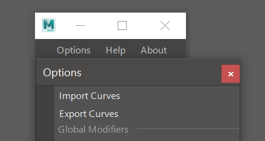
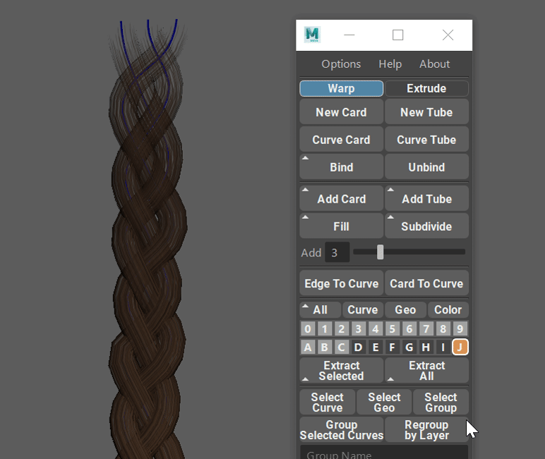

.. currentmodule:: <index>

.. _import-export-page:

##############################
Importing and Exporting Curves
##############################

User can export curves from the scene and import them into the scene by using :ref:`Options<options>` ⇨ **Export/Import** curves

Using this function, user can easily export one or multiple curve cards/tubes or bound cards to a new file, and then import it into any other project.

.. important:: Do not confuse exporting and importing curves with :ref:`Extraction Commands <extract-buttons>`. Those commands will only extract geometry and export geometry.

Exporting Curves
^^^^^^^^^^^^^^^^

To export curves simply select any number of curves in the viewport and click on "**Export Curves**" button in the outliner. 

All the export options will be applied automatically.

**Export Curves** will use its own ".curves" file extension, however user can also choose to use Maya ASCII format ".ma" for export.

In the "Save File" dialog, enter the name of the file and click Save.

Importing Curves
^^^^^^^^^^^^^^^^

Importing Curves is a simple process. Just click on :ref:`Options<options>` ⇨ **Import Curves** and in the file dialog, find and load the file you created before, using "**Export Curves**" functions.

**Import Curves** will use its own ".curves" file extension, however user can also choose to use Maya ASCII format ".ma" for import.

If :ref:`Layer Collections<layer-collections>` are enabled in the scene and :ref:`Import Into a New Collection<importing-into-a-new-collection>` checkbox is enabled in the :ref:`Options<options>` menu, all the import curves will go to "Imported Curves" collection by default. If layer collections are disabled or the checkbox is not checked, all the imported curves will be merged into the Main collection.

.. note:: It might be necessary to :ref:`Normalize<normalize-scale-factor-and-precision-scale>` freshly imported curves before use in a new project. It's only necessary if the original Scale is different from the project's chosen Scale Factor. Same goes for the Precision Scale.

.. warning:: Only files created by using "**Export Curves**" function are compatible with "**Import Curves**" function. Any other file might have unexpected behavior.