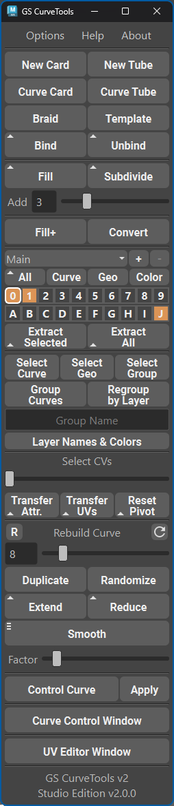

################################################
GS CurveTools v2 for Autodesk Maya Documentation
################################################

**For Maya 2018-2027**

Links
=====

- `Online Store <https://sladkovsky3d.artstation.com/store>`_
- `Discord Support Server <https://discord.gg/f4DH6HQ>`_
- `YouTube Channel <https://www.youtube.com/channel/UCmIFpG98OqbUecaf5H-ixKQ>`_
- `ArtStation <https://www.artstation.com/sladkovsky3d>`_
- `Directly support free updates <https://www.buymeacoffee.com/videonomad>`_

Introduction
============

**GS CurveTools v2**: All-in-one solution for creating and manipulating :ref:`geometry cards, tubes and braids<creating-cards-and-tubes>` with ease. From creating hair cards to designing complex braids and beards, **GS CurveTools** is the perfect tool for any workflow.

At the heart of **GS CurveTools v2** is its powerful and performant generator, braid and deformer nodes created specifically for hair cards workflows. **GS CurveTools v2** allows you to quickly create new procedural objects (cards, tubes, braids) directly from :ref:`NURBS curves<curve-card-button>` or :ref:`XGen descriptions<conversion>`.

The :ref:`Layer system<layers>` will help you organize your work quickly, and if you require more control and complexity, there are :ref:`layer collections<layer-collections>` to help you out.

Powerful :ref:`templating<templates>` allows you to set up the most-used hair cards with their parameters and UVs to quickly reuse throughout the project with one click.

Additionally, **GS CurveTools v2** includes intuitive and easy to use :ref:`curve placement, drawing and sculpting tools<controls>`.

:ref:`Place<controls>` curves directly on the surface of the mesh, blend them with nearby curves and adjust other parameters like root influence and more.

:ref:`Draw<controls>` directly on the mesh surface with offsets and other parameters. Select templates to quickly generate new cards with textures right as you draw the curve.

Use :ref:`Sculpting<controls>` mode to adjust already placed curves and with the help of additional modes (move, select, extend, reduce, smooth etc) make the exact edits you need.

:ref:`Orient to Normals<orient-to-normals>` will allow you to select all the procedural objects and align them with the mesh in one click.

:ref:`Fill Plus<fill-plus>` will allow you to quickly add density to already placed curves. It smoothly blends between selected curves and adjusts for mesh intersections.

Quick :ref:`hotkeys and marking menus<hotkeys-page>` for most used tools and functions, :ref:`randomization<randomize>`, fast :ref:`geometry export<extract-buttons>`, and much more.

.. rst-class:: clear-both

Main Features of GS CurveTools
==============================

.. image:: images/curve_control_window.png
  :align: right
  :width: 250px

- Fast creation of procedural geometry cards, tubes and braids.
- Conversion of already existing curves to curve cards, tubes and braids.
- Conversion of XGen description to curves, cards, tubes, braids, templates with automatic orientation to surface.
- Convert any single-sided cards or tubes to NURBS curves or directly to GS CurveTools cards or tubes.
- Ability to quickly place cards in between other cards using Fill and increase the density with Fill Plus.
- Subdivide selected curves into multiple smaller curves to quickly increase the density.
- Fast and intuitive layer and collection system.
- Place, Draw and Sculpt curves for quick creation and editing.
- Use marking menus for quick switching between the tools and tool modes.
- Ability to bind (attach) and unbind any geometry or already existing curve cards, tubes or braids to any curve.
- Easy to use filters to quickly show/hide all curves or geometry.
- Color mode that will change colors of the cards based on the layer colors with transparency support.
- Custom Color and Layer Name Editor.
- Regroup by Layer function to organize your curves in the outliner.
- Subdivide Selected Curves.
- Quickly Extract All geometry for Export, or Extract Selected only. Original Curves stay functional.
- Fast selection and grouping of curves.
- Interactive UV Editor specifically for procedural objects with Randomization, Lattice and other tools.
- Mirror curves easily.
- Transfer of attributes and UVs between curve cards, tubes and braids with one click.
- Interactive rebuild of existing curves for additional complexity or vice versa, to simplify control.
- Duplicate procedural objects with one button.
- Randomize created curves attributes to easily add realism.
- Smooth/Extend/Reduce created curves.
- Control multiple curves with Control Curve deformer.
- Custom interactive window for all curve controls that includes templating and other features.
- Powerful attributes (controls) for curves, including Twist, Width and Profile along the curve.
- Extremely fast to save and load the scenes even with thousands of cards.
- and much more...

Supported Platforms and Versions
================================

- **Maya 2018-2027 for Windows** ⇨ Fully Tested and Supported*.
- **Maya 2018-2027 for Mac** ⇨ **Not** Supported for **v2**. Still *supported* for v1.3+.
- **Linux** ⇨ Not Tested and Not Supported.
- **Maya LT** ⇨ Not Tested and Not Supported.
- **Maya 2017** ⇨ Is no longer supported since v1.2.7

.. toctree::
    :maxdepth: 2
    :caption: Table of Contents:

	Home <self>
	Changelog <changelog>
	Video Tutorials <video-tutorials>
	Installation <installation>
	Main Menu and First Steps <main-menu>
	Creating Cards, Tubes and Braids<creating-cards-and-tubes>
	Curve Attributes <attributes>
	Textures and UVs <uvs>
	UV Editor <uv-editor>
	Templates <templates>
	Controls and Tools <controls>
	Bind/Unbind/Unpack Functions <bind-unbind>
	Conversion Window <conversion>
	Fill Plus Window <fill-plus>
	Layers <layers>
	Color Mode and Layer Customization <layers-customization>
	Layer Collections <layer-collections>
	Quick Selection and Grouping <selection>
	Importing and Exporting Curves <import-export>
	Orient to Normals <orient-to-normals>
	Scaling Curves <scaling-curves>
	Utility Functions <utility>
	Advanced Visibility <advanced-visibility>
	Scale Factor <scale-factor>
	Hotkeys and Marking Menus<hotkeys>
	Options Menu <options>
	Settings Menu <settings>
	Useful Tips <useful-tips>
	Questions, Issues and Solutions <faq>
