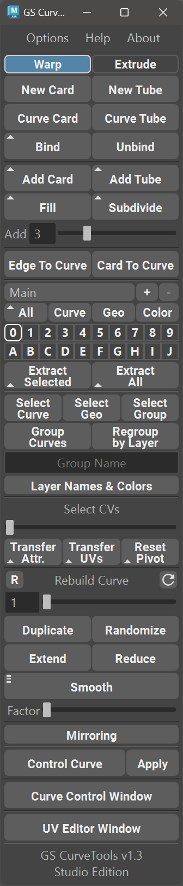

#############################################
GS CurveTools for Autodesk Maya Documentation
#############################################

**For Maya 2018-2026**

Links
^^^^^

- `Online Store <https://sladkovsky3d.artstation.com/store>`_
- `Discord Support Server <https://discord.gg/KyPCW6F>`_
- `YouTube Channel <https://www.youtube.com/channel/UCmIFpG98OqbUecaf5H-ixKQ>`_
- `ArtStation <https://www.artstation.com/sladkovsky3d>`_
- `Directly support free updates <https://www.buymeacoffee.com/videonomad>`_

Introduction
^^^^^^^^^^^^

**GS CurveTools**: All-in-one solution for creating and manipulating geometry cards and tubes with ease. From creating hair cards to designing complex braids and beards, **GS CurveTools** is the perfect tool for any workflow.

At the heart of **GS CurveTools** is its ability to create complex node networks in one click that make it easy to manipulate geometry in a natural and seamless way. **GS CurveTools** is perfect for hair card workflows, as it allows you to quickly create new hair cards, convert curves to hair cards, and adjust parameters on the fly.

With **Version 1.1**, **GS CurveTools** introduced a new feature that lets you bind custom geometry to any curve and even bind already created Curve Cards and Curve Tubes to any curve using Bind function.

With **Version 1.2**, you'll have access to a custom UV editor that's tailored to work with Cards, Tubes, and Bound objects. Unbind already created Bound objects to edit them and use the new Profile Graph feature that allows you to control the profile along the curve and much more.

**GS CurveTools** just got even better with **Version 1.3**! Even more useful features were added to help you take your hair creation to the next level.

One of the most exciting new features is the ability to create layer collections for advanced scene organization, as well as the ability to import curves into a new collection. This makes it easy to keep your workflow organized and efficient, even with complex projects with different focus points - hair, braids, beard, brows all organized neatly into different collections.

Color mode was also fully reworked, so that it can be enabled all the time and work with all the other functions seamlessly. This means you can now easily color-code your curves and cards, making it even easier to keep track of them in your project.

For even more control there is new Copy-Paste feature and Attribute Filter that allows you to selectively copy and paste attributes and UVs. This makes it easy to apply changes to specific parts of your project, without affecting the rest of your work.

Enable Advanced Highlight feature to have the ability to see selected curves even when working on complex multi-layered grooms.

**Version 1.3** also includes a range of other improvements and optimizations, making **GS CurveTools** faster and more powerful than ever before.

.. rst-class:: clear-both

Main Features of GS CurveTools
^^^^^^^^^^^^^^^^^^^^^^^^^^^^^^

- Fast creation of procedural geometry cards and tubes.
- Conversion of already existing curves to curve cards/tubes.
- Ability to quickly place cards in between other cards using Fill.
- Subdivide selected curves into multiple smaller curves to quickly increase the density.
- Intuitive and fast controls for created curves using layer workflow and numerous procedural parameters.
- Ability to bind (attach) and unbind any geometry or already existing Curve Cards/Tubes to any Curve.
- Powerful Layer System for created curves/tubes.
- Advanced Layer Collection system to keep you organized.
- Easy to use filters to quickly show/hide all curves or geometry.
- Color mode that will change colors of the cards based on the layer colors. Now with transparency support.
- Custom Color and Layer Name Editor.
- Regroup by Layer function to organize your curves in the outliner.
- Subdivide Selected Curves.
- Quickly Extract All geometry for Export, or Extract Selected only. Original Curves stay functional.
- Fast selection and grouping of curves.
- Interactive UV Editor.
- Mirror Curves.
- Convert geometry cards to Curves and match them to original geometry.
- Transfer of attributes and UVs between curve cards.
- Interactive rebuild of existing curves for additional complexity or vice versa, to simplify control.
- Duplicate entire network of curves with one button.
- Randomize created curves attributes to easily add realism.
- Smooth/Extend/Reduce created curves.
- Control multiple curves with Control Curve deformer.
- Custom window for all curve controls.
- Powerful attributes (controls) for curves, including Twist, Width and Profile along the curve.
- and much more...

Recommended Maya Versions
^^^^^^^^^^^^^^^^^^^^^^^^^

- 2018.6
- 2019.3, 2019.3.1
- 2020.4\*
- 2022.3, 2022.4
- 2023, 2023.1, 2023.2, 2023.3
- 2024, 2024.1, 2024.2
- 2025\*\*
- 2026

.. note:: 
	
	\*Maya **2020.4** has a native bug with width and twist graphs that can't be fixed on my end. Only Autodesk could fix that, but they didn't. In general, Maya 2020 is NOT recommended if you have other options. :ref:`More details<stuck-graphs>`.
	
	\*\*Maya **2025** (all versions, including 2025.3) has issues with longer scene loading times. If you can use Maya 2024 or 2026 as they are much faster.

Supported Platforms
^^^^^^^^^^^^^^^^^^^

- **Maya 2018-2026 for Windows** ⇨ Fully Tested and Supported*.
- **Maya 2018-2026 for Mac** ⇨ In Beta*.
- **Linux** ⇨ Not Tested and Not Supported.
- **Maya LT** ⇨ Not Tested and Not Supported.
- **Maya 2017** ⇨ Is no longer supported since v1.2.7

.. important:: \*Please use the latest patches if possible. For example: Maya 2018.1 has issues that were fixed in the latest 2018.6 and are essential for GS CurveTools functionality. Thank you!

.. toctree::
    :maxdepth: 2
    :caption: Table of Contents:

	Home <self>
	Changelog <changelog>
	Video Tutorials <video-tutorials>
	Installation <installation>
	Main Menu and First Steps <first-steps>
	Curve Attributes <attributes>
	Textures and UVs <uvs>
	UV Editor <uv-editor>
	Creating Cards and Tubes <creating-cards-and-tubes>
	Bind/Unbind/Unpack Functions <bind-unbind>
	Edge to Curve/Geo to Curve <edge-to-curve-card-to-curve>
	Layers <layers>
	Color Mode and Layer Customization <layers-customization>
	Layer Collections <layer-collections>
	Quick Selection and Grouping <selection>
	Importing and Exporting Curves <import-export>
	Orient to Normals <orient-to-normals>
	Utility Functions <utility>
	Advanced Visibility <advanced-visibility>
	Scale Factor and Precision <scale-factor-and-precision>
	Options Menu <options>
	Useful Tips <useful-tips>
	Questions, Issues and Solutions <faq>

.. raw:: html
	
	<a href="_static/latest-version.json" Latest Version>Latest Version</a>
