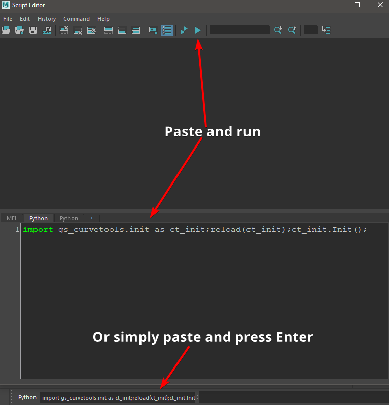
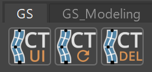

.. currentmodule:: <index>

.. role:: strike
  :class: strike

########################################
Installation, Shelf, Hotkeys and Updates
########################################

Compatibility
^^^^^^^^^^^^^

.. important:: Only **Windows** version is **fully supported**. **Mac** version is currently in **beta test** and may have some bugs. **Linux** was not tested and currently **not supported**. **Maya LT** was not tested and currently **not supported**.

.. important:: Please use the latest Maya patches if possible. For example: Maya 2018.1 has issues that were fixed in the latest 2018.6 and are essential for GS CurveTools functionality.

.. _installation-steps:

Installation Steps
^^^^^^^^^^^^^^^^^^

#. Unpack and copy **gs_curvetools** folder to Path:

    - **Windows** Path and Folder Structure:

    .. code-block::

      Documents/Maya/{Maya_Version}/scripts/

    .. image:: images/installation/folder_structure.png
        :width: 95%
        :align: center

    |

    - **Mac** Path and Folder Structure:

    .. code-block::

      {Your_Mac_Name}/Users/{User_Name}/Library/Preferences/Autodesk/maya/{Maya_Version}/scripts/

    .. image:: images/installation/folder_structure_mac.png
        :width: 95%
        :align: center

#. Run **Maya**

#. Copy and Paste this code to **Python Command Field** at the bottom (switch from MEL by clicking on it) or to the script editor:

    .. code-block:: python

      import gs_curvetools.init as ct_init;from imp import reload;reload(ct_init);ct_init.Init();

#. **Run the code** (Press Enter for the Command Field or press on triangle for script editor). Installation is complete.

  Maya Script Editor Window

Installation Video
^^^^^^^^^^^^^^^^^^

.. raw:: html

  <video width=65% controls>
    <source src="_static/installation.mp4" type="video/mp4">
  </video>

|

Main Menu, Resetting and Stopping
^^^^^^^^^^^^^^^^^^^^^^^^^^^^^^^^^
After `Installation Steps`_ **GS** tab will appear on **Maya Shelf**:

**Buttons Function:**

.. list-table:: 
  :widths: 1 6

  * - ..  image:: images/buttons/gs_ui.png
        :class: float-left
        :width: 50px

    - CT UI button will open/close GS CurveTools User Interface.

  * - ..  image:: images/buttons/gs_reset.png
        :class: float-left
        :width: 50px

    - CT Reset will reset GS CurveTools to its default state.

  * - ..  image:: images/buttons/gs_del.png
        :class: float-left
        :width: 50px

    - CT Del will close GS CurveTools UI and stop any background scripts.

.. note:: You can use middle mouse drag to drag these buttons to any tab on the shelf.

Hotkeys
^^^^^^^

After you Initialize_ the plug-in you can find all the hotkeys in::

  Hotkey Editor ⇨ Custom Scripts ⇨ GS ⇨ GS_CurveTools

.. _Initialize: `Installation Steps`_

.. _update-instructions:

Updating the Plug-in
^^^^^^^^^^^^^^^^^^^^

To update the plug-in to a new version just **delete** the old **gs_curvetools** folder and repeat the `Installation Steps`_.

Troubleshooting
^^^^^^^^^^^^^^^

*Installation issues on Windows:*

Most of the problems with the installation happen when the user copies the gs_curvetools folder to the wrong folder.

Use **only** the **version specific** scripts folder, and **NOT** the shared scripts folder.

For example - **correct** folder for me:

.. code-block::

  C:\Users\George\Documents\maya\2022\scripts

**Incorrect** folder:

.. code-block::

  C:\Users\George\Documents\maya\scripts

P.S. If you are using OneDrive, your documents folder might be in the OneDrive folder.
