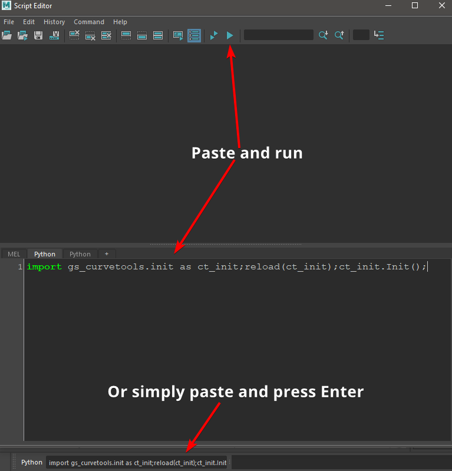
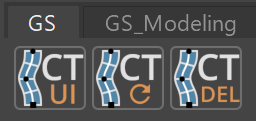

.. currentmodule:: <index>

.. role:: strike
  :class: strike

########################################
Installation, Shelf, Hotkeys and Updates
########################################

Compatibility
^^^^^^^^^^^^^
 * **Windows**: Fully Supported.
 * **Mac**: Currently in **Beta**. Some bugs may occur.
 * **Linux**: Not Tested / Not Supported.
 * **Maya LT**: Not Tested / Not Supported.

 Please use the latest Maya patches if possible. For example: Maya 2018.1 has issues that were fixed in the latest 2018.6 and are essential for GS CurveTools functionality.

.. _installation-steps:

Windows Installation
^^^^^^^^^^^^^^^^^^^^

1. **Unpack and Copy**: Copy the ``gs_curvetools`` folder to the following path:

   .. code-block:: text

      Documents/Maya/{Maya_Version}/scripts/

   .. image:: images/installation/folder_structure.png
      :width: 100%
      :align: center

2. **Launch Maya**.

3. **Initialize the Plug-in**: Copy and paste the following code into the **Python Command Field** at the bottom of the Maya UI (click "MEL" to switch it to "Python") or into the **Script Editor**:

   .. code-block:: python

      import gs_curvetools.init as ct_init; from imp import reload; reload(ct_init); ct_init.Init();

4. **Run the Code**: Press **Enter** (for Command Field) or click the **Play (Execute)** triangle icon in the Script Editor.

   Maya Script Editor Window

----

Mac Installation
^^^^^^^^^^^^^^^^

1. **Unpack and Copy**: Copy the ``gs_curvetools`` folder to the following path:

   .. code-block:: text

      {Your_Mac_Name}/Users/{User_Name}/Library/Preferences/Autodesk/maya/{Maya_Version}/scripts/

   .. image:: images/installation/folder_structure_mac.png
      :width: 100%
      :align: center

2. **Launch Maya**.

3. **Initialize the Plug-in**: Copy and paste the following code into the **Python Command Field** at the bottom of the Maya UI (click "MEL" to switch it to "Python") or into the **Script Editor**:

   .. code-block:: python

      import gs_curvetools.init as ct_init; from imp import reload; reload(ct_init); ct_init.Init();

4. **Run the Code**: Press **Enter** (for Command Field) or click the **Play (Execute)** triangle icon in the Script Editor.

   Maya Script Editor Window

----

Installation Video
^^^^^^^^^^^^^^^^^^

.. raw:: html

  

    <video width="80%" controls style="border-radius: 8px; box-shadow: 0 4px 8px rgba(0,0,0,0.2);">
      <source src="_static/installation.mp4" type="video/mp4">
      Your browser does not support the video tag.
    </video>
  

Main Menu, Resetting and Stopping
^^^^^^^^^^^^^^^^^^^^^^^^^^^^^^^^^

After completing the installation, a **GS** tab will appear on your **Maya Shelf**:

**Button Functions:**

.. list-table:: 
  :widths: 1 6
  :header-rows: 0

  * - .. image:: images/buttons/gs_ui.png
        :width: 50px
    - **CT UI**: Opens or closes the GS CurveTools User Interface.

  * - .. image:: images/buttons/gs_reset.png
        :width: 50px
    - **CT Reset**: Resets GS CurveTools to its default state.

  * - .. image:: images/buttons/gs_del.png
        :width: 50px
    - **CT Del**: Closes the UI and stops any active background scripts.

.. tip:: You can middle-mouse drag these buttons to any other tab on your shelf for convenience.

Hotkeys
^^^^^^^

Once initialized, all hotkeys are available in the **Hotkey Editor**:

.. code-block:: text

   Hotkey Editor ⇨ Custom Scripts ⇨ GS ⇨ GS_CurveTools

.. _update-instructions:

Updating the Plug-in
^^^^^^^^^^^^^^^^^^^^

To update to a new version:
1. **Delete** the old ``gs_curvetools`` folder from your scripts directory.
2. Repeat the installation steps for your platform.

Troubleshooting
^^^^^^^^^^^^^^^

* **Incorrect Folder (Windows)**: A common mistake is copying to the "shared" folder instead of the version-specific one.
  
  * **Correct**: ``C:\Users\{User}\Documents\maya\2024\scripts``
  * **Incorrect**: ``C:\Users\{User}\Documents\maya\scripts``

* **OneDrive**: If you use OneDrive, your Documents folder might be located inside the OneDrive path (e.g., ``C:\Users\{User}\OneDrive\Documents\maya...``).
