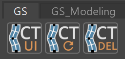

.. currentmodule:: <index>

.. role:: strike
  :class: strike

########################################
Installation, Shelf, Hotkeys and Updates
########################################

Compatibility
^^^^^^^^^^^^^

* **Windows**: Fully Supported.
* **Mac**: Not supported for v2. Supported for v1.3+.
* **Linux**: Not Tested / Not Supported.
* **Maya LT**: Not Tested / Not Supported.

Please use the latest Maya patches if possible.

.. _installation-steps:

Windows Installation
^^^^^^^^^^^^^^^^^^^^

1. Download and unpack the latest version.
#. Close Maya if it's open.
#. Copy gs_curvetools folder and gs_curvetools.mod file to ``Documents/Maya/{Maya_Version}/modules/``. Create the ``modules`` folder if it doesn't exist.
#. Open Maya, go to ``Windows -> Settings/Preferences -> Plug-in Manager`` and enable the ``gs_curvetools_v2_init.py`` plugin.
#. That's it! You can now use the GS CurveTools v2!

Installation Video
^^^^^^^^^^^^^^^^^^

.. raw:: html

  

    <video width="100%" controls style="border-radius: 8px; box-shadow: 0 4px 8px rgba(0,0,0,0.2);">
      <source src="_static/videos/installation_v2.mp4" type="video/mp4">
      Your browser does not support the video tag.
    </video>
  

Main Menu, Resetting and Stopping
^^^^^^^^^^^^^^^^^^^^^^^^^^^^^^^^^

After completing the installation, a **GS** tab will appear on your **Maya Shelf**:

**Button Functions:**

.. list-table:: 
  :widths: 1 6
  :header-rows: 0

  * - .. image:: images/buttons/gs_ui.png
        :width: 50px
    - **CT UI**: Opens or closes the GS CurveTools User Interface.

  * - .. image:: images/buttons/gs_reset.png
        :width: 50px
    - **CT Reset**: Resets GS CurveTools to its default state.

  * - .. image:: images/buttons/gs_del.png
        :width: 50px
    - **CT Del**: Closes the UI and stops any active background scripts.

.. tip:: You can middle-mouse drag these buttons to any other tab on your shelf for convenience.

Hotkeys
^^^^^^^

Once initialized, all hotkeys are available in the **Hotkey Editor**:

.. code-block:: text

   Hotkey Editor ⇨ Custom Scripts ⇨ GS ⇨ GS_CurveTools

More information here: :ref:`hotkeys-page`

.. _update-instructions:

Updating the Plugin
^^^^^^^^^^^^^^^^^^^

**To update from v2 to a new v2+ version:**

#. Close Maya.
#. **Delete** the old ``gs_curvetools`` folder and ``gs_curvetools.mod`` file from your modules directory.
#. Copy the new ones and start Maya.

**To update from v1:**

#. Press "CT DEL" shelf button in Maya.
#. Close Maya.
#. Delete the old ``gs_curvetools`` folder from ``Documents/Maya/{Maya_Version}/scripts/`` folder
#. Copy the new ``gs_curvetools`` folder and ``gs_curvetools.mod`` file to ``Documents/Maya/{Maya_Version}/scripts/`` folder.
#. Start Maya.
#. Go to ``Windows -> Settings/Preferences -> Plug-in Manager`` and enable the ``gs_curvetools_v2_init.py`` plug-in.

Troubleshooting
^^^^^^^^^^^^^^^

* **Incorrect Folder (Windows)**: A common mistake is copying to the "shared" folder instead of the version-specific one.
  
  * **Correct**: ``C:\Users\{User}\Documents\maya\2024\modules``
  * **Incorrect**: ``C:\Users\{User}\Documents\maya\modules``

* **OneDrive**: If you use OneDrive, your Documents folder might be located inside the OneDrive path (e.g., ``C:\Users\{User}\OneDrive\Documents\maya...``).
