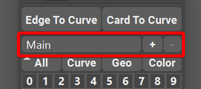
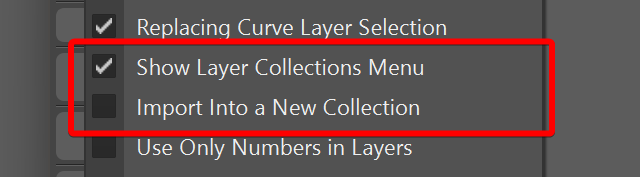
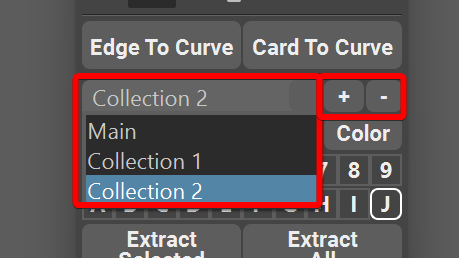
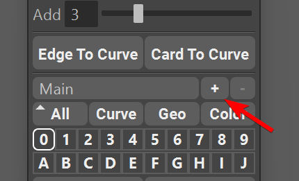
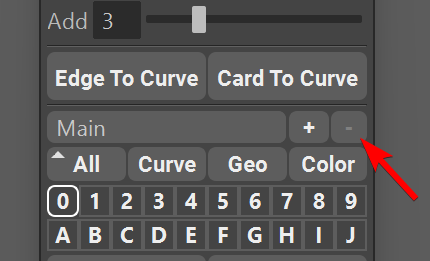
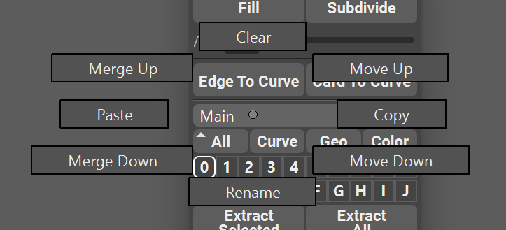
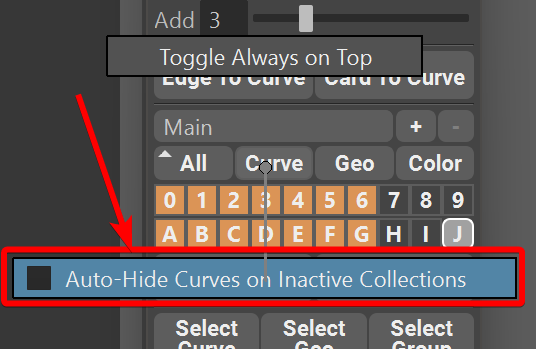
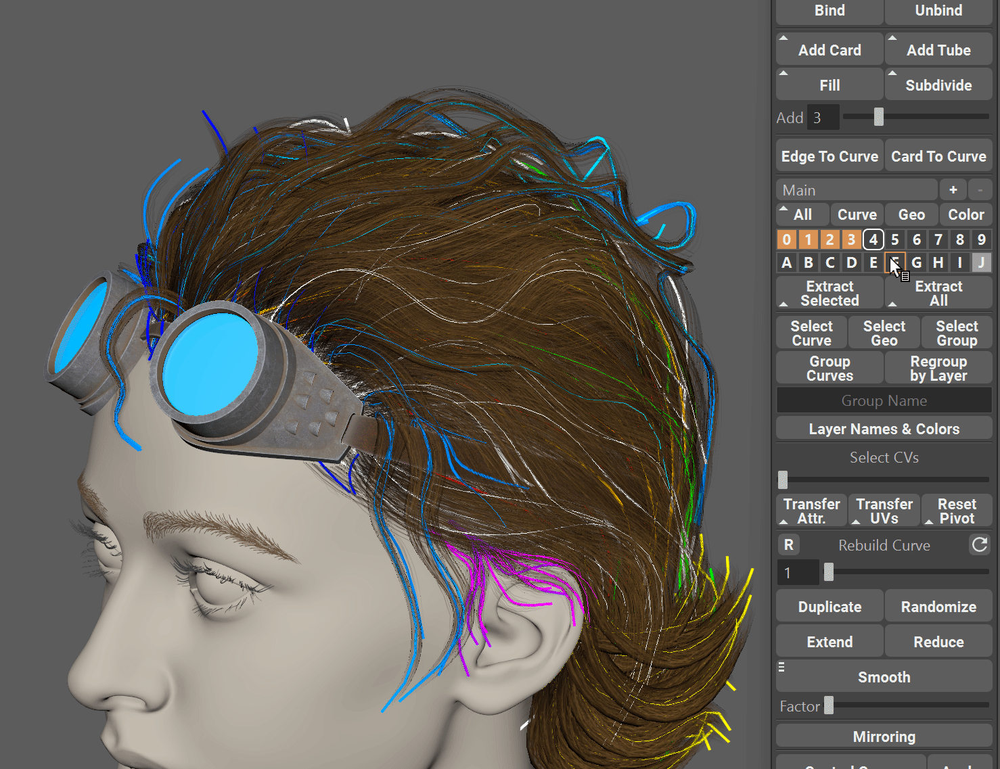

.. currentmodule:: <index>

.. _layer-collections:

#################
Layer Collections
#################

Intro
^^^^^

Layer collections offer an efficient way of organizing a project. They allow users to divide the workspace not only into distinct layers but also to have designated collections of these layers, each with a unique name. This feature can prove especially useful in projects comprising of multiple working zones, such as hair, brows, beard, accessories, or complex groom parts like big braids etc.

In addition to providing organization capabilities, layer collections come with added functionality. Users can import content to a designated layer and utilize the auto-hide feature.

Layer collections widget can be found right above the layers widget and can be hidden in the options if not used.

Layer collections widget consists of a drop-down mend two buttons (plus and minus) on the right. User can also enter a marking menu by hovering over the drop-down menu and holding RMB.
Marking menu holds all the additional functions for the layer collections.

Collections can be switched using either a drop-down menu, or by scrolling with a mouse wheel over the layer collections drop-down menu.

.. note:: By default only one "Main" collection exists in the scene. This collection cannot be renamed or deleted and is the collection that is used when layer collections are disabled.

Creating and Deleting Collections
^^^^^^^^^^^^^^^^^^^^^^^^^^^^^^^^^

User can create a new collection by pressing a [+] button near the drop-down menu.

Pressing this button will open a collection naming dialog where user can choose the name of the new collections.

If the name already exists, user will be promoted to change the name to a unique one.

When selected collection is not the Main collection user can delete this collection by pressing [-] button on the right side of the drop-down menu.

|
|

.. note:: Deleting the collection will automatically transfer all the curves from that collection to the one right above it in the list. Curves will not be deleted if the layer collection is deleted.

.. _importing-into-a-new-collection:

Importing Into a New Collection
^^^^^^^^^^^^^^^^^^^^^^^^^^^^^^^

By default, imported curves (using Options->Import Curves) will now go to a new collection called "Imported Curves".

This behavior can be changed in the options by unchecking the "Import Into a New Collection" checkbox.

|

.. note:: If layer collections are disabled in the options, imported curves will be merged into the "Main" collection.

Curve Collections Marking Menu
^^^^^^^^^^^^^^^^^^^^^^^^^^^^^^

Curve collections have several utility functions available. They are accessed by hovering over the layer collections widget and holding RMB.

- **Clear** - this command will delete all the curves from the current collection. The collection itself will not be deleted. User will be prompted before the command is execute.
- **Rename** - will rename the currently selected collection (if it is not the "Main" collection)
- **Merge Up and Merge Down** - used to combine all the curves in the current collection with the collection immediately above or below it. Merged collection will be deleted.
- **Move Up and Move Down** - will reorder the collections list and move the current collection one index up or down in the list.
- **Copy and Paste** - will copy all the curves from the currently selected collection and paste it to another selected collection. Original curves will not be deleted.

Auto-hide Curves on Inactive Collections
^^^^^^^^^^^^^^^^^^^^^^^^^^^^^^^^^^^^^^^^

When using layer collections it might be beneficial to hide the curves that are not in the current collection.

This is exactly what **Auto-hide Curves on Inactive Collections** does. To access this option just hover over Curve :ref:`Filter<layers>`, hold RMB and check the checkbox.

|

Now, when you switch the collection using :ref:`collections drop-down<layer-collections>` it will automatically hide all the curves that are not in the current collection.