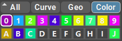
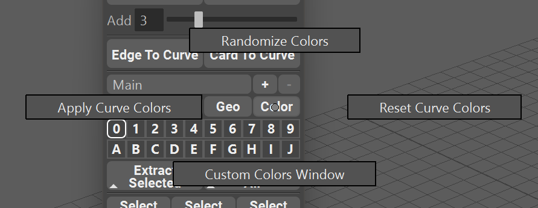
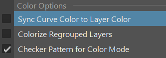

.. currentmodule:: <index>

.. _colors-page:

######################
Colors and Layer Names
######################

Color Mode
^^^^^^^^^^

.. figure:: images/buttons/color.png
    :class: with-shadow float-right
    :width: 100px

**Color** - this filter will activate a special **Colorize Mode**. In this mode all the **Geometry** will be colored based on the **Layer** color.

**Layer** color is assigned randomly at first, but you can always manually change it using **Curve Control Window** and clicking the color box at the top of the window or by opening color control window (Hold RMB on Color button). Color is **Layer** based. Clicking on this button again will restore the original materials of the Geometry. There are two options available for the color mode:

- **Color and UVs** - this default mode will colorize the geometry and also show UV checker map. This is useful to quickly check your **UVs** and which **Curve** is assigned to which **Layer**.
- **Color Only** - this mode can be activated in the Options menu and it will only show colors for each individual **Layer**. This mode is useful if you want to quickly check which **Curve** is assigned to which **Layer**. Open the options menu and uncheck the **Checker Pattern for Color mode**

.. figure:: images/color_checker_demo.png
    :class: with-shadow
    :width: 500px

.. note:: By default, last **Layer** (**J**) is not affected by **Filters**. You can use this last layer to store all your construction/template curves and then show/hide them manually as needed. This functionality can be changed in the Options menu.

Color Marking Menu
^^^^^^^^^^^^^^^^^^

By holding RMB on Colors Filter you will open the marking menu.

- Randomize Colors will randomize Layer colors when clicked. The default values for randomization is Saturation range from 0.5 to 1.0, Hue 0.0 to 1.0 and Value from 0.3 to 0.7
- Apply Curve Colors will sync the curve color in each layer to the color of that layer.
- Reset Curve Colors will reset the colors of the curves to their default Maya color.
- Custom Colors Window will open a window where the user can customize Layers color, save a preset and generate new colors.

Layers Customization Window
^^^^^^^^^^^^^^^^^^^^^^^^^^^

.. figure:: images/layers_customization_window.png
    :class: with-shadow float-right
    :width: 200px

**Layers Customization Window** holds all the controls for the color and name management of the Layers.

**Gradient** section is used to generate a linear gradient from the two colors selected and the amount of rows to generate the gradient to.

**Randomize** section will randomize the colors in every layer based on saturation minimum and maximum values. Value is fixed to a range of 0.3-0.7

**0-39 Layer Color Pickers and Name Fields** allow to set any custom color and name to every layer separately by clicking on the color picker or typing in the field, randomizing this single layer color (Rand) or resetting the color and name of the layer by clicking on Reset button.

**Reset All** button will reset all the layers to the default value.

**Get From Layers** will load the colors and names from the scene layers to the window fields and color pickers.

**Set To Layers** will apply the selected colors and names to the layers in the current scene.

**Load Preset** will load a global preset colors and names.

**Save As Preset** will save current colors and names to a global preset that can be then loaded to any scene.

|
|
|
|

Syncing Curve Color to Layer Color
^^^^^^^^^^^^^^^^^^^^^^^^^^^^^^^^^^

You can synchronize the colors of the curve to the colors of the layers by clicking on the Apply Curve Colors button in the Colors marking menu, or by selecting an option in the options menu: 

|

Colorizing Regrouped Layers
^^^^^^^^^^^^^^^^^^^^^^^^^^^

.. figure:: images/colorized_regrouped_layers.png
    :class: with-shadow float-right
    :width: 150px

You can choose to apply the colors to the Regrouped layers in the outliner (using **Regroup By Layer button**) automatically, based on the Layer color, by selecting the option "Colorize Regrouped Layers" in the options menu.

Regrouping the layers with this option enabled will colorize the groups in the outliner.