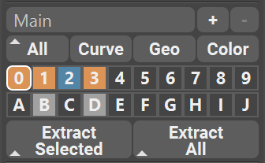
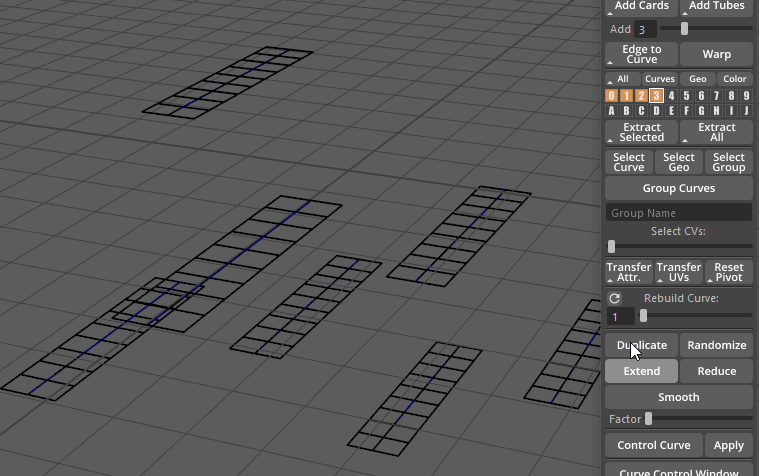
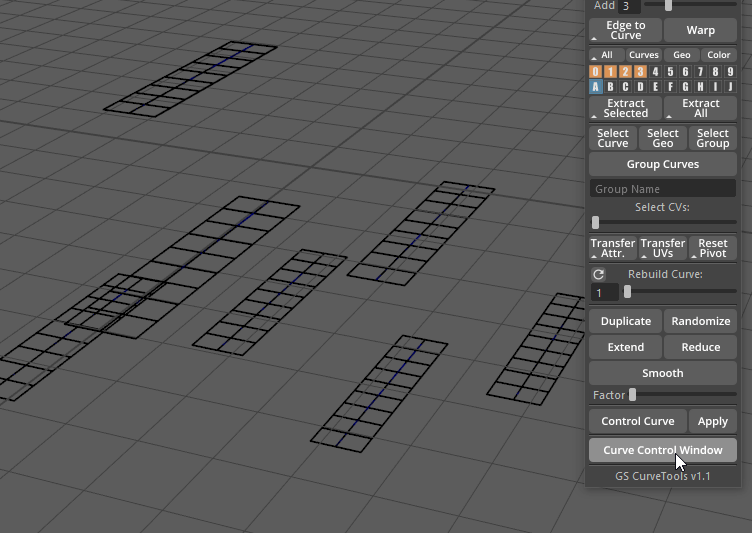
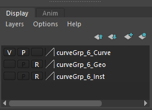
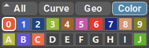
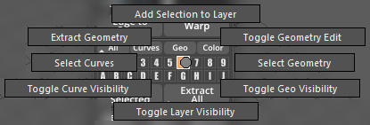
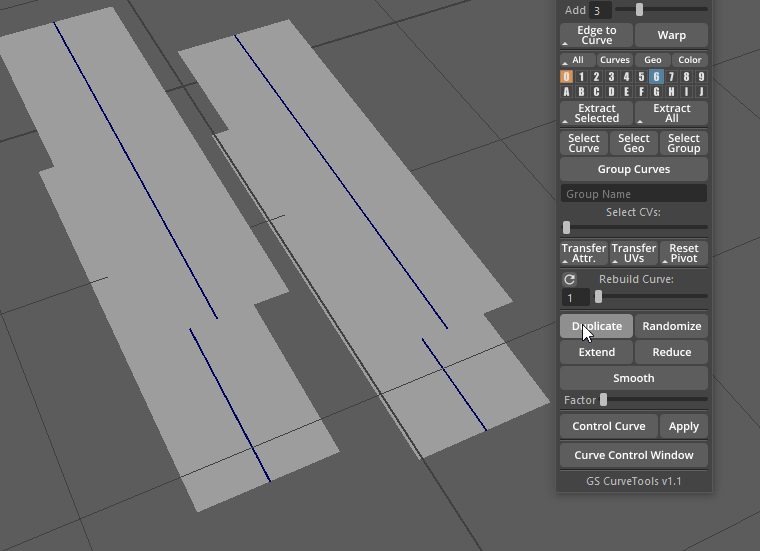

.. currentmodule:: <index>

######
Layers
######

Intro
^^^^^

**Layers** is a powerful and intuitive organization system within GS CurveTools. It has a lot of options to group together, change visibility and editability of curves generated by the plug-in.

There are four **Filters** and **20, 30 or 40 Layers** available for the user, as well as dedicated buttons to quickly extract and combine geometry from all Layers.

Filters
^^^^^^^

There are four **Filters** available:

- **Filter All** (or Show/Hide All) - this filter will show all the hidden **Curves** and **Geometry** in all the layers. By pressing **Shift** and clicking on **All** button you will instead **Hide** all the **Curves** and **Geometry**.

- **Filter Curves** - this filter will show only **Curves** and hide the **Geometry** in all the Layers. Also has **Marking Menu (Hold RMB)** that allows for the toggle of **"Always on Top"** visibility mode.

- **Filter Geo** - this filter will show only **Geometry** and hide all the **Curves** in all the **Layers**.

- **Color** - this filter will activate a special **Colorize Mode**. In this mode all the **Geometry** will be colored based on the **Layer** color. More info is in the :ref:`colors-page` section.

Menu Controls
^^^^^^^^^^^^^

**Layers are exclusive** to each other. Single curve can not be in the two Layers at the same time.

You can **Highlight Layers** by simply **clicking on them**. All the new Curves (except for Duplicated ones) will be automatically assigned to the highlighted Layer.

You can **Hide/Unhide** layers by holding **Alt** button and clicking on the layer with **LMB**.

You can **Select Curves** from a specific layer by holding **Ctrl** and clicking on not highlighted Layer. To select curves from a highlighted Layer use Marking Menu.

|
|
|

You can **Select** curves from **Multiple Layers** by holding **Shift** button and clicking on multiple Layers.

You can **Isolate Select** curves from **Specific Layers** by holding **Shift+Alt** button and clicking on multiple Layers. Only the layer clicked will be shown and others will be hidden.

|
|

You can easily **Move Layers** by simply clicking and dragging with Middle Mouse Button on the Layer, and then releasing the button over another Empty Layer.

If you want to **Merge Layers**, simply click and drag with Middle Mouse Button and release it over another Filled Layer.

**Toggling per-layer "Always on Top"** rendering mode: Hold **Ctrl+Alt** and Click on layer to toggle. Or toggle it globally by using a hotkey or "Curve" filter button marking menu.

.. note:: Layers are utilizing native Maya display layer system. User should not delete or rename any layers created in the Display Layer menu in the Channel Box. Deleting or renaming generated Layers will result in unexpected behavior of the Layer System.

Color Coordination
^^^^^^^^^^^^^^^^^^

Each **Layer** is **color coordinated** depending on their visibility or editability. Here are all the colors:

- Default **"Empty"** color indicates that the layer has no curves assigned to it.

- **"Filled"** Layer color indicates that there is at least one curve assigned to this Layer, this layer geometry is NOT editable (not selectable in the viewport) and both Geometry and Curve is visible.

- **"Editable"** Layer color indicates that there is at least one curve assigned to this layer and its geometry is currently selectable and editable in the viewport.

- **"Only Geometry Visible"** Layer color indicates that there is at least one curve assigned to this layer, the curves are hidden and only geometry is currently visible.

- **"Only Curves Visible"** Layer color indicates that there is at least one curve assigned to this layer, the geometry is hidden and only curves are currently visible.

- **"Hidden"** Layer color indicates that there is at least one curve assigned to this layer and both geometry and curves are hidden in the viewport.

- **"Colorized Mode"** - this special mode is activated by the "Color" filter button and each layer has its own distinct color assigned, mirroring the colors of the geometry in the viewport.

Marking Menu
^^^^^^^^^^^^

Each **Layer** has its own **Marking Menu** that holds many useful functions. You can access this menu by clicking and holding Right Mouse Button on any Layer.

- **Add Selection to Layer** will add any number of selected curves to this Layer. Since Layers are exclusive, curves will be automatically removed from other Layers.

- **Toggle Layer Visibility** will toggle the visibility of the layer. If the layer is hidden it will show everything in this layer and vice versa.

- **Toggle Curve Visibility** will show/hide curves in this layer.

- **Toggle Geo Visibility** will show/hide geometry in this layer.

- **Select Curves** and **Select Geometry** will select the curves or geometry in the layer.

- **Extract Geometry** will extract all the geometry from the selected layer into its separate group and then hide the original geometry and curves. You can then edit or export the extracted geometry. Original curves and geometry are still there, you just need to **Toggle Layer Visibility** to see and edit them.

- **Toggle Geometry Edit** will enable selectability of the geometry in this layer and allow user to poly edit the geometry.

.. note:: **Editing** geometry is usually safe but drastic changes of vert order can have unexpected results. Edited geometry looses the ability to change its Length and Width Divisions using Length and Width Divisions attributes.

Extract Buttons
^^^^^^^^^^^^^^^

You can quickly extract geometry from selected curves or extract the geometry from ALL curves by using special Extract Buttons.

Extract Selected will Extract all the geometry from any number of selected curves. 

It will not hide the original curves or affect them in any other way.

By default, extracted geometry will be merged into one mesh. You can skip this step by holding Shift button when clicking on the Extract Selected button. If you choose not to merge geometry, each individual curve will generate separate mesh. This is useful if you want to manually poly edit your geometry before exporting.

.. figure:: images/extract_all_function.gif
	:alt: Creation Section
	:class: with-shadow float-right
	:width: 250px

Extract All button will extract all the geometry from all the layers (except the last "J" layer).

Extract All will also Hide the original Layers so you can focus on the extracted geometry. All the original curves and geometry are still there, just hidden. You can reveal them all by using Filters or manually by Toggle Layer Visibility function in the Layer Marking Menu.

By default, extracted geometry will be merged into one mesh. You can skip this step by holding Shift button when clicking on the Extract All button. If you choose not to merge geometry, each individual Layer will generate separate group, and in this group there will be separate geometry meshes, one for each original curve. This is useful if you want to manually poly edit your geometry before exporting.

.. note:: Extracted geometry is not connected to the original curves and geometry in any way. You can freely edit it as much as you want. If you edit the original curves, edits will NOT propagate to already extracted geometry.

