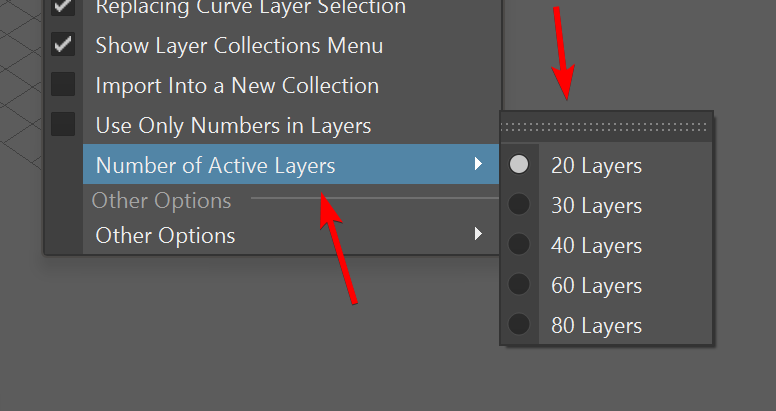
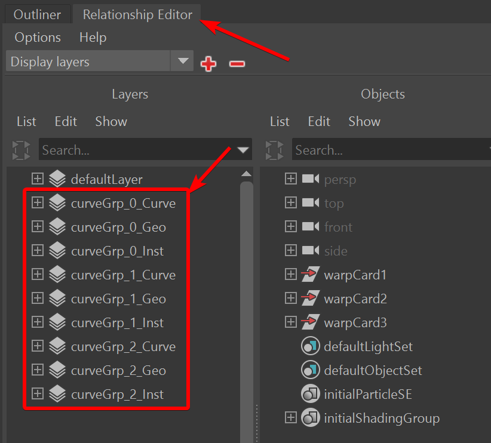

.. currentmodule:: <index>

.. _layers:

######
Layers
######

Intro
^^^^^

.. image:: images/layer_section.png
  :align: right
  :width: 200px

**Layers** is a powerful and intuitive organization system within GS CurveTools. It has a lot of options to group together, change visibility and editability of curves generated by the plug-in.

There are four **Filters** and **20, 30, 40, 60 or 80 Layers** available for the user, as well as dedicated buttons to quickly extract and combine geometry from all Layers.

Number of layers can be changed in the Options⇨Number of active Layers

|

Filters
^^^^^^^

Filters show and hide curves or geo components on all layers. There are three **Filters** and one color toggle available:

.. list-table:: **Filter Buttons**
  :widths: 9 2

  * - **Filter All** (or Show/Hide All) - this filter will show all the hidden **Curves** and **Geometry** in all the layers. By pressing **Shift** and clicking on **All** button you will instead **Hide** all the **Curves** and **Geometry**. Using **Ctrl** modifier will apply the changes to all :ref:`layer collections <layer-collections>`.
    - .. image:: images/buttons/all.png
  * - **Filter Curves** - this filter will show only **Curves** and hide the **Geometry** in all the Layers. Also has **Marking Menu (Hold RMB)** that allows for the toggle of **"Always on Top"** visibility mode. Using **Ctrl** modifier will apply the changes to all :ref:`layer collections <layer-collections>`.
    - .. image:: images/buttons/curves.png
  * - **Filter Geo** - this filter will show only **Geometry** and hide all the **Curves** in all the **Layers**. Using **Ctrl** modifier will apply the changes to all :ref:`layer collections <layer-collections>`.
    - .. image:: images/buttons/geo.png
  * - **Color** - this toggle will activate a special **Color Mode**. In this mode all the **Geometry** will be colored based on the **Layer** color. More info is in the :ref:`layer collections <layer-collections>` section.
    - .. image:: images/buttons/color.png

Layer Controls
^^^^^^^^^^^^^^

**Layers are exclusive** to each other. Single curve can not be in two Layers at the same time.

Here are all the hotkeys and motions available for layers:

**Clicks (LMB):**

- **LMB Click** - highlights the layer (white outline). All the new curves (except for duplicated ones) will automatically be placed into highlighted layer.
- **Ctrl + Click** - exclusively selects curves from single layer (:numref:`select_layer_figure`)
- **Shift + Click** - additively selects curves from multiply layers (:numref:`select_layer_multiple_figure`)
- **Alt + Click** - hide/show selected layer.
- **Ctrl + Shift + Click** - show/hide curve components of the selected layer.
- **Ctrl + Alt + Click** - show/hide geometry components of the selected layer.
- **Shift + Alt + Click** - isolate select selected layer.
- **Shift + Alt + Ctrl + Click** - toggle always-on-top curve visibility for the selected layer (Maya 2022+).

**Motions (MMB):**

- **MMB + Drag** - move the contents of one layer to another layer (:numref:`mouse_drag_layer_figure`). Combines the layers if the target layer is not empty.
- **MMB + Shift + Drag** - copy the contents of one layer to another layer (:numref:`mouse_merge_layer_figure`). Copy and combine if target layer is not empty.

.. list-table:: 

  * - .. figure:: images/select_layer.gif
        :target: _images/select_layer.gif
        :name: select_layer_figure

        Exclusive layer selection

    - .. figure:: images/select_layer_multiple.gif
        :target: _images/select_layer_multiple.gif
        :name: select_layer_multiple_figure

        Additive layer selection

  * - .. figure:: images/mouse_drag_layer.gif
        :name: mouse_drag_layer_figure
        :scale: 150%

        Moving layers using MMB

    - .. figure:: images/mouse_merge_layer.gif
        :name: mouse_merge_layer_figure
        :scale: 150%

        Merging layers using MMB

.. note:: 
  Holding RMB on any layer will open a :ref:`layer-marking-menu` with additional commands.

  Layers are utilizing native Maya display layer system.

  They are typically named **curveGrp_#_Curve**, **curveGrp_#_Geo**, **curveGrp_#_Inst** and can be found in Windows⇨Relationship Editors⇨Display Layer window.

  Starting from v1.3 GS CurveTools layers are hidden from Channel Box/Layer Editor Window.

.. warning:: 
  **User should NOT delete or rename any display layers created by GS CurveTools.**

Color Coordination
^^^^^^^^^^^^^^^^^^

Each **Layer** is **color coordinated** depending on its visibility or editability:

.. list-table::
  :widths: 8 1

  * - Default **"Empty"** color indicates that the layer has no curves assigned to it.
    - .. image:: images/buttons/empty_layer.png
  * - **"Filled"** Layer color indicates that there is at least one curve assigned to this Layer, this layer geometry is NOT editable (not selectable in the viewport) and both Geometry and Curve is visible.
    - .. image:: images/buttons/filled_layer.png
  * - **"Editable"** Layer color indicates that there is at least one curve assigned to this layer and its geometry is currently selectable and editable in the viewport.
    - .. image:: images/buttons/editable_layer.png
  * - **"Only Geometry Visible"** Layer color indicates that there is at least one curve assigned to this layer, the curves are hidden and only geometry is currently visible. 
    - .. image:: images/buttons/geo_only_layer.png
  * - **"Only Curves Visible"** Layer color indicates that there is at least one curve assigned to this layer, the geometry is hidden and only curves are currently visible.
    - .. image:: images/buttons/curve_only_layer.png
  * - **"Hidden"** Layer color indicates that there is at least one curve assigned to this layer and both geometry and curves are hidden in the viewport.
    - .. image:: images/buttons/hidden_layer.png

.. _layer-marking-menu:

Marking Menu
^^^^^^^^^^^^

.. image:: images/layer_marking_menu.png
  :align: right
  :width: 300px

Each **Layer** has its own **Marking Menu** that holds many useful functions. You can access this menu by clicking and holding Right Mouse Button on any Layer.

- **Add Selection to Layer** will add any number of selected curves to this Layer. Since Layers are exclusive, curves will be automatically removed from other Layers.

- **Toggle Layer Visibility** will toggle the visibility of the layer. If the layer is hidden it will show everything in this layer and vice versa.

- **Toggle Curve Visibility** will show/hide curves in this layer.

- **Toggle Geo Visibility** will show/hide geometry in this layer.

- **Select Curves** and **Select Geometry** will select the curves or geometry in the layer.

- **Extract Geometry** will extract all the geometry from the selected layer into its separate group and then hide the original geometry and curves. You can then edit or export the extracted geometry. Original curves and geometry are still there, you just need to **Toggle Layer Visibility** to see and edit them.

- **Toggle Geometry Edit** will enable selectability of the geometry in this layer and allow user to poly edit the geometry.

.. note:: **Editing** geometry is usually safe but drastic changes of vert order can have unexpected results. Edited geometry looses the ability to change its Length and Width Divisions using Length and Width Divisions attributes.

.. _extract-buttons:

Extract Buttons
^^^^^^^^^^^^^^^

You can quickly extract geometry from selected curves or extract the geometry from ALL curves by using special Extract Buttons. Extraction duplicates the geometry and detaches it from curves for safe export or further editing. Original curves and procedural geometry stays unchanged.

.. image:: images/buttons/extract_selected.png
  :width: 150px

.. image:: images/extract_selected_function.gif
  :align: right
  :width: 250px

Extract Selected will Extract all the geometry from any number of selected curves. 

By default, extracted geometry will be merged into one mesh. You can skip this step by holding **Shift** button when clicking on the Extract Selected button. If you choose not to merge geometry, each individual curve will generate separate mesh. This is useful if you want to manually poly edit your geometry before exporting.

Holding **Ctrl** button and clicking Extract will automatically open Export window after extraction and delete extracted geometry after successful export. This allows for quick export during modeling to check the result in engine of choice.

.. note:: Extract Selected will not hide the original curves and geo.

.. image:: images/buttons/extract_all.png
  :width: 150px

.. image:: images/extract_all_function.gif
  :align: right
  :width: 250px

Extract All button will extract all the geometry from all the layers.

Extract All will also Hide the original Layers so you can focus on the extracted geometry. All the original curves and geometry are still there, just hidden. You can reveal them all by using Filters or manually by Toggle Layer Visibility function in the Layer Marking Menu.

By default, extracted geometry will be merged into one mesh. You can skip this step by holding **Shift** button when clicking on the Extract All button. If you choose not to merge geometry, each individual Layer will generate separate group, and in this group there will be separate geometry meshes, one for each original curve. This is useful if you want to manually poly edit your geometry before exporting.

Holding **Ctrl** button and clicking Extract will automatically open Export window after extraction and delete extracted geometry after successful export. This allows for quick export during modeling to check the result in engine of choice.

Extract All can optionally ignore :ref:`Layer Collections<layer-collections>` that have "template" in their name. Refer to :ref:`Layer Collection Options<layer-collection-options>`.

.. note:: Extracted geometry is not connected to the original curves and geometry in any way. You can freely edit it as much as you want. If you edit the original curves, edits will NOT propagate to already extracted geometry.

How To Access Hidden Layers
^^^^^^^^^^^^^^^^^^^^^^^^^^^

Starting from version 1.3 GS CurveTools layers will be hidden from Channel Box/Layer Editor window to avoid cluttering the view.

User can still access those layers, if he needs additional control. They are still visible and accessible in the **Windows ⇨ Relationship Editor ⇨ Display Layers** Window

|
|

.. warning:: **User should NOT rename or delete any layers created by GS CurveTools**

