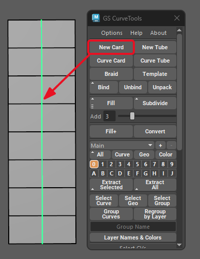
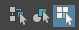
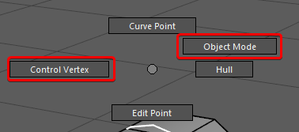
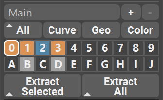
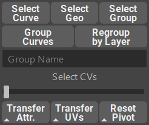
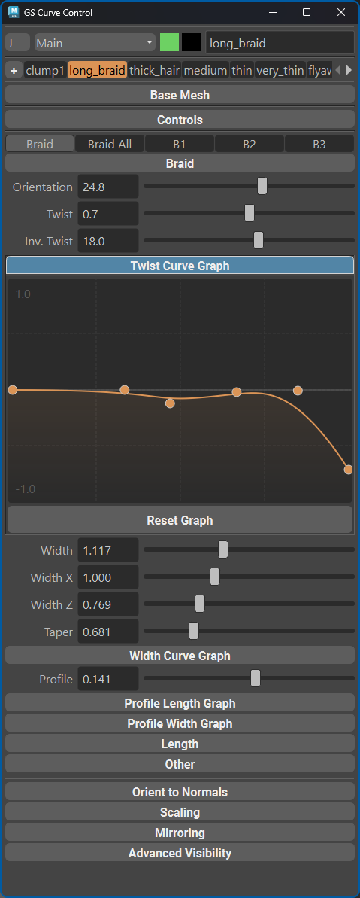
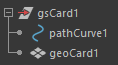

.. currentmodule:: <index>

#########################
Main Menu and First Steps
#########################

Intro
=====

GS CurveTools v2's main function is to create and manipulate geometry that is bound to a curve.

This is useful in many ways. You can create hair cards for games. Belts and straps for characters. Tubes, pipes and cables for environments and much more.

GS CurveTools also allows for advanced geometry manipulation, for example complex braided cables, hair braids, clusters of hair cards all controlled by a single curve in a natural way.

In this chapter we will go through the main concepts of the plug-in.

.. note:: If you want in-depth functionality explanation, please select appropriate chapter from the Table of Contents on the left.

Basic Workflow Example
======================

Start by creating a simple curve card with the :ref:`New Card<new-card-button>` button. A new card will be created in the selected layer (0 by default). Now try modifying the curve that was created.

You can switch to "Control Vertex" editing mode by selecting "Select by Component Type" in the Maya Menu or by pressing F8.

You can also access Marking Menu of the curve by holding RMB. There you can switch between control vertex and object selection modes.

Now open the :ref:`Curve Control Window<curve-control-window>` by pressing the button with the same name.

Here you will find all the main controls for the curve as well as Sculpt, Place, Draw and other tools.

Now select your curve and click :ref:`Duplicate <duplicate>` button. You now have two curves with the same attributes, UVs and material.

.. note:: To read about UV setup, please see the :ref:`Textures and UVs<uvs>` and :ref:`UV Editor<uv-editor>` sections.

By default, :ref:`Layer <layers>` 0 is selected and all new curves will go there. You can switch between layers by simply clicking on them. All the new curves (except for duplicated ones) will go into selected layers. Duplicated curves will inherit the layer of the original selected curve.

.. _main-menu:

Main Menu
=========

Main Menu is a simple window that can be docked to any place within Maya main window. It will persist its docked state between Maya sessions.

Main Menu is split into 5 logical sections:

    .. image:: images/options_help_about.png
        :align: right
        :width: 150px

Options section
---------------

At the top of the menu are :ref:`Options <options>`, Help and About drop down menus:

#. **Options** menu holds various tweaks that you can use to alter functionality of the plug-in.
#. **Help** menu holds main links to documentation as well as contacts and social media links of the author.
#. **About** menu holds information about the version of the plug-in and licensing details.

Creation Section
----------------

.. image:: images/creation_section.png
    :align: right
    :width: 150px

In the :ref:`Creation Section <creating-cards-and-tubes>` you will find all the commands that create new cards or tubes, modify existing curves, add cards between other cards, convert geometry, XGen or edges to curves and advanced geometry and curves binding functions - :ref:`Bind, Unbind and Unpack <bind-unbind>`.

#. :ref:`New Card<new-card-button>` and :ref:`New Tube<new-card-button>` will create a default card or tube in the center of the scene.
#. :ref:`Curve Card<curve-card-button>` or :ref:`Curve Tube<curve-card-button>` will convert any Maya curve to a fully functional Curve Card or Tube.
#. :ref:`Braid button<braids>` will create a new Braid object in the center of the scene and, if curves are selected, will create braids on those NURBS curves.
#. :ref:`Template button<template-button>` will use the currently selected template to create a new object on the curve or adjust an already existing selected object.
#. :ref:`Bind, Unbind and Unpack <bind-unbind>` buttons allow for advanced binding of geometry and curves to other curves. More details in the **Bind** section.
#. :ref:`Fill<fill-button>` will create duplicates of the selected Cards, Tubes, Braids or Bound objects and distribute them evenly in-between selected curves. Compared to Add Cards and Add Tubes, **Fill** is faster, more reliable, compatible with Bound objects and in general a recommended way of adding new cards in-between other cards.
#. :ref:`Fill<fill-button>` also hosts :ref:`Add Cards and Add Tubes<add-cards-button>` inside the marking menu (Hold RMB on the button), and they will create new Cards or Tubes between selected Curve Cards or Curve Tubes. The number of created curves is controlled by the **Add** slider.
#. :ref:`Subdivide <subdivide>` will replace any selected card with multiple duplicates based on the Add slider.
#. :ref:`Fill Plus<fill-plus>` will open a window that allows you to fill the selected curves with multiple other curves. Similar to regular Fill, but it works in volume and has collision detection with the base mesh and more controls in general.
#. :ref:`Convert<edge-to-curve-card-to-curve>` function will open a window with conversion options. You can convert geometry, XGen or selected geometry edges to NURBS curves or directly to Cards, Tubes or Template objects.

Layer Section
-------------

:ref:`Layer Section <layers>` consists of layer collections widget, three filters and one color mode toggle, 20, 30, 40, 60 or 80 available curve layers and geometry extraction buttons:

#. :ref:`Layer Collections <layer-collections>` widget creates, deletes and manages Layer Collections.
#. :ref:`Filters <layers>` allow you to quickly show/hide all curve cards, show only curves, show only geometry and enable geometry colorization mode.
#. :ref:`Color mode<color-mode>` will change the color of all the cards based on the Layer color.
#. :ref:`20 Layers <layers>` (by default) switch buttons allow for advanced and intuitive organization of curve cards. New curves are placed in the selected layer. Using Marking Menu (Hold RMB) you can transfer curves between layers, hide individual layers, change selectability of geometry and more.
#. :ref:`Extract Selected <extract-buttons>` will extract geometry from selected curves. Holding Shift during extraction will result in separated cards, instead of one combined mesh. Holding Ctrl will open Export window and delete extracted geometry after export.
#. :ref:`Extract All <extract-buttons>` will extract geometry from all layers. Holding Shift during extraction will result in separated cards, instead of one combined mesh. Holding Ctrl will open Export window and delete extracted geometry after export.

Selection and Transfer Section
------------------------------

#. :ref:`Selection and Transfer Section <selection>` adds additional useful functions to control Curve Cards/Tubes attributes and grouping.

    a. :ref:`Select Curve, Select Geo, Select Group<selection>` will select the appropriate Curve Card component. Refer to :ref:`Structure of the Curve Card/Tube Object<structure-of-curve-object>`.
    #. :ref:`Group Curves button and Group Name<group-curves>` field allows for quick grouping of selected curves in the Outliner. Selected curves will be placed in one group named based on the Group Name field text. Default name will be used if the field is empty.
    #. :ref:`Select CVs Slider <select-slider>` will quickly select CVs based on the slider position. Select curves and drag the slider.
    #. :ref:`Transfer Attr<transferring-attributes>` and :ref:`Transfer UVs<transferring-uvs>` buttons will transfer appropriate attributes and UVs from one selected curve to all other curves in the selection list. Holding RMB on these buttons will open a marking menu to :ref:`Copy-Paste<copy-paste-attributes>` and :ref:`Filter<attribute-filters>` transferred attributes.
    #. :ref:`Reset Pivot <reset-pivot>` will reset the manipulator pivot to the first CV of the curve.

    .. image:: images/utility_section.png
        :align: right
        :width: 150px

Utility Section
---------------

:ref:`Utility Section <utility>` holds advanced functions that change the curve density, length, smoothness and more:

#. :ref:`Rebuild Curve Slider <rebuild-curve-slider>` will interactively rebuild selected curves (change the number of CVs).
#. :ref:`Duplicate <duplicate>` button is probably the most important function for quick duplication of already existing Curve Cards and Tubes. Simply select any number of curves and click duplicate.
#. :ref:`Randomize <randomize>` button will open a randomization window where various curve parameters and attributes can be randomized.
#. :ref:`Extend and Reduce <extend-reduce-smooth>` will lengthen or shorten the selected curves based on the Factor Slider.
#. :ref:`Smooth<smooth>` will smooth selected curves or selected CVs based on the Factor slider.
#. :ref:`Curve Control and Apply<control-curve>` buttons create a deformer curve that can deform selected curves. To apply the deformer, simply select it and click Apply.
#. The :ref:`Curve Control Window<curve-control-window>` will open a separate menu that holds sliders and graphs that control curve attributes and UVs.
#. The :ref:`UV Editor<uv-editor>` window will open the UV Editor.

.. note:: 
    You might notice a **small triangle** ▲ on some icons. This triangle indicates that there is an alternative algorithm available for this function. To activate it, just **Hold Shift** before clicking the button.

.. note:: 
    Some buttons also have **three horizontal lines** ≡ icon that indicates that this button has marking menu. Holding RMB on that button will open it.

.. _curve-control-window:

Curve Control Window
====================

The Curve Control Window holds templates, manipulators (sculpting, place, value) and all the sliders and checkboxes that control the attributes of any selected curves. The window is dockable to any part of Maya UI. It is selection-based and has several sections:

#. At the top there are controls for :ref:`Curve Layers<layers>` drop-down menu, :ref:`Layer Collections<layer-collections>` drop-down menu, :ref:`Geometry Color swatch in Color mode<layer-customization>`, :ref:`Curve Color swatch<layer-customization>`, Curve Name and :ref:`Geometry Color in Color mode<color-mode>`.
#. Below there is a list of :ref:`Templates<templates>` as well as template creation button (+).
#. Base Mesh menu holds the input field and selection button to select the base mesh. Base mesh is used throughout the plug-in.
#. Controls section holds Place, Draw, Sculpt, Value, Twist and Width manipulators.
#. Main :ref:`Attributes<attributes>` Section holds all the main sliders and graphs for curve control as well as scope selector if the selected object has multiple sub-objects (Bind, Braid). For Braids there's an extra section that can be expanded that holds Braid-specific controls.
#. :ref:`Orient to Normals<orient-to-normals>` holds all the controls for orient to normals algorithm
#. :ref:`Scaling<scaling-curves>` holds the controls for scaling operations.
#. :ref:`Mirroring<mirroring>` holds the controls for mirroring operations.
#. :ref:`Advanced Visibility<advanced-visibility>` holds all the options for highlighting of the selected curves and geo.

.. note:: 
    You can always extend the range of the sliders by manually typing values into a value field. To reset the sliders range, right click on them and select the appropriate option.

.. _structure-of-curve-object:

Structure of the Curve Card/Tube Object
=======================================

Cards, Tubes, Braids and Bound objects are packed in a group that holds pathCurve and Geometry. For Bound objects it also holds all the child components.

**gsCard** is the main group that holds all the elements of the Curve Cards and Tubes. This top level group can be moved, grouped and renamed.

The main object that you will interact with is the **pathCurve** object. It is the only viewport-selectable object by default. It is a control curve that deforms the geometry based on its shape. This curve has no construction history, which allows you to use default Maya Deformers, curve functions and other curve-related options from Maya without losing the functionality of the Curve Card group. pathCurve should not be renamed or moved outside the main group.

**geoCard** is the actual geometry that is controlled by the **pathCurve**. The only way to interact with it is to enable "Geometry Edit" in the layer.

.. warning:: You should not remove or rename any objects inside the main group. If you want to organize your scene - use layers and/or rename and group the main group itself but not its contents.
