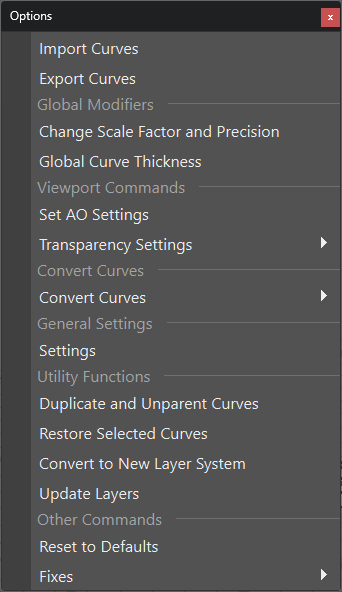
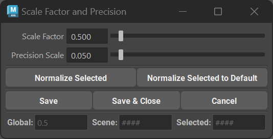
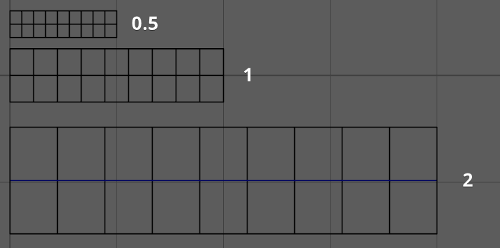
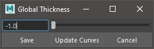

.. currentmodule:: <index>

############
Options Menu
############

Options Menu holds some additional options and functions to change the functionality of the plug-in.

**Import and Export** functions allow you to import and export curves to be used as templates, or simply to transfer them between projects. More info is in the :ref:`import-export-page` section.

Scale Factor
^^^^^^^^^^^^

Scale factor will determine the Initial Scale of the curve created by New Card, New Tube, Curve Card, Curve Tube, Add Cards and Add Tubes buttons.

This option is very important if you need to adjust the scale of new curves (mostly Width) when working on different Scene Scales.

Scale Factor is a simple multiplier and has range from 0.001 to basically infinity (default limit is 10, but you can manually type bigger values)

.. note:: Scale Factor will only affect new curves. Old curves will not change.

Global Curve Thickness
^^^^^^^^^^^^^^^^^^^^^^

This menu allows user to change global default thickness of the curves. It only affects curves that were created using the plug-in.

**Input field and slider** goes from -1 (default thickness) to 20.

**Save** button will save current thickness value and it will be consistent between Maya sessions.

**Update Curves** button will change the thickness of already existing curves in the scene.

You can setill edit individual curve thickness in the **Curve Control Window**

Set AO Settings
^^^^^^^^^^^^^^^

This button will change the settings of AO in the current scene to match those described in the Useful Tips section

Set Transparency Settings
^^^^^^^^^^^^^^^^^^^^^^^^^

This button will change the settings of transparency in the the current scene for better rendering of hair cards in the current scene.

Update Layers
^^^^^^^^^^^^^

Update layers will force-update Layers menu. If you feel that the Layers did not update after some action, you can always use this button. It should not be needed 99.9% of the time.

Reset to Defaults
^^^^^^^^^^^^^^^^^

This button will reset GS CurveTools plug-in to the "factory" defaults.

Color Options
^^^^^^^^^^^^^

**Sync Curve Color** to the Layer Color will enable the automatic sync between Layer Color and color of the path curve used to control Curve Cards and tubes

**Colorize Regrouped Layers** will enable automatic colorization of the regrouped layers when pressing **Regroup by Layer** button.

You can change the colors in Curve Control Window or using Custom Colors Window in the Colors button marking menu.

**Checker pattern for color** will determine if colorize mode should use plain color or checker pattern.

Layer Options
^^^^^^^^^^^^^

**Use Only Numbers in Layers** will activate/deactivate numbers only mode for layer names. With this option disabled, the second row of layers will have A-J letters instead.

**Use 20, 30 or 40 Layers** will switch between the number of layers available to the user.

Additional Options
^^^^^^^^^^^^^^^^^^

**Extract Last Group** and **Filter Last Group** will change the behavior of Extract All button and Filter buttons. Those buttons will either ignore or affect last Layer depending on these options.

**Sync Outliner/Layer Visibility** will automatically hide curves not only using layers, but also in the outliner (they will be greyed out)

**Keep Curve Attributes** will remember and read the curve attributes on on the curve, even if the curve is detached from the curve card/tube node network (duplicated, exported, etc.)

**Bound Curves Follow Parent** will ensure that moving a parent curve in a Bound Object (Bound Group) will also move all the child curves along with it to a new layer.

**Duplicate Curves Before Bind** will automatically duplicate the curves before binding them to the curve, leaving old curves behind with no edits.

**Add Cards/Tubes Blend Attributes** enables blending of the attributes when using Add Cards/Tubes or Fill functions.

**Auto Convert Instances will** automatically convert instanced curves to normal curves before any other function is applied.

**Replacing Curve Layer Selection** will disable additive selection for the layers. When holding Ctrl and clicking on a new layer, old layer will be deselected automatically.

**Fix Maya 2020-2022 UV Bug** This option will fix any broken UVs when trying to open old scenes in Maya 2020 or 2022 or when opening scenes in 2020 and 2022 when using Maya Binary file type. This will have no effect on older versions of Maya (<2020). This bug is native to Maya and thus can't be fixed in GS CurveTools plug-in.

**Fix Maya 2020.4 Twist Attribute** This option will fix any broken cards created in Maya 2020.4 before v1.2.2 update.