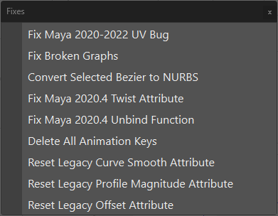

.. currentmodule:: <index>

.. _options:

############
Options Menu
############

.. image:: images/options_menu.png
  :align: right
  :width: 300px

Options Menu holds some additional options and functions to change the functionality of the plug-in.

Import and Export Curves
^^^^^^^^^^^^^^^^^^^^^^^^

**Import and Export** functions allow you to import and export curves to be used as templates, or simply to transfer them between projects. More info is in the :ref:`import-export-page` section.

Scale Factor and Precision
^^^^^^^^^^^^^^^^^^^^^^^^^^

See :ref:`scale-factor-and-precision`

Global Curve Thickness
^^^^^^^^^^^^^^^^^^^^^^

.. image:: images/global_curve_thickness_window.png
  :width: 200px

This menu allows user to change global default thickness of the curves. It only affects curves that were created using the plug-in.

**Input field and slider** goes from -1 (default thickness) to 20.

**Save** button will save current thickness value and it will be consistent between Maya sessions.

**Update Curves** button will change the thickness of already existing curves in the scene.

You can also edit individual curve thickness in the :ref:`Curve Control Window<attributes>`.

Set AO Settings
^^^^^^^^^^^^^^^

This button will change the settings of AO in the current scene to match those described in the Useful Tips section. Only useful for older versions of Maya. Using Maya's XRay and :ref:`advanced-visibility` is advised.

Transparency Settings
^^^^^^^^^^^^^^^^^^^^^

This option will change the transparency settings in the current viewport for optimal hair cards rendering.

**Depth Transparency** is recommended.

There are three transparency modes available:

- **Simple Transparency** - fast but very inaccurate render mode. Only suitable for simple, one layer hair.
- **Object Sorting Transparency** - has average performance impact and quality. Can have issues on complex multi-layered grooms.
- **Depth Transparency** - sets the optimal settings for the highest quality of the hair cards preview. Can have performance impact on slower systems.

Convert Curves
^^^^^^^^^^^^^^

These functions will convert selected type of curves to any other type of curves.

- **Convert to Warp Card** - will convert any selected cards or tubes to Warp Cards.
- **Convert to Warp Tubes** - will convert any selected cards or tubes to Warp Tubes.
- **Convert to Extrude Card** - will convert any selected cards or tubes to Extrude Cards.
- **Convert to Extrude Tube** - will convert any selected cards or tubes to Extrude Tubes.

These functions can also be used to convert old versions of cards and tubes to a new version ones. Backup before conversion.

.. warning:: Convert functions do not support :ref:`Bound<bind-unbind>` objects.

.. _duplicate-and-unparent-curves:

General Settings
^^^^^^^^^^^^^^^^

More :ref:`here<settings>`.

Duplicate and Unparent Curves
^^^^^^^^^^^^^^^^^^^^^^^^^^^^^

Duplicates selected NURBS curves and unparents them (parents them to the world).
Original curves are not deleted.
Can be used to easily extract and export curves from GS CurveTools objects.

This function is basically the same as using Ctrl+D and then Shift+P. Using a function instead of hotkeys ensures that you won't duplicate the curve twice or duplicate and forget to unparent.

Other Options
^^^^^^^^^^^^^

- **Convert to New Layer System** will convert the scene to use new layer system that will not clutter the Channel Box/Layer Editor window.
- **Update Layers** will force-update Layers menu. If you see that the Layers did not update after some action, you can always use this button. It should not be needed 99.9% of the time.
- **Reset to Defaults** this button will reset GS CurveTools plug-in to the "factory" defaults.

Fixes Menu
^^^^^^^^^^

These functions will fix various issues and legacy behaviors in the current scene.

- **Fix Maya 2020-2022 UV Bug** This function will fix any broken UVs when trying to open old scenes in Maya 2020 or 2022 or when opening scenes in 2020 and 2022 when using Maya Binary file type. This will have no effect on older versions of Maya (<2020). This bug is native to Maya and thus can't be fixed in GS CurveTools plug-in.
- **Fix Broken Graphs** This function will attempt to fix all the broken graphs in the scene. More info on broken graphs here: :ref:`broken-graphs`
- **Convert Selected Bezier to NURBS** will convert selected Bezier-based Curve Cards and Tubes to NURBS-based ones.
- **Fix Maya 2020.4 Twist Attribute** This function will fix any broken cards created in Maya 2020.4 before v1.2.2 update.
- **Fix Maya 2020.4 Unbind Function** This function will fix any cards that are not unbinding properly created before v1.2.3 update in Maya 2020.4.
- **Delete All Animation Keys** will delete all animation keys from the curves in the scene. Might fix duplication and other deformation issues.
- **Reset Legacy Curve Smooth Attribute** will reset the now deprecated curve smooth attribute to 0. Useful, because the slider is no longer available in the Curve Control Window.
- **Reset Legacy Offest Attribute** will reset the now deprecated offset attribute to 0. Useful, because the slider is no longer available in the Curve Control Window.
