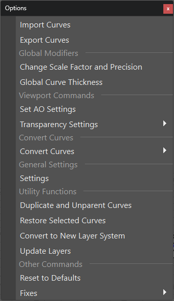
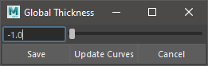

.. currentmodule:: <index>

.. _options:

############
Options Menu
############

Options Menu holds some additional options and functions to change the functionality of the plug-in.

Import and Export Curves
^^^^^^^^^^^^^^^^^^^^^^^^

**Import and Export** functions allow you to import and export curves to be used as templates, or simply to transfer them between projects. More info is in the :ref:`import-export-page` section.

Scale Factor and Precision
^^^^^^^^^^^^^^^^^^^^^^^^^^

See :ref:`Scale Factor and Precision<scale-factor>`

Global Curve Thickness
^^^^^^^^^^^^^^^^^^^^^^

This menu allows user to change global default thickness of the curves. It only affects curves that were created using the plug-in.

**Input field and slider** goes from -1 (default thickness) to 20.

**Save** button will save current thickness value and it will be consistent between Maya sessions.

**Update Curves** button will change the thickness of already existing curves in the scene.

You can also edit individual curve thickness in the :ref:`Curve Control Window<curve-control-window>`.

Set AO Settings
^^^^^^^^^^^^^^^

This button will change the settings of AO in the current scene to match those described in the Useful Tips section. It is only useful for older versions of Maya. Using Maya's XRay and :ref:`Advanced Visibility<advanced-visibility>` is advised.

Transparency Settings
^^^^^^^^^^^^^^^^^^^^^

This option will change the transparency settings in the current viewport for optimal hair cards rendering.

**Depth Transparency** is recommended.

There are three transparency modes available:

- **Object Sorting Transparency** - the default Maya transparency mode. Unfit for hair cards.
- **Alpha Cut** - fast but ugly rendering. Will not smoothly blend alpha map and will create a rough edges where transparency should be.
- **Depth Transparency** - sets the optimal settings for the highest quality of the hair cards preview. Can have performance impact on slower systems.

.. _duplicate-and-unparent-curves:

General Settings
^^^^^^^^^^^^^^^^

More :ref:`here<settings>`.

Duplicate and Unparent Curves
^^^^^^^^^^^^^^^^^^^^^^^^^^^^^

Duplicates selected NURBS curves and unparents them (parents them to the world).
Original curves are not deleted.
Can be used to easily extract and export curves from GS CurveTools objects.

This function is basically the same as using Ctrl+D and then Shift+P. Using a function instead of hotkeys ensures that you won't duplicate the curve twice or duplicate and forget to unparent.

Restore Selected Curves
^^^^^^^^^^^^^^^^^^^^^^^

This function will attempt to restore the selected curves to their original functional state. This is useful if you accidentally cleared construction history on geometry or the entire scene.

All types are supported (curves, tubes, bound objects).

Other Options
^^^^^^^^^^^^^

- **Update Layers** will force-update Layers menu. If you see that the Layers did not update after some action, you can always use this button. It should not be needed 99.9% of the time.
- **Reset to Defaults** this button will reset GS CurveTools plug-in to the "factory" defaults.

Fixes Menu
^^^^^^^^^^

- **Convert Selected Bezier to NURBS** will convert selected Bezier-based Curve Cards and Tubes to NURBS-based ones.
- **Delete All Animation Keys** will delete all animation keys from the curves in the scene. Might fix duplication and other deformation issues.
