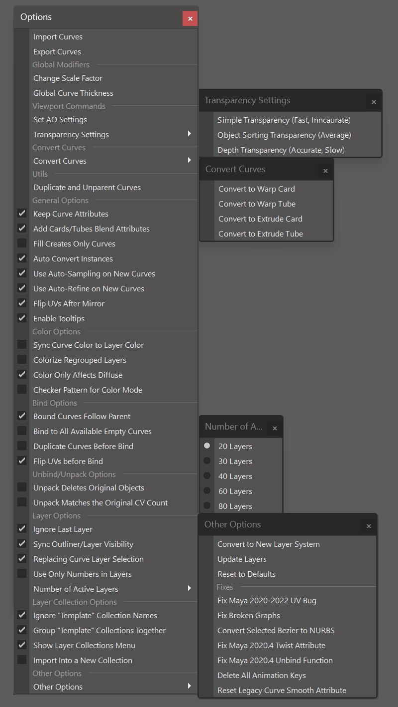
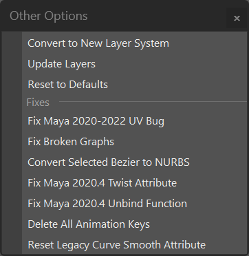

.. currentmodule:: <index>

.. _options:

############
Options Menu
############

Options Menu holds some additional options and functions to change the functionality of the plug-in.

Import and Export Curves
^^^^^^^^^^^^^^^^^^^^^^^^

**Import and Export** functions allow you to import and export curves to be used as templates, or simply to transfer them between projects. More info is in the :ref:`import-export-page` section.

Scale Factor
^^^^^^^^^^^^

See :ref:`scale-factor-and-precision`

Precision Scale
^^^^^^^^^^^^^^^

See :ref:`precision-scale`

Global Curve Thickness
^^^^^^^^^^^^^^^^^^^^^^

This menu allows user to change global default thickness of the curves. It only affects curves that were created using the plug-in.

**Input field and slider** goes from -1 (default thickness) to 20.

**Save** button will save current thickness value and it will be consistent between Maya sessions.

**Update Curves** button will change the thickness of already existing curves in the scene.

You can also edit individual curve thickness in the :ref:`Curve Control Window<attributes>`.

Set AO Settings
^^^^^^^^^^^^^^^

This button will change the settings of AO in the current scene to match those described in the Useful Tips section. Only useful for older versions of Maya. Using Maya's XRay and :ref:`advanced-visibility` is advised.

Transparency Settings
^^^^^^^^^^^^^^^^^^^^^

This option will change the transparency settings in the current viewport for optimal hair cards rendering.

**Depth Transparency** is recommended.

There are three transparency modes available:

- **Simple Transparency** - fast but very inaccurate render mode. Only suitable for simple, one layer hair.
- **Object Sorting Transparency** - has average performance impact and quality. Can have issues on complex multi-layered grooms.
- **Depth Transparency** - sets the optimal settings for the highest quality of the hair cards preview. Can have performance impact on slower systems.

Convert Curves
^^^^^^^^^^^^^^

These functions will convert selected type of curves to any other type of curves.

- **Convert to Warp Card** - will convert any selected cards or tubes to Warp Cards.
- **Convert to Warp Tubes** - will convert any selected cards or tubes to Warp Tubes.
- **Convert to Extrude Card** - will convert any selected cards or tubes to Extrude Cards.
- **Convert to Extrude Tube** - will convert any selected cards or tubes to Extrude Tubes.

.. note:: These functions can also be used to convert old versions of cards and tubes to a new version ones. Backup before conversion.

.. warning:: Convert functions do not support :ref:`Bound<bind-unbind>` objects.

.. _duplicate-and-unparent-curves:

Duplicate and Unparent Curves
^^^^^^^^^^^^^^^^^^^^^^^^^^^^^

Duplicates selected NURBS curves and unparents them (parents them to the world).
Original curves are not deleted.
Can be used to easily extract and export curves from GS CurveTools objects.

.. note:: This function is basically the same as using Ctrl+D and then Shift+P. Using a function instead of hotkeys ensures that you won't duplicate the curve twice or duplicate and forget to unparent.

General Options
^^^^^^^^^^^^^^^

These are the general options that affect the functionality of the plug-in:

- **Keep Curve Attributes** will remember and read the curve attributes on on the curve, even if the curve is detached from the curve card/tube node network (duplicated, exported, etc.)
- **Add Cards/Tubes Blend Attributes** enables blending of the attributes when using Add Cards/Tubes or Fill functions.
- **Fill Creates Only Curves** will enable curve only output during :ref:`Fill<fill-button>` function
- **Auto Convert Instances will** automatically convert instanced curves to normal curves before any other function is applied.
- **Use Auto-Refine on New Curves** - will automatically enabled :ref:`Auto-Refine<attributes>` mode on newly created curves and tubes.
- **Flip UVs After Mirror** - will automatically flip UVs after the mirror (or flip) function is used. This allows for more accurate mirroring.
- **Enable Tooltips** - will toggle the tooltips visibility on plug-in controls and buttons.

Color Options
^^^^^^^^^^^^^

- **Sync Curve Color** to the Layer Color will enable the automatic sync between Layer Color and color of the path curve used to control Curve Cards and tubes
- **Colorize Regrouped Layers** will enable automatic colorization of the regrouped layers when pressing **Regroup by Layer** button. You can change the colors in :ref:`Curve Control Window<attributes>` or using :ref:`Custom Colors Window<layer-customization-window>`.
- **Color Only Diffuse** - will apply color only to the diffuse component and keep the alpha transparency active.
- **Checker pattern for color** will determine if colorize mode should use plain color or checker pattern.

Bind Options
^^^^^^^^^^^^

- **Bound Curves Follow Parent** will ensure that moving a parent curve in a Bound Object (Bound Group) will also move all the child curves along with it to a new layer.
- **Bind to All Available Curves** will bind selected hair clump (or geometry) to all selected "empty" curves. More info here: :ref:`Mass Bind<mass-bind>`
- **Duplicate Curves Before Bind** will automatically duplicate the curves before binding them to the curve, leaving old curves behind with no edits.
- **Flip UVs before Bind** will flip the UVs on original curves before using Bind command. This eliminates the Bind mirroring effect.

Unpack Options
^^^^^^^^^^^^^^

- **Unpack Deletes Original Objects** will enable deletion of original :ref:`Bound<bind-unbind>` objects during the :ref:`Unpack<unpack>`.
- **Unpack Matches the Original CV Count** will enable matching the CV count of the original curves during the :ref:`Unpack<unpack>` operation.

Layer Options
^^^^^^^^^^^^^

- **Ignore Last Layer** will change the behavior of Extract All button and Filter buttons. Those buttons will either ignore or affect last Layer depending on this options.
- **Sync Outliner/Layer Visibility** will automatically hide curves not only using layers, but also in the outliner (they will be greyed out)
- **Replacing Curve Layer Selection** will disable additive selection for the layers. When holding Ctrl and clicking on a new layer, old layer will be deselected automatically.
- **Use Only Numbers in Layers** will activate/deactivate numbers only mode for layer names. With this option disabled, the second row of layers will have A-J letters instead.
- **Number of Active Layers** allows user to choose the number of active layers in the scene (up to 80).

.. _layer-collection-options:

Layer Collection Options
^^^^^^^^^^^^^^^^^^^^^^^^

- **Ignore "Template" Collection** Names if active will ignore all the collections with "template" (case insensitive) in their name when performing Extract All or Filter operations.
- **Group "Template" Collections** Together if active will regroup all the curves from collections with "template" (case insensitive) in their name into a separate group called "CT_Templates". Other collections and layers will be regrouped normally.
- **Show Layer Collections Menu** will activate :ref:`Layer Collections Menu<layer-collections>`.
- **Import Into a New Collection** will enable :ref:`Importing<import-export-page>` curves into a separate "Imported Curves" collection. Only works if **Show Layers Collection Menu** is checked.

Other Options
^^^^^^^^^^^^^

- **Convert to New Layer System** will convert the scene to use new layer system that will not clutter the Channel Box/Layer Editor window.
- **Update Layers** will force-update Layers menu. If you see that the Layers did not update after some action, you can always use this button. It should not be needed 99.9% of the time.
- **Reset to Defaults** this button will reset GS CurveTools plug-in to the "factory" defaults.
- **Fix Maya 2020-2022 UV Bug** This function will fix any broken UVs when trying to open old scenes in Maya 2020 or 2022 or when opening scenes in 2020 and 2022 when using Maya Binary file type. This will have no effect on older versions of Maya (<2020). This bug is native to Maya and thus can't be fixed in GS CurveTools plug-in. 
- **Fix Broken Graphs** This function will attempt to fix all the broken graphs in the scene. More info on broken graphs here: :ref:`broken-graphs`
- **Convert Selected Bezier to NURBS** will convert selected Bezier-based Curve Cards and Tubes to NURBS-based ones.
- **Fix Maya 2020.4 Twist Attribute** This function will fix any broken cards created in Maya 2020.4 before v1.2.2 update.
- **Fix Maya 2020.4 Unbind Function** This function will fix any cards that are not unbinding properly created before v1.2.3 update in Maya 2020.4.
- **Delete All Animation Keys** will delete all animation keys from the curves in the scene. Might fix duplication and other deformation issues.
- **Reset Legacy Curve Smooth Attribute** will reset the now deprecated curve smooth attribute to 0. Useful, because the slider is no longer available in the Curve Control Window.