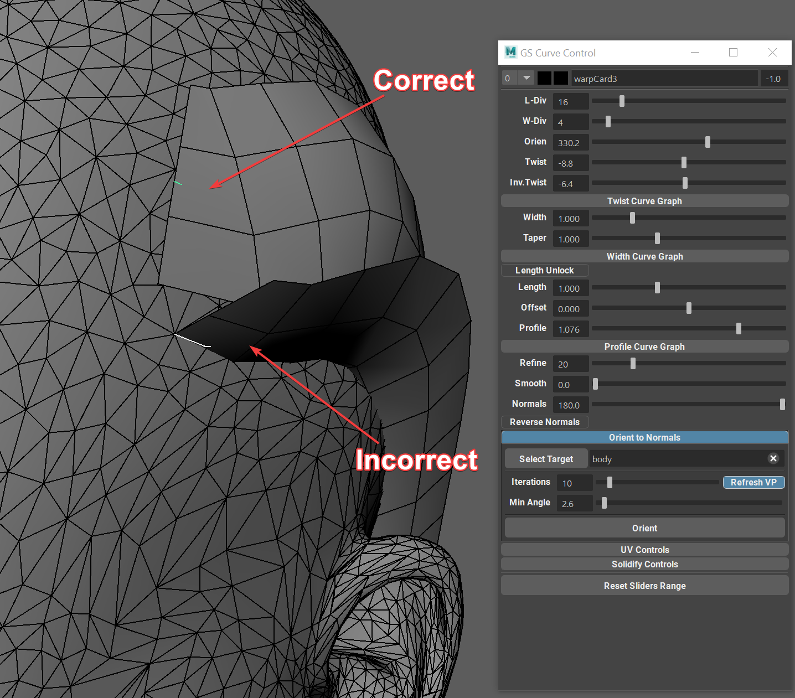
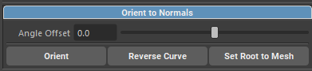

.. currentmodule:: <index>

.. _orient-to-normals:

#################
Orient to Normals
#################

When creating hair (especially the shorter variations), it can be tricky to place all the cards and orient them correctly to the scalp. This manual process can take hours, and even days.

While Orient to Normal is not a "one button click" solution to making an amazing-looking hairstyle, it can definitely improve your workflow and save some time.

Orient to Normals' main function is to orient all the selected cards to the normal direction of the base mesh. What that means is that it will try to align all the selected cards so they are facing away from the mesh, just how they are supposed to be.

Orient to Normals
=================

Orient to Normal consists of a menu that can be found in the :ref:`Curve Control Window<curve-control-window>`.

This menu uses the global Base Mesh from the top of the :ref:`Curve Control Window<curve-control-window>`. Set the mesh there.

Now that you have your target polygon mesh selected, you can simply select all the curves you wish to orient and click on "Orient".

Angle Offset will change the final target angle from 0 (perfect alignment) to any value between -180 and 180 degrees.

Reverse Curve
=============

This function will simply reverse the selected Cards, Tubes, Braids or Bound objects.

It will automatically compensate for any rotation, which the normal Reverse Curve command from Maya won't do.

Set Root to Mesh
================

Using global Base Mesh it will calculate the appropriate root point (closest to mesh) and reverse the selected curves if needed.

