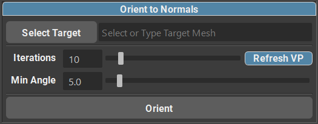

.. currentmodule:: <index>

#################
Orient to Normals
#################

When creating hair (especially the shorter variations), it can be tricky to place all the cards and orient them correctly to the scalp. This manual process can take hours, and even days.

While Orient to Normal is not a "one button click" solution to making amazing looking hair style, it can definitely improve your workflow and save some time.

Orient to Normals main function is to orient all the selected cards to the normal direction of the base mesh. What that means, is that it will try to align all the selected cards so they are facing away from the mesh, just how they are supposed to be.

Main Menu
^^^^^^^^^

Orient to Normal consists of a Menu that can be found in a Curve Control Window. This menu will be active when either polygon mesh or nurbs curve is selected.

In this menu you can find a target mesh field as well as "Select Target" button.

Selecting a Target Mesh
^^^^^^^^^^^^^^^^^^^^^^^

To select a mesh as a target you can simply type the name of the mesh in the field, or select the mesh in the viewport (or outliner) and click on "Select Target".

Now that you have your target polygon mesh selected, you can simply select all the curves you wish to orient and click on "Orient".

|
|
|
|
|
|
|
|
|
|
|
|

Options
^^^^^^^

    
You also have some options available for Orient to Normals function.

- **Refresh VP** checkbox will Enable/Disable viewport updates during the orientation process. Disabling the updates can save some computation time and speed up the process, especially if you are orienting hundreds of cards.

- **Iterations** control the maximum amount of iterations per card that is allowed to happen. Increasing the iteration count can result in a more precise orientation, but with longer computation times. It is not recommended to blindly crank up the iteration count as this can lead to very long computation times and the final result can be marginally better.

- **Min.Angle** this slider controls the minimum angle tolerance that the Orient to Normals is targeting. The smaller the angle, the closer the orientation will be to the "ideal" alignment with the mesh. Please note that very small numbers can cause incorrect orientation calculation, depending on the position of the card. Recommended value is 3-5 degrees.

Hotkey
^^^^^^

**Hotkey** for Orient to Normals function is also available in the Hotkey Editor

