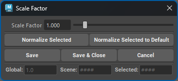
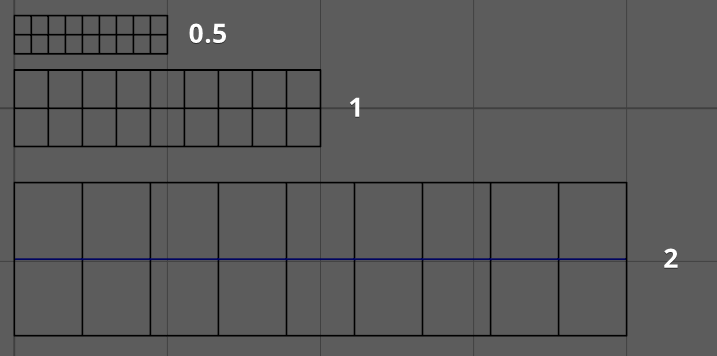

.. currentmodule:: <index>

.. _scale-factor-and-precision:
.. _scale-factor:

############
Scale Factor
############

Scale Factor
^^^^^^^^^^^^

The **Scale Factor** determines the initial scale of the curve created by the buttons New Card, New Tube, Curve Card, Curve Tube, Add Cards, and Add Tubes.

This option is crucial if you need to adjust the scale of new curves, mostly the width, to match the Maya scene's scale. Values ranging from 0.5-1.5 are usually a good middle ground for any default Maya scene and any project that uses real-world scale.

.. important::
  Suppose you import your base mesh, and it's approximately 180 cm tall. In that case, a scale factor value of around 1.0 should generate cards with good width. The length of the cards will change freely based on the length of the curve.

The scale factor is a simple multiplier and ranges from 0.001 to very large values. The default limit is 10, but you can manually type bigger values.

  Using different Scale Factors to generate cards of different sizes

.. note:: Scale Factor will only affect new curves. Old curves will not change when just clicking Save or Save and Close. Scale factor is usually set at the beginning of the project and never touched again, however, user can change it any time he wants during the project and :ref:`Normalize<normalize-scale-factor>` all the previously created curves.

There are three number fields: Global, Scene, and Selected. They show the values of the scale factor that is saved globally (Global), in the scene (Scene), and on every new curve.

The scale factor has a priority of Selected ⇨ Scene ⇨ Global. When the user changes the scale factor, it will be saved as scene and global. If the scene has no scale factor set, the global value will be used.

Each curve also has its own scale factor that will have priority over Scene or Global. This value is important when working with curves that have different scale factors (imported or created in the same scene after changing the scale factor).

Normalize Scale Factor
^^^^^^^^^^^^^^^^^^^^^^

.. _normalize-scale-factor:

User can **normalize** any already existing Warp objects (Card, Tube or Bind object) to any chosen Scale Factor.

- **Normalize Selected** - will normalize all the selected objects to the chosen Scale Factor.
- **Normalize Selected** to Default - will normalize all the selected objects to the default Scale Factor of 0.5.

Other parameters of the object (width, profile etc.) will be recalculated to match the original shape of the object.

Normalization buttons will also save the new values of the Scale Factor to global preset automatically.
