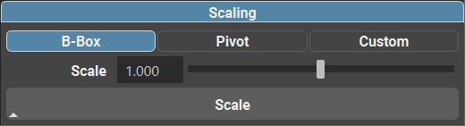

.. currentmodule:: <index>

.. _scaling-curves:

##############
Scaling Curves
##############

Scaling Curves
^^^^^^^^^^^^^^

Because of the procedural nature of GS CurveTools, cards and tubes created by the plug-in can't be scaled reliable using regular Maya scale gizmo.
The curves themselves will scale correctly, but the procedural geometry will not.
Parameters like Width and Profile will not be scaled.

To scale the curves properly there is a separate **Scaling** section in the Curve Control Window.

This special scale function will scale *all selected objects* (including regular geo and curves) and it will automatically adjust any parameters on the procedural geometry.

**Three modes:**

- **Bounding Box**: This mode will scale all the selected objects based on their combined bounding box.
- **Pivot**: This mode will scale all the selected objects based on their individual pivot points.
- **Custom Center Point**: This mode will scale all the selected objects based on a custom center point (by default 0,0,0 or center of the scene)

**Two controls:**

- **Scale Slider**: Will control the scale value applied to the selected objects.
- **Scale Button**: Will apply the scale value to the selected objects. Shift + Click will invert the scale value (1/scale).

**Scaling Demo:**

.. raw:: html

  

    <video width="80%" controls style="border-radius: 8px; box-shadow: 0 4px 8px rgba(0,0,0,0.2);">
      <source src="_static/scaling_demo.mp4" type="video/mp4">
      Your browser does not support the video tag.
    </video>
  

