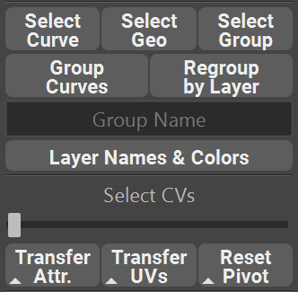

.. currentmodule:: <index>

.. _selection:

############################
Quick Selection and Grouping
############################

Select Components
^^^^^^^^^^^^^^^^^

Geometry and Curves generated by GS CurveTools plug-in are grouped together and only pathCurve component is selectable in the Viewport by default. You can however switch between the components using Selection Functions.

- **Select Curve** will select Curve (pathCurve) component of the Curve Card or Tube group

- **Select Geo** will select geometry component of the Curve Card or Tube group

- **Select Group** will select Group component of the Curve Card or Tube group

Components Selection commands are multi-selection capable, so it will work on any number of selections.

.. _group-curves:

Group Curves in the Outliner
^^^^^^^^^^^^^^^^^^^^^^^^^^^^

It is recommended to use **Layers** to organize your curves. However, you can also quickly group selected curves (and their components) in the Maya Outliner using **Group Curves** Function.

**Group Curves** will group all the selected curves (and their components) in the Outliner and name the Group based on the Group Name input field. If Input Filed is empty, group will have the default name (**crvGrp**).

.. _regroup-by-layer:

Regroup by Layer
^^^^^^^^^^^^^^^^

.. image:: images/colorized_regrouped_layers.png
	:align: right
	:width: 150px

**Regroup by Layer** function will take all the curves and group them in the outliner based on their Layer number the name of the layer in :ref:`Layer Customization Window<layer-customization-window>`.

Optionally, it will also apply layer color to the created groups, if the option **Colorize Regrouped Layers** was enabled in the :ref:`options<options>` menu. Applied color is based on the color selected for that layer in :ref:`Layer Customization Window<layer-customization-window>`.

If :ref:`Layer Collections<layer-collections>` are used, collection name will be appended to the regrouped layer name.

Optionally, collections with "template" in their name can be regrouped to a separate group called "CT_Templates". Refer to :ref:`Layer Collection Options<layer-collection-options>`.

.. _select-slider:

Select CVs Slider
^^^^^^^^^^^^^^^^^

Select CVs Slider will interactively select CVs of any selected curves based on the position of the slider.

Select any number of curves in the Viewport and then drag the slider. Depending on the position of the slider, different CVs will be selected.

**Left** of the slider is the **Root** of the curve and **Right** of the slider is the **Tip** of the curve.

You can also use **Modifier** buttons to change the behavior of the slider:

- Holding **Shift** will additively select CVs based on the slider position.

|
|
|
|
|

- Holding **Alt** button will Deselect any selected CVs based on the slider position.

|

- Holding **Ctrl** button will temporarily disable the slider and allow you to reposition it without changing the selection on the curve.

|
|
|
|
|

Transfer Attr and Transfer UVs
^^^^^^^^^^^^^^^^^^^^^^^^^^^^^^

:ref:`Transfer Attr. <transferring-attributes>` and :ref:`Transfer UVs<transferring-uvs>` buttons were already covered in the :ref:`Curve Attributes<attributes>` and :ref:`Textures and UVs<uvs>` chapter.

.. _reset-pivot:

Reset Pivot
^^^^^^^^^^^

**Reset Pivot** button will simply reset pivot point of any number of selected curves back to its original position at the Root CVs of the curve.

Holding **Shift** Modifier will position the pivot point at the last CV of the curve (tip of the curve).

This command is extremely useful because if you move the first CV, or all CVs at the same time in component mode (not the curve itself in the object mode) your pivot point will not follow the curve.

