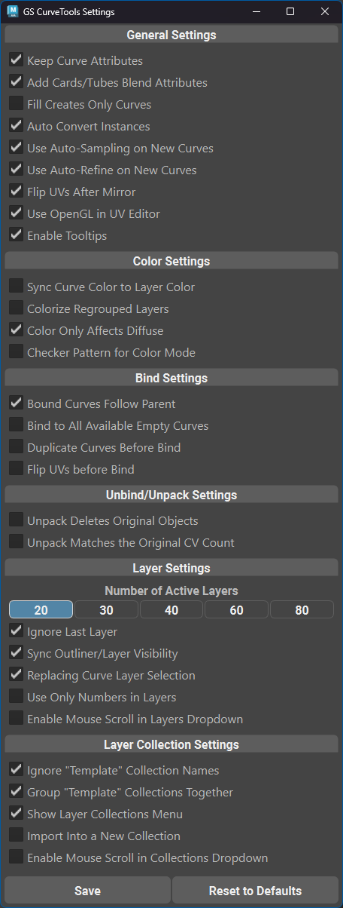

.. currentmodule:: <index>

.. _settings:

#############
Settings Menu
#############

General Settings
^^^^^^^^^^^^^^^^

These are the general options that affect the functionality of the plug-in:

- **Keep Curve Attributes** will remember and read the curve attributes on on the curve, even if the curve is detached from the curve card/tube node network (duplicated, exported, etc.)
- **Add Cards/Tubes Blend Attributes** enables blending of the attributes when using Add Cards/Tubes or Fill functions.
- **Fill Creates Only Curves** will enable curve only output during :ref:`Fill<fill-button>` function
- **Auto Convert Instances will** automatically convert instanced curves to normal curves before any other function is applied.
- **Use Auto-Refine on New Curves** - will automatically enabled :ref:`Auto-Refine<attributes>` mode on newly created curves and tubes.
- **Flip UVs After Mirror** - will automatically flip UVs after the mirror (or flip) function is used. This allows for more accurate mirroring.
- **Enable Tooltips** - will toggle the tooltips visibility on plug-in controls and buttons.

Color Settings
^^^^^^^^^^^^^^

- **Sync Curve Color** to the Layer Color will enable the automatic sync between Layer Color and color of the path curve used to control Curve Cards and tubes
- **Colorize Regrouped Layers** will enable automatic colorization of the regrouped layers when pressing **Regroup by Layer** button. You can change the colors in :ref:`Curve Control Window<attributes>` or using :ref:`Custom Colors Window<layer-customization-window>`.
- **Color Only Diffuse** - will apply color only to the diffuse component and keep the alpha transparency active.
- **Checker pattern for color** will determine if colorize mode should use plain color or checker pattern.

Bind Settings
^^^^^^^^^^^^^

- **Bound Curves Follow Parent** will ensure that moving a parent curve in a Bound Object (Bound Group) will also move all the child curves along with it to a new layer.
- **Bind to All Available Curves** will bind selected hair clump (or geometry) to all selected "empty" curves. More info here: :ref:`Mass Bind<mass-bind>`
- **Duplicate Curves Before Bind** will automatically duplicate the curves before binding them to the curve, leaving old curves behind with no edits.
- **Flip UVs before Bind** will flip the UVs on original curves before using Bind command. This eliminates the Bind mirroring effect.

Unpack Settings
^^^^^^^^^^^^^^^

- **Unpack Deletes Original Objects** will enable deletion of original :ref:`Bound<bind-unbind>` objects during the :ref:`Unpack<unpack>`.
- **Unpack Matches the Original CV Count** will enable matching the CV count of the original curves during the :ref:`Unpack<unpack>` operation.

Layer Settings
^^^^^^^^^^^^^^

- **Ignore Last Layer** will change the behavior of Extract All button and Filter buttons. Those buttons will either ignore or affect last Layer depending on this options.
- **Sync Outliner/Layer Visibility** will automatically hide curves not only using layers, but also in the outliner (they will be greyed out)
- **Replacing Curve Layer Selection** will disable additive selection for the layers. When holding Ctrl and clicking on a new layer, old layer will be deselected automatically.
- **Use Only Numbers in Layers** will activate/deactivate numbers only mode for layer names. With this option disabled, the second row of layers will have A-J letters instead.
- **Number of Active Layers** allows user to choose the number of active layers in the scene (up to 80).

.. _layer-collection-options:

Layer Collection Settings
^^^^^^^^^^^^^^^^^^^^^^^^^

- **Ignore "Template" Collection** Names if active will ignore all the collections with "template" (case insensitive) in their name when performing Extract All or Filter operations.
- **Group "Template" Collections** Together if active will regroup all the curves from collections with "template" (case insensitive) in their name into a separate group called "CT_Templates". Other collections and layers will be regrouped normally.
- **Show Layer Collections Menu** will activate :ref:`Layer Collections Menu<layer-collections>`.
- **Import Into a New Collection** will enable :ref:`Importing<import-export-page>` curves into a separate "Imported Curves" collection. Only works if **Show Layers Collection Menu** is checked.
