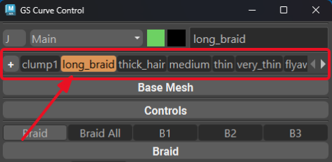

.. currentmodule:: <index>

.. _templates:

#########
Templates
#########

**Templates** are a powerful system that allows you to store and quickly reuse GS CurveTools objects.

The templates bar is located in the :ref:`Curve Control Window<curve-control-window>` and has a "Create" button (+ sign) and a scrollable list of templates. You can add, reposition, rename, and delete your templates. They are scoped to the current scene.

Templates are used in many functions in GS CurveTools such as :ref:`Template Button<template-button>`, :ref:`Fill Plus<fill-plus>`, :ref:`Conversion<conversion>` and more. Generally they either copy the template object to the selected empty NURBS curve or transfer template parameters to the selected GS CurveTools object.

When you name templates make sure to use regular letters and underscores only. Numbers are allowed, but not as the first symbol of the name. Templates bar will automatically correct the invalid names for you.

The default template is **Blank** and, depending on the context, it will either create a default card or just an empty NURBS curve. The Blank template cannot be moved, renamed, or deleted.

Adding Templates
================

.. gifvideo:: images/adding_templates.mp4
    :width: 350
    :align: right

To add a template, simply select the curves you want to use as templates and click on the (+) Create button. Any number of unique GS CurveTools objects can be added as templates.

|
|
|

Switching Templates
===================

.. gifvideo:: images/switching_templates.mp4
    :width: 350
    :align: right

To switch between templates simply click on the template name in the templates bar or use the mouse wheel. The highlighted template will now be used for many functions in GS CurveTools.

|

Renaming Templates
==================

.. gifvideo:: images/renaming_templates.mp4
    :width: 350
    :align: right

You can also rename templates by right clicking on the template name and selecting "Rename". This will open a dialog where you can rename the template. Invalid names will be auto-corrected.

|
|
|
|
|

Reordering Templates
====================

.. gifvideo:: images/reordering_templates.mp4
    :width: 350
    :align: right

You can also reorder templates by dragging and dropping them in the templates bar. This will change the order of the templates in the list. Holding Shift and scrolling with mouse will also reposition the currently highlighted template.
