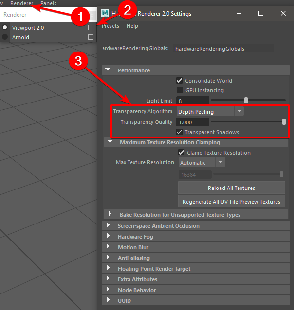
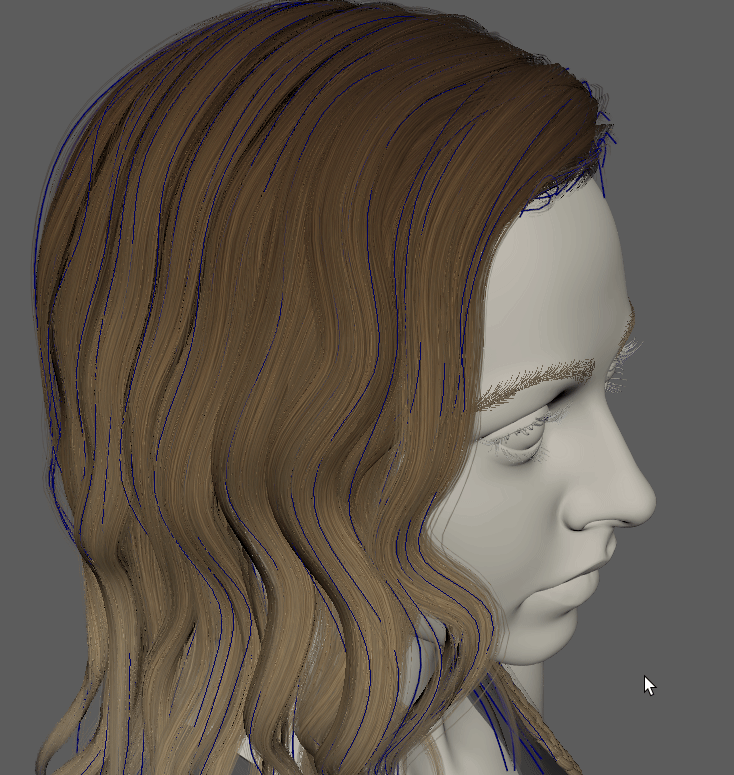
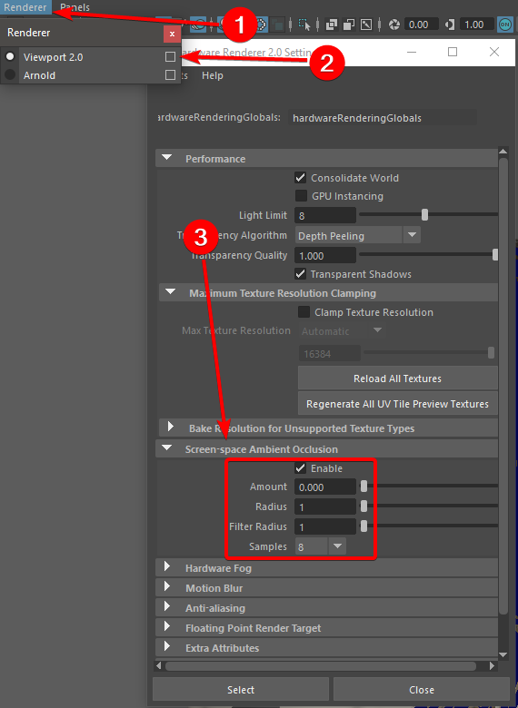

.. currentmodule:: <index>

###########
Useful Tips
###########

Better Transparency Settings Viewport
^^^^^^^^^^^^^^^^^^^^^^^^^^^^^^^^^^^^^

Maya Viewport default settings are not very well suited for the needs of hair creation and preview. In order to have the best possible preview you can change a few options.

.. note:: Since **GS CurveTools v1.1.3** you have an option to Set Transparency Settings automatically in the Options menu. It will do exactly what is described below.

1. Open Viewport Settings in the Renderer -> Viewport 2.0 Option box.

2. Set the Transparency Algorithm to Depth Peeling, Transparency Quality to 1 and enable Transparent Shadows.

3. You can also add some lights you your scene to have better representation of your hair.

4. Although these options will give you a nice approximation, you should always check your project in a game engine or marmoset toolbag.

|
|

Better Curve Visibility in Viewport (Maya 2017-2020 only)
^^^^^^^^^^^^^^^^^^^^^^^^^^^^^^^^^^^^^^^^^^^^^^^^^^^^^^^^^

It can be tricky sometimes to see curves using default Maya settings, especially when you have a lot of them with applied textures.

There are a few simple steps you can take to fix this problem:

You can enable Screen-space Ambient Occlusion but without any actual occlusion happening. Maya 2017-2020 viewport will increase the visibility of the curves if you have Ambient Occlusion enabled. 

|

.. note:: This bug was fixed in Maya 2022+ and no longer works, which is a shame. It would be better if Autodesk fixed the UV bug instead, but hey, I guess you only get so much funding in a multi-million dollar company. One bug in a decade.

.. important:: This trick only works on materials with transparency. If you don't use alpha on your material, just add a little bit of overall transparency. Even smallest amount will enable this AO trick.

.. note:: Since **GS CurveTools v1.1.3** you can simply go to the plug-in "Options -> Set AO Settings" to set AO settings automatically. You still need to set your custom hotkey in the "GS -> GS_CurveTools -> Misc -> GSCT_ToggleAO"

**Set AO settings manually (legacy):**

- To avoid any unwanted visual effects from AO, go to Renderer -> Viewport 2.0 (options box) -> Screen-space Ambient Occlusion and change the settings as showed on the screenshot:

- Now you only need to add a hotkey to quickly switch between two modes:

	.. note:: In **Version 1.1.1** you don't need to add this hotkey. It is already there in **"GS -> GS_CurveTools -> Misc -> GSCT_ToggleAO"**

    - Go to Windows -> Settings/Preferences -> Hotkey Editor -> Runtime Command Editor -> New
    - Copy and Paste this code to the Python command field:

        .. code-block:: python
        
            import maya.cmds as mc

            if(mc.getAttr('hardwareRenderingGlobals.ssaoEnable')):
                mc.setAttr('hardwareRenderingGlobals.ssaoEnable', 0)
            else:
                mc.setAttr('hardwareRenderingGlobals.ssaoEnable', 1)

        .. note:: It might look something like this when you paste it, don't worry it's a visual bug in Maya. Just leave it as is:

            .. figure:: images/maya_paste_text_bug.png
                :alt: Maya Shelf
                :class: with-shadow
                :width: 400px
                :align: center

    - Name your Runtime Command to something like "MY_AOToggle"
    - Add a Description
    - Click "Save Runtime Command"
    - Assign a new Hotkey to your custom command in the Hotkey Editor under the Custom Scripts drop down menu.

    - You should get something like this in the end:

    .. figure:: images/ao_hotkey.png
                    :alt: Maya Shelf
                    :class: with-shadow
                    :width: 400px
                    :align: center

- Now by clicking on your custom hotkey, you will toggle between two visibility modes.

Curve Thickness
^^^^^^^^^^^^^^^

You can change the thickness of the curves globally or for each curve individually.

.. figure:: images/global_curve_thickness_window.png
	:class: with-shadow float-right
	:width: 200px

To change curve thickness globally go to GS CurveTools Options -> Global Curve Thickness.

You can also change curve thickness manually in Curve Control Window using number field on the top right. This will not change global curve thickness. Only selected curves will be affected.

.. figure:: images/curve_thickness_demo.gif
	:alt: Maya Shelf
	:class: with-shadow
	:width: 400px
	:align: center