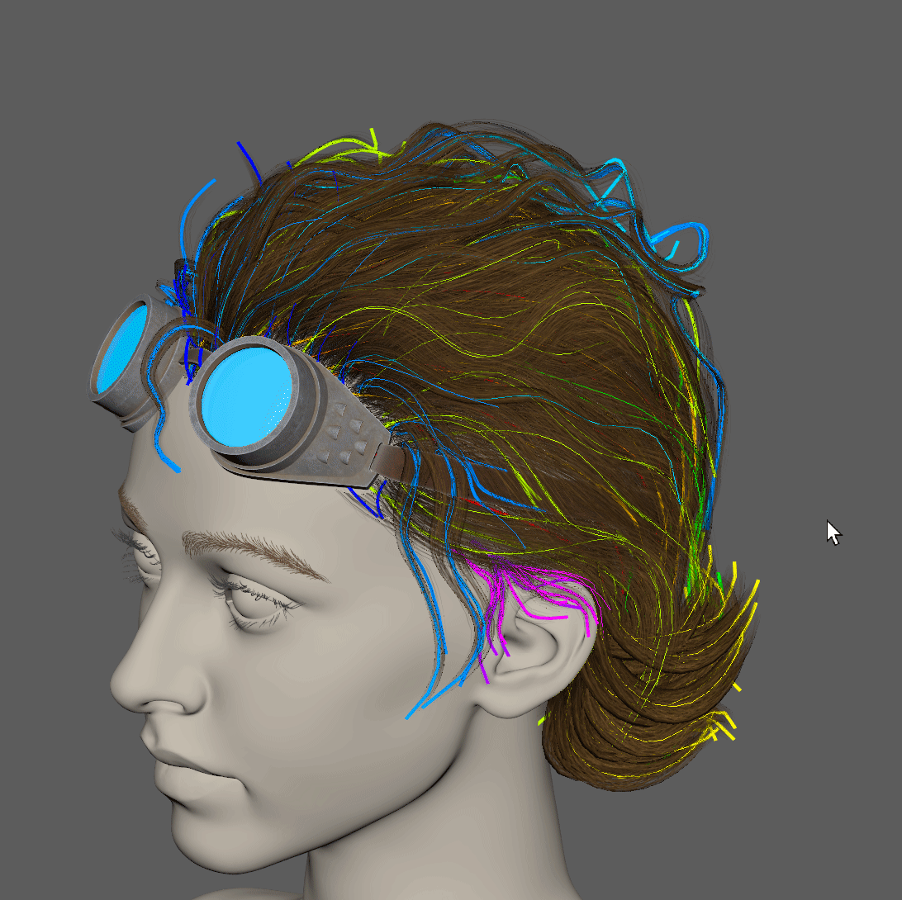
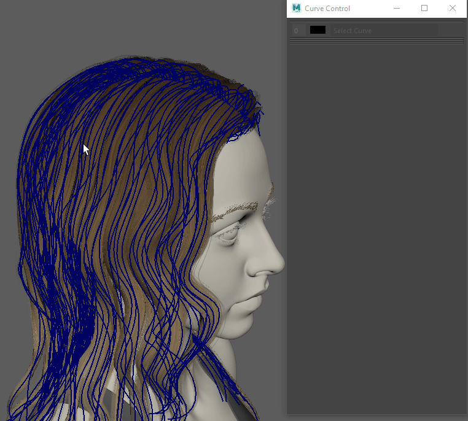
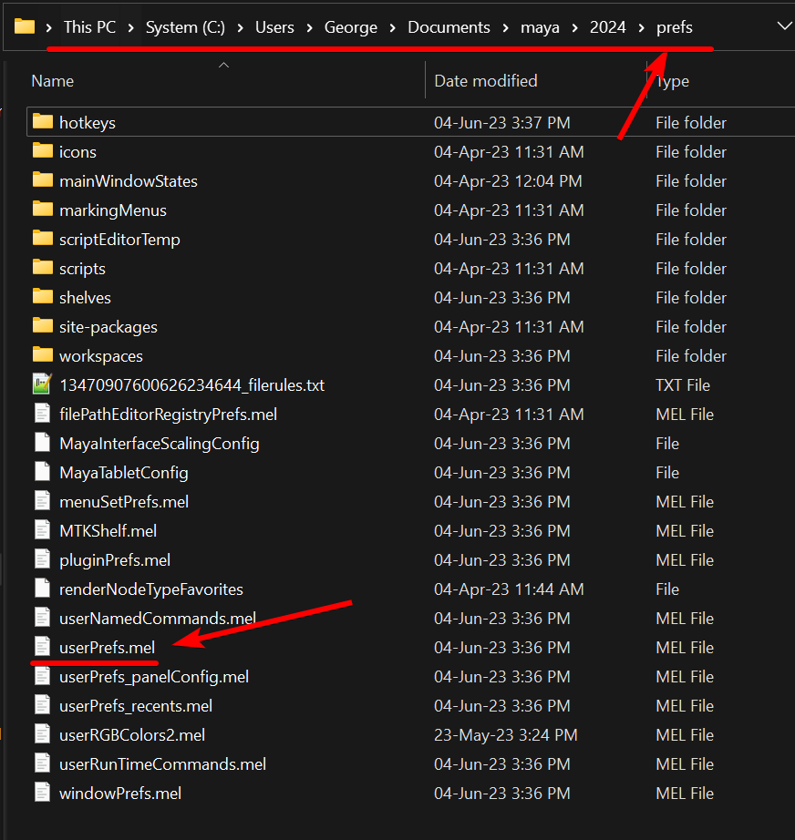

.. currentmodule:: <index>

###########
Useful Tips
###########

Better Transparency Settings Viewport
^^^^^^^^^^^^^^^^^^^^^^^^^^^^^^^^^^^^^

There are three transparency presets that can be changed in the :ref:`options<options>` menu. It is recommended to use Depth Peeling mode for best transparency rendering.

Better Curve Visibility
^^^^^^^^^^^^^^^^^^^^^^^

Selecting individual curves can be a challenging task, especially if you are not using enough layers and keep curves from those layers visible at all times.

There are a few ways you can improve that:

  XRay mode toggled by hotkey

1. Use XRay mode and set hotkey to toggle it. XRay mode in Maya will make every geometry and curve semi-transparent and it can be extremely helpful when searching for the curve that needs to be selected.
2. Use :ref:`Curve Colors<layer-customization>`.
3. Increase :ref:`Curve Thickness<options>`.
4. User :ref:`Advanced Visibility<advanced-visibility>` options and bind some hotkeys to it.

|
|

Curve Thickness
^^^^^^^^^^^^^^^

.. image:: images/global_curve_thickness_window.png
  :align: right
  :width: 200px

You can change the thickness of the curves globally or for each curve individually.

To change curve thickness globally go to GS CurveTools :ref:`Options<options>` -> Global Curve Thickness.

  Curve Thickness changed on selected curves

You can also change curve thickness manually in :ref:`Curve Control Window<attributes>` using number field on the top right. This will not change global curve thickness. Only selected curves will be affected.

|
|
|
|
|
|
|
|
|
|

Resetting Maya for GS CurveTools
^^^^^^^^^^^^^^^^^^^^^^^^^^^^^^^^

Sometimes, Maya internal preferences can become corrupted or in general behave weirdly. This can affect GS CurveTools performance and functions as well, since it uses Maya functions for its operation.

In that case the only option might be to reset Maya preferences to defaults. This can be done while keeping the hotkeys, shelves and workspaces intact.

How to reset Maya preferences:

  userPrefs.mel file on Windows

1. Close Maya and locate **prefs** folder. It is a folder that holds all the preferences for Maya and is located here: "**\\Documents\\maya\\2024\\prefs**" (Windows and Maya 2024 as an example)
  
2. Locate the **userPrefs.mel** file inside the prefs folder.

3. Rename it to userPrefs.backup or userPrefs_backup.mel or to anything similar. This file holds all the Maya internal preferences for all the functions and variables. Your shelves and custom hotkeys as well as workspaces should remain intact.

4. Open Maya and run the :ref:`init command for GS CurveTools again<initialize>`.

5. Check the functions that were not working. If they are still not functional - file a bug report.

6. If this reset didn't help, you can close Maya again, return to the prefs folder, delete newly generated **userPrefs.mel** file and rename the old **userPrefs_backup.mel** back to **userPrefs.mel**. This will restore all the previous settings back.