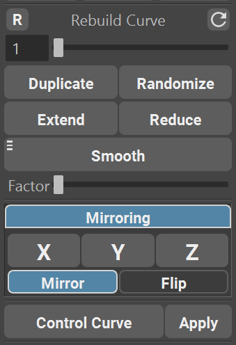
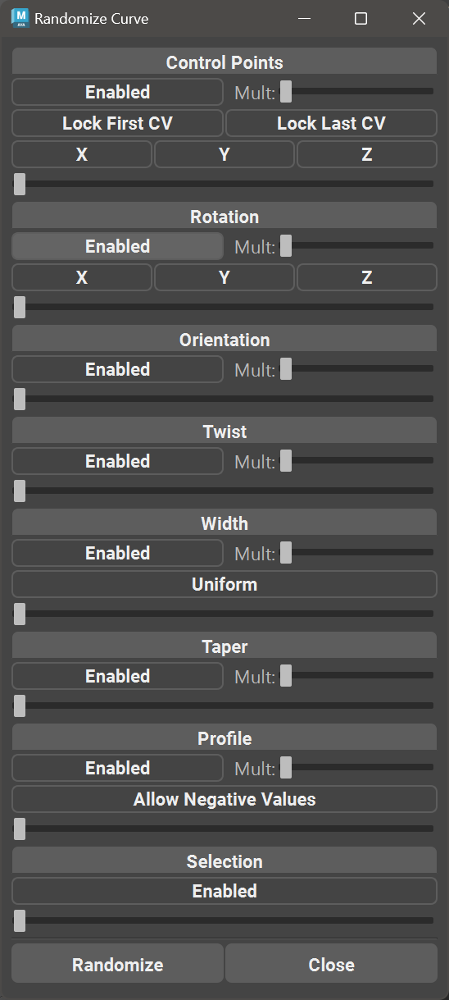

.. currentmodule:: <index>

.. _utility:

#################
Utility Functions
#################

Intro
^^^^^

Utility Section expands the functionality of GS CurveTools plug-in and allows for fast rebuilding, duplication, smoothing, extending and reducing the curve.

It also holds Control Curve function and Curve Control Window button.

|
|
|
|
|

.. _rebuild-curve-slider:

Rebuild Curve Slider
^^^^^^^^^^^^^^^^^^^^

**Rebuild Curve Slider** is a fast way to change the density of curve CVs maintaining the original shape of the curve and visualizing the process of rebuilding.

**Rebuild Curve Slider** works on any number of selected curves. It also works on regular curves, not only on **GS CurveTools** generated ones.

Simply select any number of curves in the viewport and start dragging the slider. You will see the preview of the final curve, and old curve will still be there as a reference.

**Releasing the Slider** will apply the changes to the curve.

You can also **Manually Type** values in the **Value Field** and as soon as you press **Enter**, selected curves will be rebuilt.

Typing the value over default 50 will still work and **expand the range of the slider** to double of the typed value (if you type 51, it will expand the slider range to 102 and so on).

The slider can be reset using |slider_reset| button.

Selected curve can be rebuilt to the current value by using Manual Rebuild button |manual_rebuild|

.. _duplicate:

Duplicate
^^^^^^^^^

.. image:: images/buttons/duplicate.png
  :align: right
  :width: 150px

Probably one of the most important and at the same time the most simple function is **Duplicate**.

**Duplicate** will duplicate any selected number of curves and all of their components.

Duplicated curves are fully functional, have the same material etc.

**Duplicate** also works if you select Group instead of curve.

**Duplicate** is fully compatible with Warp Geometry and Curves bound by Warp function.

**Duplicate** will respect Outliner grouping and hierarchy and put new duplicated curves next to the original ones.

|

.. _randomize:

Randomize
^^^^^^^^^

Randomize button opens the randomization parameters window. This window holds parameters that can be used to randomize selected curves.

**Workflow:**

- Select the curves to randomize.
- Enable/disable the randomization modules by clicking on the "Enable" checkbox (Curve Points, Rotation, etc).
- Change parameters (X,Y,Z, etc).
- Drag the slider and hold the mouse button to look at the preview of the amount of randomization.
- Release the slider and click "Randomize" button to apply the randomization. Releasing the slider will disable the preview.
- If magnitude of randomization is not enough, use "mult" slider to multiply the sliders, increasing the final randomization.

**Randomization modules:**

- **Control Points:** This module will randomize all the control points (CVs) on the selected curves. At least one axis should be enabled for the randomization to occur. Additionally, user can Lock First and/or Last CV on the curves to avoid moving the root or tip CV.
- **Rotation:** Randomize the overall rotation on the curves based on the pivot point on those curves. At least one axis should be enabled for the randomization to occur.
- **Orientation:** Randomize the orientation of the geometry on the curve. Rotates the geometry around the curve.
- **Twist:** Randomize the twist parameter on the selected curves.
- **Width:** Randomize width parameter of the curves. Uniform checkbox is used to sync WidthX and WidthZ parameter on Curve Tubes. Disabling Uniform will result in separate randomization values for WidthX and WidthZ parameter on Curve Tubes.
- **Taper:** Randomize taper parameter of the curves.
- **Profile:** Randomize profile parameter of the curve. Allow negative values will allow randomization to go negative, flipping the profile.
- **Selection:** Randomize selection based on the slider value. Middle of the slider means that 50% of the selected curves will randomly stay selected.

**Randomize:** button will apply any randomization that was enabled.

**Close:** Closes the window.

.. _extend-reduce-smooth:

Extend, Reduce and Smooth
^^^^^^^^^^^^^^^^^^^^^^^^^

**Extend and Reduce** will simply lengthen and shorten the curve based on the Factor slider.

Extend will try to interpolate the next point based on the curvature of the curve. However, on high Factor values this can behave unpredictably.

|
|
|

.. _smooth:

**Smooth** function will smooth the selected curve or only selected CVs, depending on the selection and Factor slider.

You can smooth multiple curves at the same time.

You can smooth CVs on multiple curves at the same time. Just select the curves, switch to Component Mode (F8) and select the CVs.

.. note:: For CVs smoothing to work you need to select at least 3 CVs on each selected curve. Curves with less than 3 CVs selected will be skipped.

.. image:: images/smooth_marking_menu.png
  :align: right
  :width: 250px

Smooth button also has Marking Menu where you can select Smoothing Multiplier. 

To access sooth marking menu, simply Hold Right Mouse Button over the Smooth Button. 

You can select from x1, x3, x5 and x10 multipliers. They will increase the strength of the smoothing.

.. _mirroring:

Mirroring
^^^^^^^^^

Mirror functions allow to mirror curves from one side of the world to the other across X, Y or Z Axis.

User can switch between Mirror and Flip modes.

In Mirror mode curves will be duplicated and then flipped based on the Axis selected.

In Flip mode curve will be flipped to the opposite side of the world based on the Axis selected.

.. _control-curve:

Control Curve
^^^^^^^^^^^^^
.. image:: images/buttons/control_curve.png
  :width: 150px

.. image:: images/control_curve_function.gif
  :align: right
  :width: 250px

**Control Curve** is a special deformer created to control multiple curves at the same time.

Select multiple curves and click on Control Curve button. A new curve will be generated in the middle of the selected curves. Deforming this curve will also deform any bound curve.

To Apply the deformer, simply select the Control Curve and click **Apply** button.

.. Note:: There might be some warnings during the creation of the Control Curve like "No points were weighted to the wrap". Ignore them.

.. important:: Control Curve is a temporary deformer (like Maya's Lattice, Twist etc.) and should be used to quickly change the shape of multiple selected curves, but it should not be used as a permanent controller for those curves. If you need to control multiple curves on a permanent basis, refer to :ref:`bind-unbind`.
