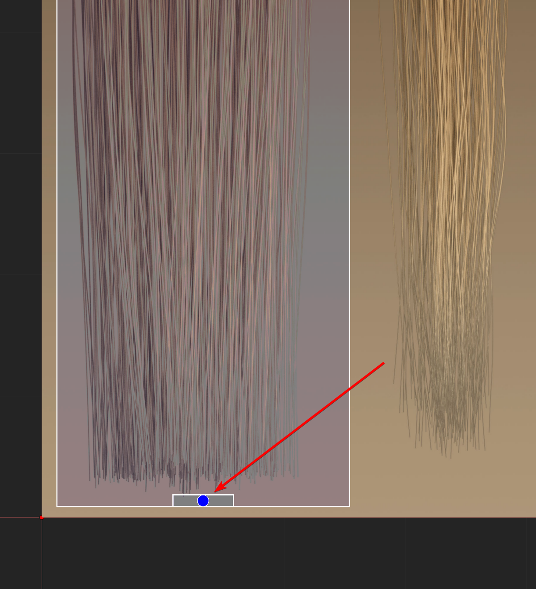
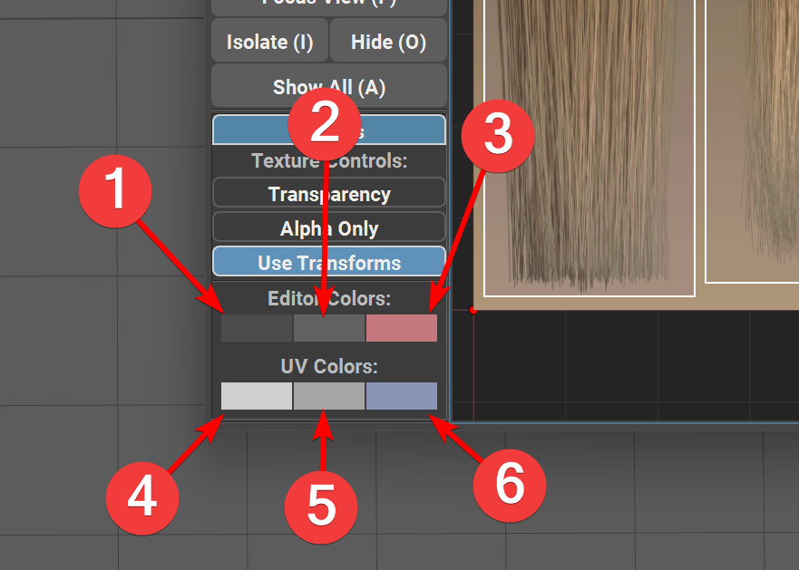

.. currentmodule:: <index>

.. _uv-editor:

#########
UV Editor
#########

New UV Editor
^^^^^^^^^^^^^

.. image:: images/uv_editor/uv_editor_window.png
	:align: right
	:width: 350px

Changing UVs in GS CurveTools was always a challenge, because of the procedural limitation of UV attributes. Using sliders was always a temporary solution to a problem, and not an elegant one.

Fortunately, with the release of v1.2 user now have access to a fully functional UV editor that is compatible with current and previous UV Attributes.

This UV Editor allows to control UV attributes using intuitive user interface, and also adds multiple useful functions.

All the functions have dedicated Hotkey that is separate from Maya hotkeys (in parenthesis). Hotkey will work only if the editor window is in focus (blue outline around the viewport)

UV editor consists of a Viewport on the right, and function buttons on the left, along with the UV list.

UV editor will update every time you select a new curve in Maya Viewport. Incompatible curves will not show any UV rectangles or textures.

The UVs will dynamically update in the Maya Viewport when you edit them in the UV Editor

.. image:: images/uv_editor/uv_root.png
	:align: right
	:width: 200px

Small rectangle at the base of the UV rectangle indicates the root of this UV and its orientation in space.

|
|
|

Material Setup
^^^^^^^^^^^^^^

In order for the UV Editor to work correctly a correct material should be used for the cards (:numref:`material_setup_final_material`).

Supported textures and nodes:

- Shader nodes: Lambert, Blinn, Phong, PhongE, Standard Surface or OpenPBR.
- File nodes: file and psdFileTex.
- Texture file formats: JPG/JPEG, PNG, TIF, TIFF, TGA, PSD, EXR, HDR.

.. important::

   Ramp, checker or other procedural textures are not supported as color input. There needs to be an actual texture file for UV Editor to load.

Simply connect Out Color of Diffuse File to Color of the Lambert and Out Transparency to Transparency (or BaseColor and Opacity for Standard Surface).

Out Transparency can either be from separate file or from the same file if supported by the format.

**Final Material Setup:**

.. figure:: images/Lambert_Final_Material.png
	:name: material_setup_final_material
	:width: 50%

	Simple Material Node Connections

**Material Setup Steps:**

1. Select newly created curve(s).
2. Click on Select Geo.
3. Holding right mouse button in the viewport select Assign New Material ⇨ Lambert.
4. In Attribute Editor Click on checker button |pic1| near the Color Slider ⇨ File (:numref:`lambert_material_01`).
5. Under the Image Name field click on a folder icon and select your Diffuse(color) texture (:numref:`lambert_material_02`).
6. If you have separate Alpha, return back to the lambert node by clicking on the box with the right arrow with Right Mouse Button and selecting the lambert.color. (:numref:`lambert_material_02`)
7. Repeat steps 4, 5 for the Alpha if you have separate Alpha file.

.. list-table::

	* - .. figure:: images/Lambert_Material_01.png
		 	:target: _images/Lambert_Material_01.png
			:name: lambert_material_01

			Lambert color and transparency sliders

	  - .. figure:: images/Lambert_Material_02.png
		 	:target: _images/Lambert_Material_02.png
			:name: lambert_material_02

			File and how to get back to lambert

**Video of the setup:**

.. raw:: html

	<video width="50%" controls>
	<source src="_static/uv_editor_material_setup.mp4" type="video/mp4">
	Your browser does not support the video tag.
	</video>

|
|

Select, Move, Rotate, Scale and Draw
^^^^^^^^^^^^^^^^^^^^^^^^^^^^^^^^^^^^

.. image:: images/uv_editor/uv_selection.gif
	:align: right
	:width: 400px

**Selection**

In order to select UV rectangle for edit, simply switch to Select mode (Q) and click or marquee select any number of UVs.

|
|
|
|
|
|
|
|
|

**Move**

.. image:: images/uv_editor/uv_move.gif
	:align: right
	:width: 400px

In order to move selected UVs, change to Move mode (W) and click and drag with LMB on the UV rectangles.

|
|
|
|
|
|
|
|
|
|

**Rotate**

.. image:: images/uv_editor/uv_rotate.gif
	:align: right
	:width: 400px

In order to rotate selected UVs, change to Rotate mode (E) and click and drag with LMB to rotate the UVs.

|
|
|
|
|
|
|
|
|
|
|

**Scale**

.. image:: images/uv_editor/uv_scale.gif
	:align: right
	:width: 400px

In order to Scale selected UVs, change to Scale mode (R) and click and drag with LMB to scale the UVs.

There are three modes for scale - H, V and U (disabled by default). H will scale UV rectangle horizontally, and V will scale vertically.

U will scale UVs uniformly in all directions. U mode is disabled by default, but can be enabled by right clicking on the grayed out U button. It can also be temporarily enabled by holding Shift button and using any other scale mode.

You can switch between these modes by clicking on the H or V switch button or by pressing R button on your keyboard multiple times.

**Draw**

	
Draw mode (D) allows for quick reposition of the UVs using simple drawing gestures. If will change any number of selected UV rectangles to match the shape that was drawn by the user.

Draw will rotate the UVs to the default rotation angle by default but toggling the "Inverted" mode indicated by the "I" button will invert this behavior.

Draw allows for quick initial positioning of the UV rectangles.

|

Utility Functions
^^^^^^^^^^^^^^^^^

**H-Flip UV**

This function mirrors the H-Flip UV button in the Curve Control Window. 

It will flip the UV rectangle horizontally.

All horizontally flipped UVs are indicated by the small blue dot at the root of the UV rectangle.

|
|
|

	
**V-Flip UV**

This function will vertically flip the selected UV rectangle allowing for a quick rotation and repositioning.

Position, Rotation and Scale does not matter when using this function.

|
|
|
|
|

.. image:: images/uv_editor/uv_reset.gif
	:align: right
	:width: 400px
	
**Reset UVs**

This function will reset the UV rectangle to its initial default position and rotation.

|
|
|
|
|
|
|
|
|
|

**Sync Selection** - This function will select curves in Maya Viewport based on the currently selected (highlighted) UV rectangles.

|
|
|
|
|
|
|

**Focus View**

This function will simply focus the viewport on currently selected UVs or reset it to the default position if nothing is selected.

Randomize Function
^^^^^^^^^^^^^^^^^^

This function will randomize the positions of the selected UV rectangles inside the UV editor.

Randomization only occurs between already existing UV rectangle positions and they will only move between those original positions. 

**Normal click** on the Randomize button will ensure that the original density distribution stays the same. For example, if there were 3 uv rectangles in the position on the left and 10 uv rectangles on the right, selecting all of those rectangles and clicking randomize will still give you this 3-10 distribution (3 on the left and 10 on the right), but the which cards is where will be randomized.

|

Pressing the **Shift** button before the randomization will ignore this density distribution and fully randomize the selected UVs between the original locations.

|
|
|
|
|

UV List
^^^^^^^

This list holds the information on the selected UVs - their names and visibility.

Selected UVs in this list will be visible and editable in the UV Editor viewport

Deselected UVs will be hidden from viewport.

**Isolate Select** will show only selected UVs in the Editor Viewport and hide everything else.

**Show All** will show all the available UVs in the Editor Viewport.

|
|
|
|
|

Bound Cards UV Editing
^^^^^^^^^^^^^^^^^^^^^^

.. image:: images/uv_editor/uv_bound_cards.png
	:align: right
	:width: 200px

You can easily edit the UVs of the bound card using this UV editor. 

Multiple nested bound cards (when you create a bound group from other bound groups) will be represented as flat list under the main card.

|
|
|
|
|
|

You can easily isolate select or do any other functions with these nested cards and the result will be visible in Maya Viewport immediately.

|
|
|
|
|
|
|
|
|
|
|
|
|

Options Menu
^^^^^^^^^^^^

In the options menu user can change the texture and viewport visual appearance.

.. important:: It is recommended for the Diffuse and Alpha map to have the same resolution and aspect ratio.

**Transparency modes:**

- **Off** - Show the diffuse map only without any transparency.
- **On** - Show the diffuse map with transparency.
- **Alpha** - Show only the alpha map with transparency. This helps with the texture readability.

|
|
|
|
|

.. image:: images/place2dtexture_node.png
	:align: right
	:width: 400px

.. image:: images/coverage_translateframe.png
	:align: right
	:width: 400px

**Use Transforms** - this toggle will enable/disable texture map transformations based on the place2dTexture node parameters: Coverage and Translate Frame.

.. warning:: **Offset** parameter is **NOT** supported. Both diffuse and alpha map should have the same Coverage and Translate Frame parameter or use the same place2dTexture node for this to work.

--------

**Viewport Color Controls** - Using three color pickers you can change uv editor viewport appearance:

- (1) Background color
- (2) Grid color
- (3) Frame color

**UV Rectangle Color Controls** - Using these three color pickers you can change the UV Rectangle appearance:

- (4) Selected UV frame color
- (5) Deselected UV frame color
- (6) UV Frame background color (fill color).

The colors set here will be saved and used in every project.

To reset the colors, reset the plug-in to default using CT Reset icon on the shelf.
