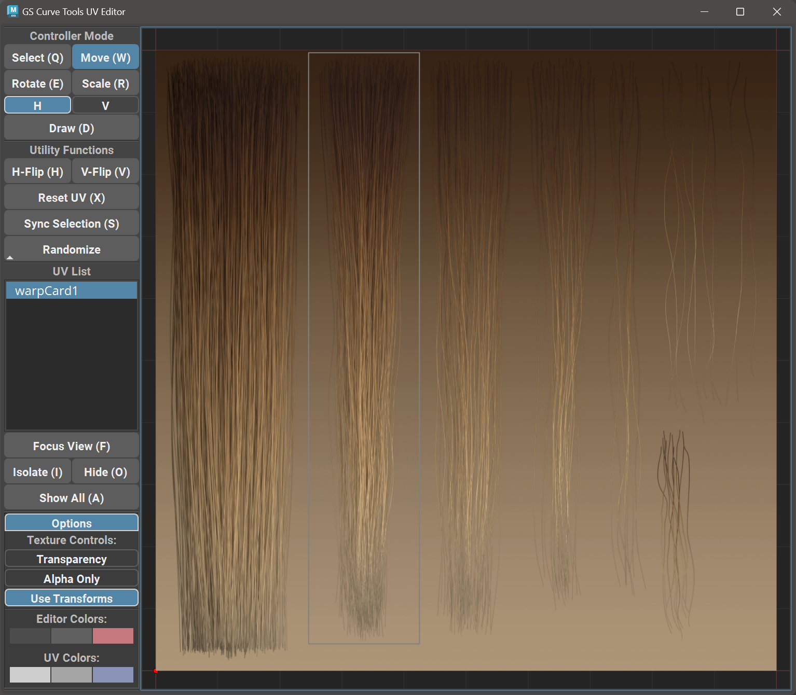

.. currentmodule:: <index>

.. _uv-editor:

#########
UV Editor
#########

New UV Editor
^^^^^^^^^^^^^

Changing UVs in GS CurveTools was always a challenge, because of the procedural limitation of UV attributes. Using slides was always a temporary solution to a problem, and not an elegant one.

Fortunately, with the release of v1.2 user now have access to a fully functional UV editor that is compatible with current and previous UV Attributes.

This UV Editor allows to control UV attributes using intuitive user interface, and also adds multiple useful functions.

All the functions have dedicated Hotkey that is separate from Maya hotkeys (in parenthesis). Hotkey will work only if the editor window is in focus (blue outline around the viewport)

UV editor consists of a Viewport on the right, and function buttons on the left, along with the UV list.

UV editor will update every time you select a new curve in Maya Viewport. Incompatible curves will not show any UV rectangles or textures.

The UVs will dynamically update in the Maya Viewport when you edit them in the UV Editor

Small rectangle at the base of the UV rectangle indicates the root of this UV and its orientation in space.

|
|
|

Select, Move, Rotate, Scale and Draw
^^^^^^^^^^^^^^^^^^^^^^^^^^^^^^^^^^^^

**Selection**

In order to select UV rectangle for edit, simply switch to Select mode (Q) and click or marquee select any number of UVs.

|
|
|
|
|
|
|
|
|

**Move**

In order to move selected UVs, change to Move mode (W) and click and drag with LMB on the UV rectangles.

|
|
|
|
|
|
|
|
|

**Rotate**

In order to rotate selected UVs, change to Rotate mode (E) and click and drag with LMB to rotate the UVs. 

UV rotation pivot is in the same location as the original UV Rotation Attribute pivot.

|
|
|
|
|
|
|
|

**Scale**

In order to Scale selected UVs, change to Scale mode (R) and click and drag with LMB to scale the UVs.

There are two modes for scale - H and V. H will scale UV rectangle horizontally, and V will scale vertically.

You can switch between these modes by clicking on the H or V switch button or by pressing R button on your keyboard multiple times.

|
|
|

**Draw**

.. figure:: images/uv_editor/uv_draw.gif
	:class: with-shadow float-right
	:width: 400px
    
Draw mode (D) allows for quick reposition of the UVs using simple drawing gestures. If will change any number of selected UV rectangles to match the shape that was drawn by the user.

Draw will rotate the UVs to the default rotation angle.

Draw allows for quick initial positioning of the UV rectangles.

|
|
|

Utility Functions
^^^^^^^^^^^^^^^^^

.. figure:: images/uv_editor/h_flip_indicator.png
    :class: with-shadow float-right
    :width: 250px

**H-Flip UV**

This function mirrors the H-Flip UV button in the Curve Control Window. 

It will flip the UV rectangle horizontally.

All horizontally flipped UVs are indicated by the small blue dot at the root of the UV rectangle.

|
|
|

.. figure:: images/uv_editor/v_flip_uv.gif
    :class: with-shadow float-right
    :width: 400px
    
**V-Flip UV**

This function will vertically flip the selected UV rectangle allowing for a quick rotation and repositioning. 

Position, Rotation and Scale does not matter when using this function.

|
|
|
|
|

    
**Reset UVs**

This function will reset the UV rectangle to its initial default position and rotation.

|
|
|
|
|
|
|
|
|

**Focus View**

This function will simply focus the viewport on currently selected UVs or reset it to the default position if nothing is selected.

UV List
^^^^^^^

.. figure:: images/uv_editor/uv_list.png
    :class: with-shadow float-right
    :width: 400px

This list holds the information on the selected UVs - their names and visibility.

Selected UVs in this list will be visible and editable in the UV Editor viewport

Deselected UVs will be hidden from viewport.

**Isolate Select** will show only selected UVs in the Editor Viewport and hide everything else.

**Show All** will show all the available UVs in the Editor Viewport.

|
|
|
|
|

Bound Cards UV Editing
^^^^^^^^^^^^^^^^^^^^^^

You can easily edit the UVs of the bound card using this UV editor. 

Multiple nested bound cards (when you create a bound group from other bound groups) will be represented as flat list under the main card.

|
|
|
|
|
|

.. figure:: images/uv_editor/nested_uvs_editing.gif
    :class: with-shadow float-right
    :width: 400px

You can easily isolate select or do any other functions with these nested cards and the result will be visible in Maya Viewport immediately.

|
|
|
|
|
|
|
|
|
|
|
|
|

Options Menu
^^^^^^^^^^^^

.. figure:: images/uv_editor/options_menu.png
    :class: with-shadow float-right
    :width: 300px

In the options menu user can change the texture and viewport visual appearance.

|
|
|
|
|
|
|
|
|
|

----

**Transform** - this toggle will enable/disable texture map transformations based on the place2dTexture node parameters: Coverage and Translate Frame.

.. warning:: **Offset** parameter is **NOT** supported. Both diffuse and alpha map should have the same Coverage and Translate Frame parameter or use the same place2dTexture node for this to work.

--------

**Alpha** - this toggle will enable/disable the use of Alpha map that is connected to the Transparency plug of the material (from separate files or the same file).

.. important:: It is recommended for the Diffuse and Alpha map to have the same resolution and aspect ratio.

--------

.. figure:: images/uv_editor/options_menu.png
    :class: with-shadow float-right
    :width: 300px

**Color Controls** - Using three color pickers you can change uv editor viewport background (1), grid (2) and frame(3) colors.

The colors set here will be saved and used in every project.

To reset the colors, reset the plug-in to default using CT Reset icon on the shelf.
