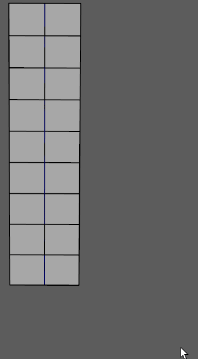
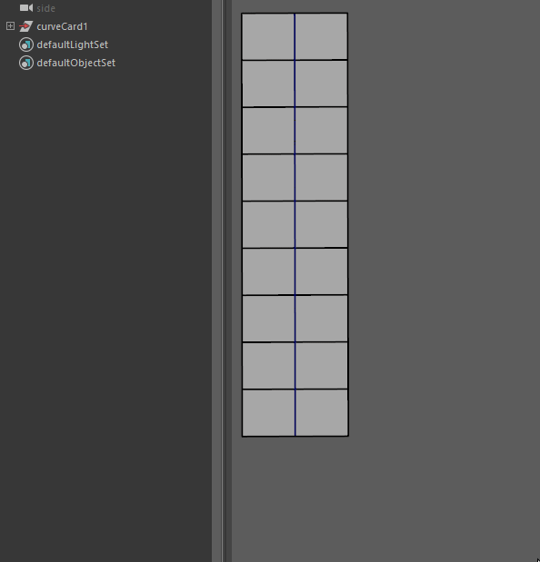
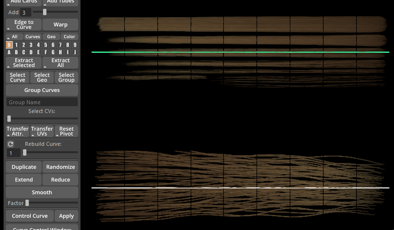
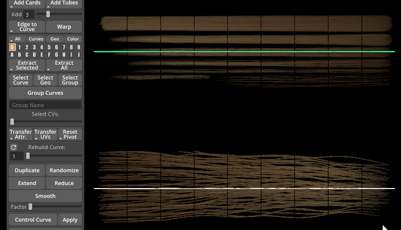
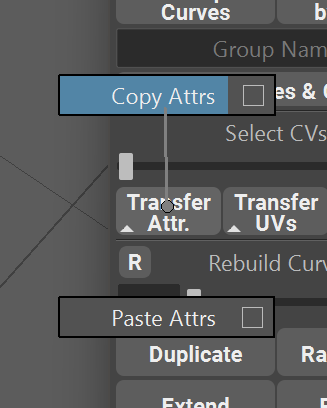

.. currentmodule:: <index>

.. _uvs:

#########################
UV Unwrapping and Editing
#########################

Applying Texture to Geometry
^^^^^^^^^^^^^^^^^^^^^^^^^^^^

Applying texture to the geometry generated by GS CurveTools plug-in is easy. You can use any of these methods:

- The simplest one is to select the curve in the Viewport, press "UP" arrow key on your keyboard, Hold Right Mouse button on the viewport and then click on any of the regular "Assign Material" options.

|
|
|
|
|
|
|
|
|
|
|
|
|
|

- You can also select the geometry or the entire group in the Outliner.

|
|
|
|
|
|
|

- Probably the slowest method is to enable Geometry Editing on the :ref:`Layer<layers>`, select the geometry, and apply the texture this way.

.. _transferring-uvs:

Transferring UVs
^^^^^^^^^^^^^^^^

You can easily **copy** (or **transfer**) UVs from one curve to any number of other curves. For that, just use the provided **"Transfer UVs."** button. It will show you the **[Source]** curve when you click on it. UVs are transferred from the **[Source]** curve to all other curves.

Transfer UVs work in two directions:

- By default, it will transfer **From First Selected Curve** ⇨ **To All Other Curves**.

|
|
|
|
|
|
|
|

- Using **Shift** modifier, you can reverse the direction of the transfer. It will now transfer **From Last Selected Curve** ⇨ **To All Other Curves**.

|
|
|
|

.. note:: Transfer UVs command is **multi-selection compatible**, so you can transfer UVs from one curve to any number of other curves in one click.

.. _copy-paste-uvs:

Copy-Paste UVs
^^^^^^^^^^^^^^

User can also choose to copy and paste UVs instead of transferring them with selection.

To copy UVs simply select a curve, open the marking menu (hold RMB on Transfer UVs), and choose Copy.

After that select any number of target curves, open marking menu and Paste.

Hotkeys are also available for both commands.

:ref:`Attribute filters<attribute-filters>` can be used to limit which attributes will be transferred.
