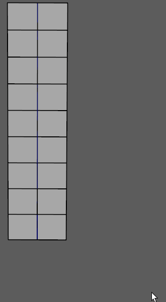
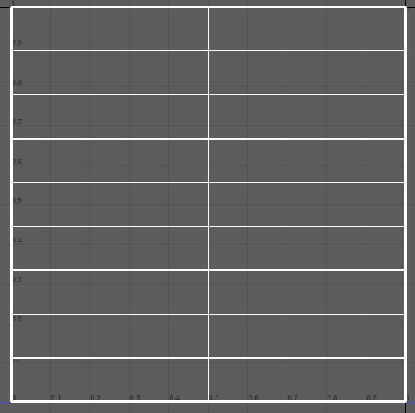

.. currentmodule:: <index>

.. _uvs:

#########################
UV Unwrapping and Editing
#########################

Applying Texture to Geometry
^^^^^^^^^^^^^^^^^^^^^^^^^^^^

Applying texture to the geometry generated by GS CurveTools plug-in is easy. You can use any of these methods:

- The simplest one is to select the curve in the Viewport, press "UP" arrow key on your keyboard, Hold Right Mouse button on the viewport and then click on any of the regular "Assign Material" options.

|
|
|
|
|
|
|
|
|
|
|
|
|
|

- You can also select the geometry or the entire group in the Outliner.

|
|
|
|
|
|
|

- Probably the slowest method is to enable Geometry Editing on the Layer, select the geometry and apply the texture this way.

.. _transferring-uvs:

Transferring UVs
^^^^^^^^^^^^^^^^

You can easily **copy** (or **transfer**) UVs from one curve to any number of other curves. For that, just use the provided **"Transfer UVs."** button. It will show you the **[Source]** curve when you click on it. UVs are transferred from the **[Source]** curve to all other curves.

Transfer UVs work in two directions:

- By default, it will transfer **From First Selected Curve** -> **To All Other Curves**.

|
|
|
|
|
|
|
|

- Using **Shift** modifier, you can reverse the direction of the transfer. It will now transfer **From Last Selected Curve** -> **To All Other Curves**.

|
|
|
|

.. note:: Transfer UVs command is **multi selection compatible**, so you can transfer UVs from one curve to any number of other curves in one click.

.. _copy-paste-uvs:

Copy-Paste UVs
^^^^^^^^^^^^^^

.. image:: images/transfer-attributes-marking-menu.png
	:align: right
	:width: 250px

User can also choose to copy and paste uvs instead of transferring them with selection.

To copy uvs simply select a curve, open marking menu (hold RMB on Transfer UVs) and choose Copy.

After that select any number of target curves, open marking menu and Paste.

Hotkeys are also available for both commands.

:ref:`Attribute filters <attribute-filters>` can be used to limit which attributes will be transferred.

Transferring UVs for Bound Cards
^^^^^^^^^^^^^^^^^^^^^^^^^^^^^^^^

Same logic as with :ref:`Transferring attributes to Bound Objects<transferring-attributes-to-bound>` 

Why UV Attributes?
^^^^^^^^^^^^^^^^^^

.. warning:: All the information below this line is either outdated or redundant. I'm leaving it for the explanation of the UV attributes workflow, but it is recommended to just use :ref:`uv-editor`.

----

**UV Attributes** were created to procedurally change the UVs of the geometry in a way that supports further modification using, for example, width and hight divisions attributes.

.. important:: With the release of **Version 1.2** there is now a dedicated :ref:`uv-editor` that allows to set the UVs without ever touching the UV attribute sliders. Check :ref:`uv-editor` section.

If you try to set the UVs using Maya UV Editor, it will work but only until you try to change the width and height divisions of the geometry.

Here is an example of broken UVs, when using regular Maya UV workflow and trying to change length division attribute ->

|
|
|

To avoid this issue, it is best to use provided UV attributes to Move, Scale and Rotate the UV

|
|
|
|

The default UVs of the cards and tubes are just uniform UV map that fills the 0,1 space.

By changing the UV attributes you will change the shape of this default UV map.

|
|
|
|

UV Attributes List
^^^^^^^^^^^^^^^^^^

- **Select for UV edit** button will highlight the UV map of the selected curve so it is visible in Maya UV editor. This button is optional, you can always set your UVs directly from Viewport, skipping the UV Editor completely.

- **H-Flip UV** - allows for horizontal flip of the selected UV.

|
|
|
|
|
|
|
|

- **MoveU** and **MoveV** attributes will move the UV map left, right, up and down in the UV space

|
|
|
|
|
|

- **ScaleU** and **ScaleV** will scale the UV map. ScaleU will scale the map from sides to center, and ScaleV will scale from top to bottom. ScaleV behaves so unusually because it is much easier to control the map this way. You don't need to scale and then move each time if you are aiming for a specific hair texture in your map.

|
|
|

- **Rotate UV** (RotUV) will rotate the map around its center point.

|
|
|
|
|
|
|

- **Rotate Root UV** (deprecated in v1.2+) will rotate around the "root" part of the UV map.

|
|
|
|
|
|

- **Rotate Tip UV** (deprecated in v1.2+) will rotate the "tip" part of the UV map.

|
|
|
|
|

Workflow Examples
^^^^^^^^^^^^^^^^^

.. important:: With the release of **Version 1.2** there is now a dedicated :ref:`uv-editor` that allows to set the UVs without ever touching the UV attribute sliders. Check :ref:`uv-editor` section.

Let's imagine we have a texture map (we are using alpha map for better visibility) with hair strands rendered in a vertical orientation. Some of them are long and go from top to bottom of the map. Some of them are short and even stacked on top of each other. So how do we approach this? There are two main ways:

|
|
|
|
|
|
|

**Workflow 1 (recommended)** - You can easily set up your UVs right in the viewport. Just remember how the map changes when you change the attributes and you are set.

.. note:: Hair Card is scaled to almost square shape in this example to provide better visibility.

- First, let's move the UV map using our curve as "aim". "Select" the appropriate hair strand using MoveU like this:
	
|
|
|
|
|
|
|

.. image:: images/workflow_02.gif
	:align: right
	:width: 400px

- After that let's scale our map using ScaleU until the strand fills the entire card:

|
|
|
|
|
|
|

- In this example, map is upside down. Let's rotate the UVs 180 deg, to flip it back to normal:

|
|
|
|
|
|
|

.. image:: images/workflow_04.gif
	:align: right
	:width: 400px

- As you can see, map does not fill the entirety of the hair card. This is wasted texture space. Let's fix this by combining MoveU and ScaleV attributes:

|
|
|
|
|
|

.. note:: To use better precision than sliders can provide we can either stretch the Curve Control Window or use combination of Ctrl + Left Mouse Button Drag on the Value Fields.

And here we go. Now we just need to add alpha back to the texture and scale the curve back to its original size.

As you can see, Viewport method is extremely simple and intuitive. You only need to do this once per each hair strand in the texture map, and then you can just use "TransferUVs" button to copy UV attributes to other curves.

|
|
|
|
|
|
|
|
|
|
|
|
|

.. important:: With the release of **Version 1.2** there is now a dedicated :ref:`uv-editor` that allows to set the UVs without ever touching the UV attribute sliders. Check :ref:`uv-editor` section.

**Workflow 2 (Maya UV Editor)** - You can use normal Maya UV editor as a reference. This method allows for better visibility of the actual changes of the UV map when you change the UV attributes. It is slower though, and I recommend you to get used to the first workflow.

- Let's select our curve and open Maya UV Editor.

- Now you will notice that UV editor is empty. That's because we only selected our curve, not the actual geometry. To fix this, in the UV section of Curve Control Window click on the "Select for UV edit" button.

|
|
|
|
|

- Now it is only a matter of changing the attributes to the desired values:

|
|
|
|
|
|
|

As you can see, although this method is fast and easy, it lacks the precision you get when viewing your texture in the viewport
